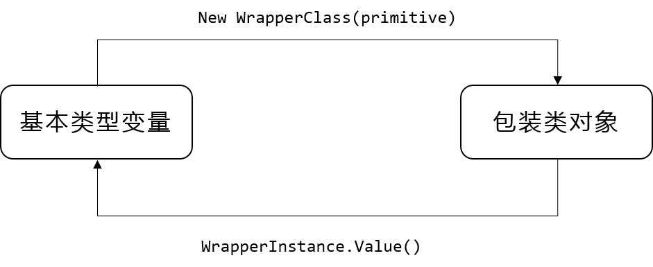
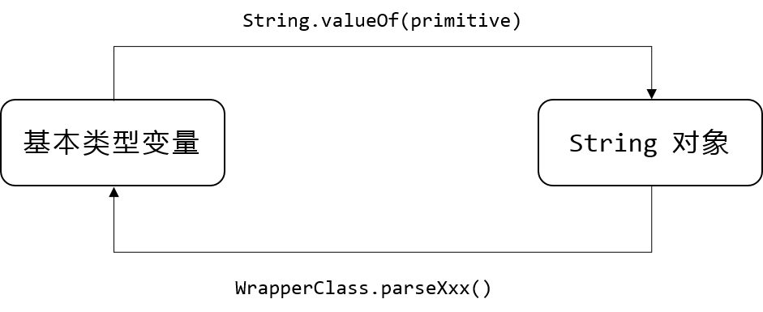
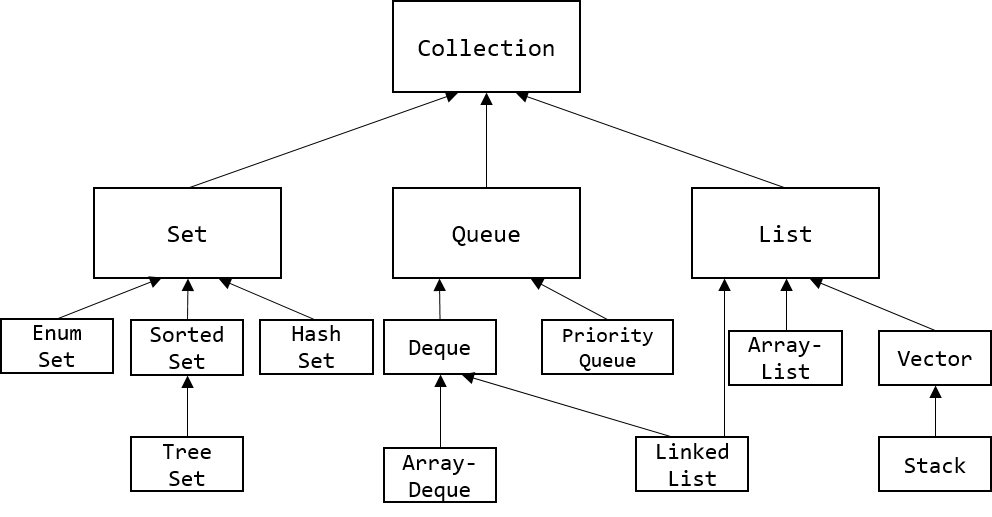
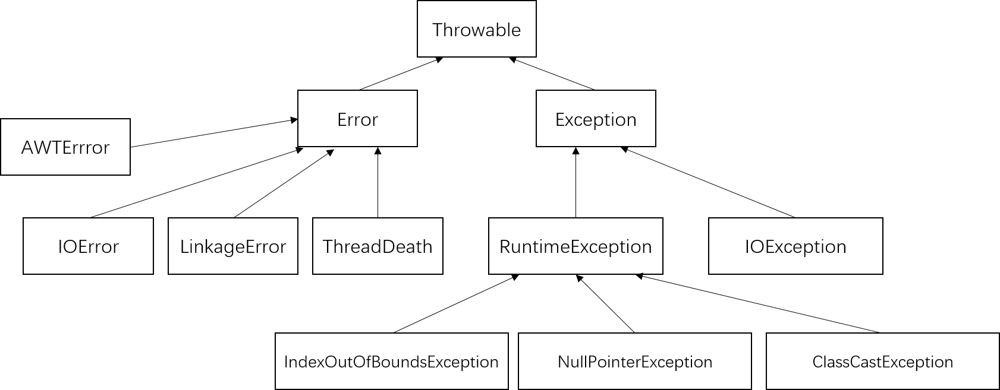

# 疯狂 Java 讲义笔记

## 1. Java 语言描述

所有程序部分必须放在类定义里；
如果某个类能被解释器直接解释执行，则这个类必须包含 main 方法

### 1.1 Java 源文件命名规则
- Java 源代码里定义了一个 public 类， 则该源文件名必须与该 public 类名相同
- 一个 Java 源文件最多只能定义一个 public 类名相同
- Java 中的关键字全部是小写
- 路径不要包含空格

## 2. 理解面向对象
面向对象的程序单位是类（面向过程的程序单位是函数） 
面向对象基本特征：封装、继承、多态 

### 2.1 类之间的三种基本关系
- 关联（包括聚合、组合）
- 泛化（与继承同一个概念）
- 依赖（一个类的改动会导致另一个类的改动）

## 3. 数据类型分类
- 基本类型
- 引用类型：包括类、接口和数组类型

> 空引用(null)只能被转换成引用类型，不能转换成基本类型，不要把一个 null 值赋给基本数据类型的变量

## 4. 流程控制
保留 if, for 等执行体的花括弧，增加可读性，减少犯错

多层循环中，break 语句不仅可以结束其所在的循环，还可以直接结束外层循环。 
此时要使用标签，Java 中的标签是一个紧跟着英文冒号(:)的标识符, 放在循环语句前有作用
<pre><code>
public static void main(String[] args) {
    //外层循环
    outer:
    for(int i = 0; i < 5; i++) {
        //内层循环
        for(int j = 0; j < 3; j++) {
            System.out.println("========");
            if(j == 1) {
                break outer;
            }
        }
    }
}
</code></pre>

continue 后也可以紧跟一个标签，用于直接跳过标签所标识循环的当次循环的剩下语句，重新开始下一次循环：
<pre><code>
public static void main(String[] args) {
    outer:
    for(int i = 0; i < 5; i++) {
        for(int j = 0; j < 3; j++) {
            System.out.println("i:" + i + " j:" + j);
        }
    }
}
</code></pre>

return 的功能是结束一个方法。一旦在循环体内执行到 return 语句时，就会结束该方法
<pre><code>
public class ReturnTest {
    public static void main(String[] args) {
        for(int i = 0; i < 3; i++) {
            System.out.println("i: " + i);
            if(i == 1) {
                return ;
            }
            System.out.println("return 后的语句");
        }
    }
}
</code></pre>

## 5. 数组
Arrays 类处于 java.util 包下 
一个数组中只能存储一种数据类型的数据（可以是子类） 
数组也是一种数据类型，本身是一种引用类型 
<pre><code>
type[] arrayName;
type arrayName[];
</pre></code>
都可以，推荐第一种方式

实际的数组对象被存储在堆(heap)内存中； 
如果引用该数组对象的数组引用变量是一个局部变量，那么它被存储在栈(stack)内存中; 
从数组底层的运行机制上来看，没有多维数组

### 注意 length, length(), size()
- length属性是针对数组说的
- length()方法是针对字符串String说的
- size()方法是针对泛型集合说的,如果想看这个泛型有多少个元素,就调用此方法来查看

### 5.2 foreach 循环
<pre><code>
for(type variableName : array | collection) {
    // variableName 自动迭代每个元素
}
</code></pre>

## 6. 面向对象
类定义 包含三种成员：构造器、Field 和方法 

Java 类名：每个单词首字母大写，单词之间无分隔符 
Field 名：第一个单词字母小写，后面每个单词首字母大写 
方法名：建议以动词开头，同 Field 名 

static 修饰的成员不能访问没有 static 修饰的成员 
构造器用于构造类的实例，通过 new 关键字来调用构造器 
修饰方法的修饰符：abstract 和 final 最多只能二选一，可与 static 组合

static 修饰的成员表明它属于这个类本身，而不属于该类的单个实例

### 6.1 引用
类也是一种引用数据类型 
栈内存里的引用变量并未对真正存储对象的 Field 数据，对象的 Field 数据实际存放在堆内存里； 
而引用变量只是指向该堆内存里的对象; 
当一个对象被创建成功以后，这个对象将保存在堆内存中 
- Java 不允许直接访问堆内存中的对象，只能通过该对象的引用操作该对象。
- 堆内存里的对象可以有多个引用，即多个引用变量指向同一个对象

### 6.2 this 引用
this 作为对象的默认引用有2种情形：
- 构造器种引用该构造器正在初始化的对象
- 在方法种引用调用该方法的对象

this 关键字最大的作用：让类种的一个方法访问该类里的另一个方法或 Field 
Java 允许对象的一个成员直接调用另一个成员，可以省略 this 前缀 
static 修饰的方法不能使用 this 引用

- 不要使用对象去调用 static 修饰的 Field、方法，而是应该使用类去调用 static 修饰的 Field、方法
- 如果方法里有个局部变量和 Field 同名，但程序又需要在该方法里访问这个被覆盖的 Field，则必须使用 this 前缀 

### 6.3 方法
方法不能独立存在，方法必须属于类或对象 
方法被 static 修饰，则这个方法属于这个类，否则属于这个类的实例 
Java 里方法的参数传递方式只有一种：值传递（将实际参数值的副本传入方法内，参数本身不受影响） 
Java 允许定义形参个数可变的参数，在最后一个形参后增加"..."，表明该形参可接收多个参数值，被当成数组传入 
一个方法最多只能有一个长度可变的形参

<pre><code>
public static void test(int a, String... books) {
    for(String tmp : books) {
        System.out.println(tmp);
    }
}
</code></pre>

Java 里不能使用方法返回值类型作为区分方法重载的依据 
不推荐重载形参长度可变的方法

### 6.4 成员变量和局部变量
<table>
    <tr>
        <th rowspan = 6>所有变量</th>
        <th rowspan = 2>成员变量</th>
        <th>实例 Field（不以 static 修饰）</th>
    </tr>
    <tr>
        <th>类 Field(以 static 修饰)</th>
    </tr>
    <tr>
        <th rowspan = 4>局部变量</th>
    </tr>
    <tr>
        <th>形参（方法签名中定义的变量）</th>
    </tr>
    <tr>
        <th>方法局部变量（在方法内定义）</th>
    </tr>
    <tr>
        <th>代码块局部变量（在代码块内定义）<th>
    </tr>
</table>

类 Field 的作用域比 实例 Field 更大 
如果通过一个实例修改类 Field 的值，会导致该类的其他实例来访问这个类 Field 时也获得被修改的值 

局部变量分三种：
- 形参：在定义方法签名时定义的变量，作用域在整个方法有效
- 方法局部变量： 在方法体内定义的局部变量，从定义该变量的地方生效，方法结束时消失
- 代码块局部变量：在代码块中定义，从定义地方生效，代码块结束失效

尽量避免局部变量和成员变量同名 
局部变量不属于任何类或实例，它总保存在所在方法的栈内存中
> 如果局部变量是基本类型，则直接把变量值保存在对应内存中； 
> 如果是引用类型，则变量里存放的是地址

变量的使用规则：
- 用于描述类或对象的固有信息，使用成员变量
- 某个类中需要以一个变量来保存该类或实例运行时的状态信息，使用成员变量
- 某个信息需要在某个类的多个方法之间共享，使用成员变量

### 6.5 隐藏和封装
控制级别由小到大：
<pre>privte -> default -> protected -> public</pre>

|-|private|default|protected|public|
|-|-|-|-|-|
|同一个类中|√|√|√|√|
|同一个包中||√|√|√|
|子类中|||√|√|
|全局范围内||||√|

控制符基本原则：
- 绝大部分 Field 都应该用 private 修饰，只有一些 static 修饰的、类似全局变量的 Field 才考虑 public。除此之外，工具方法（只用于辅助实现该类的其他方法）也应该使用 private 修饰
- 某个类用做其他类的父类，包含大部分方法仅希望被子类重写，应使用 protected 修饰
- 希望暴露给其他类自由调用的方法使用 public 修饰

### 6.6 package, import 和 import static
Java 允许将一组功能相关的类放在同一 package 下，组成逻辑上的类库单元 
一旦使用了 package 语句，意味着该文件定义的所有类都属于这个包 
同一个包中的类不必位于相同目录下 
建议把 Java 源文件放在与包名一致的目录下 
package 语句必须作为源文件的第一条非注释语句，一个源文件只能指定一个包 

import 可以向某个 Java 文件中导入指定包层次下某个类或全部类 
import 语句中的 "*" 只能代表类不能代表包

### 6.7 Java 常用包
- java.lang: 核心类，无需使用 import, 自动导入
- java.util: 大量工具和集合框架
- java.net: 网络编程
- java.collection: Java 输入/输出
- java.text: Java 格式化 
- java.sql: JDBC 数据库编程

### 6.8 构造器
使用 this 调用另一个重载的构造器只能在构造器中使用，而且必须作为构造器执行体第一行语句

### 6.9 继承
Java 的子类不能获得父类的构造器 
java.lang.Object 类是所有类的父类 
方法重写重写遵循"两同两小一大"： 
- 方法名、形参列表相同
- 子类方法返回值类型比父类更小或相等，子类方法声明抛出异常类应比父类更小或相等
- 子类方法返回权限应比父类更大或相等

可用 super 调用被覆盖的父类实例方法和 Field 
super 也不能出现在 static 修饰的方法中  
在子类构造器中调用父类构造器使用 super 调用来完成(而同一个类中用 this 调用重载的构造器) 

overload 重载：同一类的多个同名方法之间 
override 重写：子类父类同名方法之间

### 6.10 多态
Java 引用变量有2个类型：编译时类型和运行时类型，如果他们不一致，就可能出现多态 
<pre><code>
    BasicClass x = new SubClass();
</code></pre>
Java 允许把一个子类对象直接赋值给一个父类引用变量，成为向上转型 
上例中，编译类型是 BaseClass，运行时类型是 SubClass 
而 Field 不具备多态性，调用时输出的是 BaseClass 中的 Field

引用变量强制类型转换：
- 基本类型间的转换只能在数值类型之间，数值和布尔型之间不能转换
- 引用类型之间的转换只能在具有继承关系的两个类型之间。如果把一个父类实例转换成子类类型，则这个对象必须实际上时子类实例

instanceof 作用：在进行强制类型转换之前，先判断前一个对象是否是后一个类的实例，是否成功转换

### 6.11 继承与组合
设计父类通常遵循：
- 尽量隐藏父类的内部数据
- 不要让子类随意访问、修改父类的方法
- 尽量不要在父类构造器中调用将被子类重写的方法

继承&组合：
- 继承：将一个较为抽象的类改造成嫩适用于某些特定需求的类 （is-a）
- 组合：如果两个类之间有明确的整体、部分关系(has-a)

### 初始化块
初始化块只在创建 Java 对象时隐式执行，而且在执行构造器之前执行 
初始化块是构造器的补充 
使用 static 修饰的初始化块是类初始化块

### 6.12 包装类
基本数据类型 -> 包装类 

8个包装类除了 Character 外，可通过传入一个字符串参数来构建包装类对象
<pre><code>
Float fl = new Float("4.56");
</code></pre>

如果希望获得包装类对象中包装的基本类型变量，则可以使用包装类提供的 xxxValue()实例方法 

### 6.13 处理对象

toString() 方法是 Object 类里的一个实例方法，所有 Java 对象都可以和字符串进行连接计算 
toString() 方法返回该对象实现类的 "类名 + @ + hashCode" 

- == 如果两个变量是基本类型，只要值相等，就返回 true
- == 如果两个引用类型变量，它们必须指向同一对象，才返回 true
- equals 是 Object 类提供的实例方法，与 == 没有区别
- String 重写了 equals() 方法：只要两个字符串包含字符序列相同，通过 equals() 比较将返回 true

正确重写 equals 方法应满足：
- 自反性：对任意 x, x.equals(x)一定返回 true
- 对称性：对任意 x 和 y, 如果 y.equals(x) 返回 true, 则 x.equals(y) 也返回 true
- 传递性：对任意x,y,z, 如果 x.equals(y) 返回ture, y.equals(z) 返回 true, 则 x.equals(z) 一定返回 true
- 一致性：对任意 x 和 y, 如果对象中用于等价比较的信息没有改变，那么返回结果保持一致

### 6.14 类成员
单例类： 一个类时钟只能创建一个实例 
- 把该类构造器使用 private 修饰 
- 一旦隐藏构造器，就需要提供一个 public 方法作为该类的访问点，用于创建类的对象，且该方法必须是 static 修饰 
- 该类还必须缓存已创建的对象

<pre><code>
class Singleton {
    private static Singleton instance;
    private Singleton() {

    }
    public static Singleton getInstance() {
        if(instance == null) {
            instance = new Singleton();
        }
        return instance;
    }
}
</code></pre>

### 6.15 final 修饰符

final 关键字修饰的类、方法和变量不可改变 
final Field
- 类 Field：必须在镜头初始化过程中或声明该 Field 时指定初始值
- 实例 Field：必须在非静态初始化块、声明该 Field 或构造器中指定初始值
- final 成员变量必须显式初始化
- final 修饰局部变量可在定义时不指定默认值
- 使用 final 修饰引用类型变量不能被重新赋值，但可以改变引用类型变量所引用对象的内容

final 方法：
- 不可被重写，如果不希望子类重写父类方法，则可用 final
- Object 类中的 getClass() 方法就是 final 方法

final 类：
- 不能有子类

不可变类：创建实例后，实例的 Field 关键字修饰的类、方法和变量不可改变 
<pre><code>
Double d = new Double(6.5);
</code></pre>

创建不可变类的规则：
- 使用 private 和 final 修饰符来修饰该类的 Field
- 提供带参数构造器，用于根据传入参数来初始化类里的 Field
- 仅为该类的 Field 提供 getter 方法，不提供 setter方法
- 若有必要，重写 Object 类的 hashCode 和 equals 方法

### 6.16 抽象类
抽象方法 & 抽象类 规则：
- 必须使用 abstract 修饰，抽象方法不能有方法体
- 抽象类不能被实例化
- 抽象类可包含 Field, 方法（普通和抽象均可），构造器，初始化块，内部类，枚举类
- 含抽象方法的类只能被定义为抽象类

<pre><code>
public abstract void test(); //抽象方法(记得带分号)
public void test() {} //是普通方法
</code></pre>

- abstract 类只能被集成
- abstract 方法只能被重写
- final 和 abstract 永远不能同时使用
- static 和 abstract 不能同时修饰某个方法
- private 和 abstract 不能同时修饰某个方法

使用模板模式的简单规则：
- 抽象父类可只定义需要使用的某些方法，把不能实现的部分抽象成抽象方法，留给子类去实现
- 父类可能包含需要调用的其他系列方法的方法，这些方法既可以父类实现，也可以子类实现

### 6.17 接口
接口里通常定义一组公用方法 
interface 语法：
- 修饰符可 public 可省略，省略后只有相同包下才可访问
- 接口名应与类名采用相同的命名规则，每个单词首字母大写
- 一个接口可以有多个直接父接口，但接口只能继承接口，不能继承类
- interface 里不能包含构造器和初始化块
- interface 内的 Field 只能是常量，方法只能是抽象方法
- interface 内的所有成员均是 public 权限
- interface 内没有静态方法
- 一个 Java 文件内最多只能有一个 public 接口

接口的实现：
- 一个类实现了接口后，必须完全实现这个接口里定义的全部抽象方法
- 实现接口方法时，必须使用 public 修饰符

接口和抽象类：
- 都不能被实例化
- 都可以包含抽象方法，实现接口或继承抽象类都必须实现这些抽象方法
- 接口里只能包含抽象方法，抽象类可包含普通方法
- 接口里不能自定义静态方法，抽象类可定义静态方法
- 接口只能定义静态 Field， 抽象类可定义普通 Field 和 静态 Field
- 接口不包含构造器；抽象类可包含构造器
- 接口不包含初始化块，抽象类可以
- 一个类最多一个直接父类，但可直接实现多个接口

### 6.18 内部类
内部类作用：
- 更好的封装，不允许同一个包中其他类访问
- 内部成员可直接访问外部类私有数据
- 匿名内部类适合创建仅需要使用一次的类

内部类可用 private 修饰符来修饰该类 
成员内部类编译后的 class 文件形式：OuterClass$InnerClass.class 
如果外部类成员变量、内部类成员变量与内部类方法局部变量同名，可通过 this、 OuterLass.this 作为区分 
外部类的静态方法、静态代码块不能访问非静态内部类 
Java 不允许在非静态内部类里定义静态成员 
静态内部类是外部类的一个静态成员，因此外部类的静态方法、静态初始化块中可使用静态内部类来定义变量、创建对象 
外部类不能直接访问静态内部类的成员，但可使用静态内部类类名作为调用者来访问静态内部类成员 
 > 接口内部类只能是静态内部类（但意义不大），默认使用 public static 修饰

#### 内部类的用法
1. 在外部类中使用内部类：和使用普通类没有太大区别
2. 在外部类以外使用非晶态内部类：内部类不能用 private 修饰；创建内部类对象前必须先创建外部类对象

#### 匿名内部类
适合创建只需要使用一次的类 
定义：
<pre><code>
new 父类构造器(实参列表)|实现接口() {
    //类体部分
}
</code></pre>

匿名内部类规则：
- 不能是抽象类
- 不能定义构造器，因为没有类名

#### 闭包和回调
闭包：一种被调用的对象，保存了创建它的作用域信息 
把非静态内部类当成面向对象领域的闭包 

回调：某个方法一旦获得了内部类对象的引用后，就可以在合适的时候反过来去调用外部类实例的方法

例：
<pre><code>
interface Teachable {
    void work();
}
public class Programmer {
    private String name;
    public Programmer() {

    }
    public Programmer(String name) {
        this.name = name;
    }

    public void work() {
        System.out.println(name + "coding...");
    }
}

public class TeachableProgrammer extends Programmer {
    public TeachableProgrammer() {

    }
    public TeachableProgrammer(String name) {
        super(name);
    }
    private void teach() {
        System.out.println("Teacher's teaching on the stage..");
    }
    private class Closure implements Teachable {
        public void work() {
            teach();
        }
    }
    //返回一个非静态内部类引用，允许外部类通过该非静态内部类引用来回调外部类的方法
    public Teachable getCallbackReference() {
        return new Closure();
    }

}
</code></pre>

### 枚举类
枚举类： 实例有限而且固定的类 
enum 关键字定义枚举类

- 一个 Java 源文件最多只能定义一个 public 的枚举类
- enum 定义的枚举类继承 java.lang.Enum，而非 Object
- 枚举类构造器只能使用 private 修饰符
- 枚举类所有实例必须在枚举类第一行显示列出
- 枚举类也可以定义 Field、方法
- 一旦枚举类显示定义了构造器，列出枚举值就必须传入参数
- 枚举类实现接口，可以让每个枚举类分别来实现方法，提供不同的实现方式
- 当创建枚举值时，实际上创建了枚举类的匿名子类实例

<pre><code>
public enum SeasonEnum {
    SPRING,SUMMER,FALL,WINTER;
}
</code></pre>

java.lang.Enum 包含的方法
- int compareTo(E o): 指定枚举对象比较顺序，若该枚举对象位于指定枚举对象之后，返回正整数；在之前返回负整数；否则返回零
- int ordinal(): 返回枚举值在枚举类中的索引值（在枚举声明中的位置）
- String toString(): 返回枚举常量名称

### 对象与垃圾回收
- 只负责回收堆内存中的对象，不会回收任何物理资源
- 程序无法精确控制垃圾回收运行

#### 对象在内存中的状态
- 可达状态：对象被创建后，有一个以上引用
- 可恢复状态：某个对象不再有任何引用变量引用它
- 不可达状态：对象与所有引用变量的关联被切断，且系统调用finalize()方法后依然没有使该对象变成可达状态

#### 强制垃圾回收
- System.gc()
- Runtime.getRuntime().gc()
只是通知系统进行垃圾回收，但系统是否进行垃圾回收依然不确定

#### finalize()方法4个特点：
- 永远不要主动调用
- 该方法何时被调用，是否被调用具有不确定性
- JVM 执行客恢复对象的finalize()方法时，可能使其重变成可达
- 不会报告异常

#### 对象的强、软、弱、虚引用
1. 强引用：最常见，通过引用变量来操作实际对象，处于可达时不被回收
2. 软引用：通过SoftReference实现，当对象只有软引用时有可能被强制回收；当内存空间足够，不会被回收，空间不足时系统可能回收它
3. 弱引用：和软引用很像，但垃圾回收机制运行时，总会被回收
4. 虚引用：完全类似于没有引用，用于跟踪对象被垃圾回收的状态，必须和引用队列(ReferenceQueue)联合使用

### JAR 包
全称 Java Archive File Java 档案文件

## 7. 与运行环境交互
### 7.1 与用户互动
main 方法由 JVM 调用，args形参由 JVM 赋值 

Scanner 类是一个基于正则表达式的文本扫描器，可以从文件、输入流、字符串中解析出基于基本类型值的字符串值
- hasNextXxx():是否还有下一个输入项，其中Xxx 可以是Int\Long等基本数据类型
- nxtXxx():获取下一个输入项
- boolean hasNextLine():返回输入源中是否还有下一行
- String nextLine():返回输入源中下一行的字符串
- 创建Scanner 对象时传入一个File对象作为参数，就可以让Scanner读取该文件内容
<pre><code>
Scanner sc = new Scanner(new File("ScannerFileTest.java"));
while(sc.hasNextLine()) {
    System.out.println(sc.nextLine());
}
</code></pre>

### 7.2 系统相关
#### System 类
- 程序不能创建System 类对象
- 提供标准输入输出和错误输出的类 Field, 并提供静态方法访问环境变量、系统属性
- 提供 identityHashCode(Object x) 方法，返回指定对象的精确 hashCode 值（根据对象的地址计算得到）

#### Runtime 类
- 代表Java 程序的运行时环境，程序不能自己创建 Runtime 实例
- 可访问 JVM 相关信息

### 7.3 常用类
#### Object 类
- 是所有类的父类，所有类默认继承 Object
- boolean equals(Obkect obj) 和"=="基本没有区别，存在的意义在于被重写
- protected void finalize() 垃圾回收调用
- Class<?> getClass() 返回运行时类
- int hashCode() 返回对象hashCode值
- String toString() 返回 “运行时类名@十六进制hashCode值”
- protected clone()方法,帮助其他对象实现自我克隆，即获得当前对象副本，且二者完全隔离；是一种浅克隆，只克隆该对象的所有Field值，不会对引用类型的Field值所引用对象进行克隆

#### String、StringBuffer
- String 一旦一个 String 对象被创建以后字符序列不可变
- StringBuffer 对象代表一个字符序列可变的字符串，通过该类提供的append(),insert(),reverse(),setCharAt(),setLength()等方法可改变这个字符串
- StringBuilder基本类似于StringBuffer，但 StringBuffer 是线程安全的
- StringBuffer 和 StringBuilder 有两个属性：length 和 capacity，与 String 对象不同的是，length 可变，capacity 通常比 length 大，且无需关心

因为 String 是不可变的，在执行连接字符串操作时，会额外产生很多临时变量，使用 StringBuffer 或 StringBuilder 就可以避免

#### Math 类
- 两个静态 Field:PI, E
- 工具类，无法创建 Math 对象

#### ThreadLocalRandom 与 Random
- Random 类生成伪随机数，如果这个类的两个实例用同一个种子创建，对它们同样顺序调用，会产生相同数字序列
- ThreadLocalRandom 类可保证系统更好的线程安全性，提供静态 current() 方法获取 ThreadLocalRandom 对象，之后可调用各种 nextXxx() 方法
- 为避免产生相同数字序列，通常已当前时间作为 Random 对象的种子
<pre><code>
Random rand = new Random(System.currentTimeMills());
</code></pre>

#### BigDecimal 类
为了精确表示、计算浮点数 
通常建议有限使用基于 String 的构造器 
若必须使用 double 作为 BigDecimal 构造器参数，应通过 BigDecimal.valueOf(double value) 静态方法来创建 BigDecimal 对象

### 7.4 处理日期的类
#### Date 类
不推荐使用

#### Calendar 类
抽象类，用于表示日历 
GregorianCalendar：公历，Calendar 类的子类

### 7.5 正则表达式
正则表达式是一个用于匹配字符串的模板 
通配符是可以匹配多个字符的特殊字符 
Pattern 对象是正则表达式编译后在内存中的表示形式，然后利用该 Pattern 对象创建对应的 Matcher对象 
Matcher 类的 find() 和 group()方法可从目标字符串中依次取出特点子串 

> String 类的 equals(), startsWith()都与字符串比较，而 Matcher 的 matches() 和 lookingAt() 是与正则表达式匹配

## 8. Java 集合
### 8.1 集合概述
所有集合类都位于 java.util 包下 
集合李只能保存对象（引用）而不能保存基本数据类型 
主要由两个接口派生出来：Collection 和 Map 

- Set 和 List 接口分别代表了无序集合和有序集合
- Queue 是 Java 提供的队列实现，有点类似 List
- 所有的 Map 实现类用于保存具有映射关系的数据
- Set 里的元素不能重复
- List可以记住每次添加元素的顺序，长度可变
- Map 的每项数据都由两个值组成

### 8.2 Collection 和 Iterator 接口
Collection 接口：List, Set 和 Queue 的父接口 
所有的 Collection 都重写了 toString()方法，可以一次性输出集合中的所有元素 
Iterator 用于遍历 Collection 集合中的元素 
Iterator 进行迭代时，是把集合元素的值传给了迭代变量，修改迭代变量的值对集合元素本身无影响 
foreach 循环迭代集合元素时，该集合也不能被改变

### 8.3 Set 集合
Set 集合不允许包含相同的元素 
判断两个元素相同是根据 equals 方法 
#### HashSet
HashSet 按 Hash 算法来存储集合中的元素
- 不能保证元素排列顺序
- 不同步，多线程同时修改HashSet时，必须通过代码来保证同步
- 元素值可以是 null
- 把一个对象放入 HashSet 中，如需重写 equals() 方法，也要重写 hashCode()方法，其规则是：如果两个对象通过 equals() 方法返回 true，这两个对象的 hashCode 值也应相同

> Hash 算法的功能：保证通过一个对象快速查找到另一个对象，价值在于速度 
> hash 算法可以直接根据元素值计算出该元素的存储位置 
> 与数组不同的是，数组定长且索引连续；hash根据元素 hashcode 值来计算索引

重写 hashCode() 的基本规则：
- 同一对象多次调用 hashCode()应返回相同值
- 两对象通过 equals()返回true，则 hashCode()返回相同
- 对象中用作 equals() 比较标准的 Field，都应计算 hashCode()值
一般规则
1. 把对象内每个有意义的 Field计算出一个 int 类型的 hashCode值
2. 第1步多个 hashCode值组合计算出一个 hashCode 值返回

#### LinkedHashSet 类
使用链表维护元素的次序，遍历时按元素插入顺序访问 
性能略低于 HashSet 
依然不允许集合元素重复

#### TreeSet 类
- 是 SortedSet 接口实现类，可确保集合元素处于排序状态
- 所以增加了访问第一个、前一个、后一个、最后一个元素的方法
- 根据元素实际值的大小来排序
- 采用红黑树数据结构来存储集合元素
- 支持自然排序（默认）和定制排序

1. 自然排序 
TreeSet 调用集合元素的 compareTo(Object obj) 方法比较两元素大小，将集合元素按升序排列 
Java 中的 Comparable 接口提供了一个 compareTo(Object obj)方法，实现该接口的类必须实现此方法 
向 TreeSet 中添加的应该是同一个类的对象，否则引发异常 
TreeSet 判断两元素相等的唯一标准：compareTo方法返回值是否是0 
> 当可变对象的Field被修改时，TreeSet 处理这些对象将非常复杂，且容易出错,推荐 HashSet 和 TreeSet 只放入不可变对象

2. 定制排序 
如需实现定制排序，需要在创建 TreeSet 集合时通过 Comparable 接口帮助

#### EnumSet 类
- 专为枚举类设计的集合类
- 所有元素都必须是指定枚举类型的枚举值
- 元素有序，以枚举值排序
- 以向量形式存储，内存占用小，运行效率高
- 不允许加入 null 元素
- 无可调用的构造器，需通过 static 方法创建 EnumSet 对象

#### 各 Set 性能分析
- HashSet 性能总比 TreeSet 好
- 只有当需要保持排序的 Set 时，才使用 TreeSet
- HashSet 的子类 LinkedHashSet 比 HashSet 略慢，但遍历更快
- EnumSet 性能最好，但只能保存同一个枚举类的枚举值作为集合元素
- 线程都是不安全的

### 8.4 List 集合
List 代表一个元素有序、可重复的集合

#### List 接口 和 ListIterator 接口
相比于 Set， List 增加了根据索引来插入、替换和删除集合元素的方法 
List 额外提供了一个 liseIterator()方法，返回 ListIterator 对象，提供前向迭代，还可通过add方法向List集合中添加元素 

#### ArrayList 和 Vector
ArrayList 和 Vector 都基于数组实现 List 类，所以 ArrayList 和 Vector 封装了一个动态的、允许再分配的 Object[] 数组 
ArrayList 或 Vector 对象使用 initialCapacity 设置数组长度，当元素超出长度时，initialCapacity 自动增加
- ArrayList 和 Vector 显著区别： ArrayList 线程不安全，Vector 是线程安全的，Vector性能差
- Vetor 提供了一个 Stack 子类， 用于模拟“栈”这种数据结构

### 8.5 Queue 集合
Queue 用于模拟队列，通常队列不允许随机访问 

#### PriorityQueue 实现类
PriorityQueue 是一个比较标准的队列实现类，但是按队列元素大小进行重排，而非按加入顺序 
取出队列元素时先取出最小的元素 
不允许插入 null 元素 
采用自然排序和定制排序 

#### Deque 接口与 ArrayDeque 实现类
Deque 是 Queue 的子接口，代表一个双端队列，允许从两端操作队列元素 
Deque 提供了一个经典实现类： ArrayDeque，基于数组实现，创建对象时可指定一 numElements 参数，用于指定Object[] 数组长度 

#### LinkedList 实现类
LinkedList 可以根据索引来随机访问集合中的元素 
LinkedList 可作为双端队列、栈使用

#### 各种线性表的性能分析

|  | 实现机制 | 随机访问排名 | 迭代操作排名 | 插入操作排名 | 删除操作排名 |
| ------------- |:-------------:| :-----:| :-----:| :-----:| :-----:|
| 数组 | 连续内存区保存元素 | 1 | 不支持 | 不支持 | 不支持 |
| ArrayList/ArrayDeque | 以数组保存元素 | 2 | 2 | 2 | 2 |
| Vector | 以数组保存元素 | 3 | 3 | 3 | 3 |
| LinkedList | 以链表保存元素 | 4 | 1 | 1 | 1 |

### 8.6 Map
- Map 用于保存具有映射关系的数据
- 一组值保存key，另一组保存 value，都可以是引用变量
- key 不允许重复
- key 和 value 间存在单向一对一关系
- Map 里的所有 key 构成 set 集合

> map 与 set 关系密切，Map 提供一个 Entry 内部类来封装 key-value 对，计算 Entry 存储时只考虑 Entry 封装的 key

#### HashMap 和 Hasgtable 实现类
- 都是 map 接口的经典实现，关系类比 ArrayList 与 Vector
- 两点区别：Hashtable 是线程安全的，HashMap 性能高；Hashtable 不允许使用 null 作为 key 和 value，HashMap 可以
- HashMap 和 Hashtable 均不保证元素顺序
- 尽量不要在程序中修改 key，或不要使用可变对象作为 key

#### LinkedHashMap 实现类
- LinkedHashMap 使用双向链表来维护 key-value 对的次序（其实是key的次序）  
- 迭代顺序与 key-value 对的插入次序保持一致，性能略低于 HashMap

#### SortedMap 接口和 TreeMap 实现类
Map 接口派生出一个 SortedMap 接口和一个 TreeMap 实现类
- TreeMap 是一个**红黑树**数据结构, 每个 key-value 对即作为红黑树的一个节点
- TreeMap 存储 key-value 对时，需根据 key 对节点进行排序
- 采用2种排序方式
  - 自然排序： 所有 key 实现 Comparable 接口，且所有 key 都是同一类的对象，否则抛出 ClassCastexception 异常
  - 定制排序： 不要求实现 Comparable 接口，创建 TreeMap 时传入一个 Comparator 对象，负责对 TreeMap 中所有 key 进行排序；需要重写 equals() 和 compareTo() 方法

#### WeakHashMap 实现类
WeakHashMap 与 HashMap 用法相似，区别在于：
- 只要该 HashMap 对象不被摧毁， HashMap 所有 key 所引用的对象就不会被垃圾回收， HashMap 也不自动删除这些 key 对应的 key-value 对
- WeakHashMap 的 key 只保留了对实际对象的弱引用，意味着如果 WeakHashMap 对象的 key 所引对象没有被其他强引用变量所引用，则这些 key 所引用的对象可能被垃圾回收， WeakHashMap 也可能自动删除这些 key-value 对

> 如果需要使用 WeakHashMap 的 key 来保留对象的弱引用，则不要让该 key 所引用的对象具有任何强引用

#### IdentityHashMap 实现类
- IdentityHashMap 类在处理两个 key 严格相等 （key1 == key2） 时， 才认为两个 key 相等；
- 普通 HashMap 类则通过 equals() 方法判定

> IdentityHashMap 在实现 Map 接口时，有意违反 Map 通常规范

#### EnumMap 实现类
- EnumMap 中所有 key 都必须时单个枚举类的枚举值
- 创建 EnumMap 时必须显式或隐式指定它对应的枚举类
- 在内部以数组形式保存
- 根据 key 的自然顺序（即枚举值在枚举类中的定义顺序）维护 key-value 顺序
- 不允许使用 null 作为 key，但可作为 value

#### 各 Map 性能分析
- HashMap 和 Hashtable 效率大致相同
- TreeMap 比HashMap 慢，在底层采用红黑树管理 key-value 对
- 对于一般的场景，考虑 HashMap
- LinkedHashMap 比 HashMap 慢，需要维护链表来保持 key-value 的添加顺序
- EnumMap 性能最好，但只能使用同一个枚举类的枚举值作为 key

### 8.7 HashSet 和 HashMap 的性能选项
- 容量(capacity)：hash 表中桶的数量
- 初始化容量(initial capacity)：创建hash表时桶的数量
- 尺寸(size)：当前hash表中记录的数量
- 负载因子(load factor)： 等于 size/capacity

### 8.8 操作集合工具类 Collections
#### 排序操作
- reverse 反转
- shuffle 随机排序
- sort(List list) 根据自然顺序升序排序
- sort(List list, Comparator c) 根据指定 comparator 产生顺序对List排序
- swap 指定两元素交换
- rotate(List list, int distance) 当 distance为正，将list的后 distance 个元素整体移到前面；当 distance 为负，将 list 的前 distance 个元素整体移到后面

#### 查找、替换操作
- binarySearch 二分法搜索
- max 根据（自然/指定）排序，返回集合中最大元素
- min 返回最小元素
- fill 用指定元素替换list中所有元素
- frequency 返回元素出现次数
- indexOfSubList 返回子List对象在父List对象中第一次出现的位置索引
- lastIndexOfSubList 返回子List对象在父List对象中最后一次出现的位置索引
- replaceAll 使用一个新值替换List对象的所有旧值

#### 同步控制
synchronizedXxx() 方法，将指定集合包装成线程同步的集合,解决多线程并发访问集合时的线程安全问题

#### 设置不可变集合
- emptyXxx() 返回一个空的、不可变的集合对象，可为 List, Set, Map
- singletonXxx() 返回一个只包含指定对象的、不可变的集合对象，可为 List, Set, Map
- unmodifiableXxx() 返回指定集合对象的不可变视图

## 第9章 泛型
### 9.1 泛型入门
把一个对象丢进 Java 集合，集合就会忘记这个对象的数据类型，取出对象时编译类型就变成了 Object  
Java 引入参数化类型的概念，允许在创建集合时能指定集合元素类型  
参数化类型被称为泛型
<pre><code>
List&lt;String> strList = new ArrayList<>();
Map&lt;String, Integer> scores = new HashMap<>();
</code></pre>
Java 允许在构造器后不需要带完整的泛型信息，只要给出一对尖括号即可

### 9.2 深入泛型
泛型：允许在定义类、接口、方法时使用类型形参，这个类型形参将在声明变量、创建对象、调用方法时动态指定  
可以在声明集合变量、创建集合对象时传入类型实参

**泛型的实质**：允许在定义接口、类时声明类型形参，类型形参在整个接口、类体内可当成类型使用  
几乎所有可使用普通类型的地方都可以使用这种类型形参  

Set<K>形式时一种特殊的数据类型，是一种与 Set 不同的数据类型，可认为是 Set 类型的子类

> 并不是只有集合类才可以使用泛型声明，虽然集合类是泛型的重要使用场所
> 当创建带泛型声明的自定义类，为该类定义构造器时，构造器名还是原来的类名，不要增加泛型声明

#### 从泛型类派生子类
创建了带泛型声明的接口、父类之后，可为接口创建实现类，或从该父类派生子类，但当使用这些接口、父类时不能再包含类型形参
<pre><code>
//以下代码均正确
public class A extends Apple&lt;String>
public class A extends Apple
</code></pre>

> 如果子类需要重写父类的方法，注意将返回值类型也进行修改（如果父类中该方法的返回值是泛型）

#### 并不存在泛型类
不管泛型的实际类型参数是什么，它们在运行时总有同样的类  
在静态方法、静态初始化块或静态变量的声明和初始化中不允许使用类型形参  

### 9.3 类型通配符
> List&lt;String> 对象不能被当作 List&lt;Object> 对象使用  
> 即 List&lt;String> 并不是 List&lt;Object>的子类

未来表示各种泛型List的父类，我们需要使用类型通配符，类型通配符是一个问号(?)，写作List<?>   
不管List的真实类型是什么，它包含的都是Object
> 这种写法适用于任何支持泛型声明的接口和类。如：Set<?>, Collection<?>, Map<?,?>  

- 这种带通配符的List仅表示它是各种泛型List的父类，并不能把元素加入其中  
- 调用get()方法返回List<?>集合元素，总是一个Object，可以把get()返回值赋给一个Object类型变量

#### 设定通配符的上限
当我们想要用通配符表示某一泛型List的父类，而不是任何泛型List的父类，可以使用：
<pre><code>
//表示所有SuperClass泛型List的父类
List&lt;? extends SuperClass>
</code></pre>

#### 设定类型形参上限
用于表示传给该类型的实际类型要么是该上限类型，要么是该上限类型的子类
<pre><code>
public class Apple&lt;T extends Number> {
    T col;
    public static void main(String[] args) {
        Apple&lt;Integer> ai = new Apple<>();
        Apple&lt;Double> ad = new Apple<>();
        //编译错误,String 不是 Number 子类型
        Apple&lt;String> as = new Appke<>(); 
    }
} 
</code></pre>

### 9.4 泛型方法
#### 定义泛型方法
**泛型方法**：在声明方法时定义一个或多个类型形参
<pre><code>
修饰符 &lt;T, S> 返回值类型 方法名(形参列表){
    //方法体
}
static &lt;T> void fromArrayToCollection(T[] a, Collection&lt;T> c) {
    for(T o : a) {
        c.add(o);
    }
}
</code></pre>
- 与接口、类声明中定义的类型形参不同，方法中定义的形参只能在该方法里使用
- 方法中的泛型参数无须显式传入实际类型参数

#### 泛型方法和类型通配符的区别
大多数时候都可以用泛型方法代替类型通配符
> 如果某个方法中一个形参(a)的类型或返回值的类型依赖于另一形参(b)的类型，则形参(b)的类型声明不应该使用通配符，而只能考虑在方法签名中声明类型形参——即使用泛型方法  

#### 泛型构造器
定义了泛型构造器后，可让Java根据数据参数类型来推断类型参数的类型，且可以显示为构造器中的形参指定实际的类型  
> 如果程序显式指定了泛型构造器中声明的类型形参的实际类型，则不可以使用“菱形”语法
<pre><code>
class MyClass&lt;E>{
    public &lt;T> MyClass(T ) {
        //
    }
}

public class GenericDiamondTest {
    public static void main(String[] args) {
        MyClass&lt;String> mc1 = new MyClass&lt;>(5); //合法
        MyClass&lt;String> mc2 = new &lt;Integer> Myclass&lt;String>(5); //合法
        MyClass&lt;String> mc3 = new &lt;Integer> MyClass&lt;>(5); //不合法
    }
}
</code></pre>

#### 设定通配符下限
&lt;? super Type> 这个通配符表示它必须是 Type 本身，或是 Type 的父类

### 9.5 擦除和转换
当把一个具有泛型信息的对象赋给一个没有泛型信息的变量时，所有在尖括号内的类型信息都将被扔掉。
> 比如一个List&lt;String> 类型被转换为 List, 则该List对集合元素的类型检查变成了类型变量的上限（即Object）

### 9.6 泛型与数组
- 数组元素的类型不能包含类型变量或类型形参，除非是无上限的类型通配符  
- 但可以声明元素类型包含类型变量或类型形参的数组
> List&lt;String>[] 可以被声明  
> ArrayList&lt;String>[10] 不能被创建

## 第10章 异常处理
### 10.1 异常概述
### 10.2 异常处理机制
#### try catch捕获异常
<pre><code>
try{

}catch (Exception e) {

}
</code></pre>
try 语句块出现异常，系统自动生成一个异常对象，该异常对象提交给JRE的过程称为**抛出异常**

#### 异常类的继承体系
当JRE收到异常对象后，会依次判断该异常对象是否是catch块后异常类或其子类的实例  
如果是，则调用该catch块来处理异常；否则往下比较  

#### 多异常捕获
<pre><code>
try{

}cactch(IndexOutOfBoundsException | NumberFormatException | 
        ArithmeticException ie) {

}
</code></pre>

#### 访问异常信息
- getMessage() 返回异常详细描述字符串
- printStackTrace() 返回异常跟踪栈信息输出到标准错误输出
- printStackTrace(PrintStream s) 将异常跟踪栈信息输出到指定输出流
- getStrackTrace() 返回异常的跟踪栈信息

#### Finally
不论try语句块是否出现异常，都会执行finally 语句

> 异常处理中， try语句必须有， catch和finally至少出现一种  
> 即便是catch语句块中有return语句，也会先执行finally再return  
> 通常情况下，不要在finall语句块中使用return和throw

### 10.3 Checked 异常 与 Runtime 异常
Java的异常分为两类： Checked 异常和 Runtime 异常（运行时异常）  
所有的RuntimeException类及其子类实例被称为 Runtime异常；  
不是Runtime类及其子类实例则被称为Checked异常

Checked异常的处理方式：
- 当前方法明确知道如何处理异常，使用try...catch捕获异常，在对应catch块修复异常
- 当前方法不知道如何处理异常，应在定义该方法时抛出异常

#### throws 声明抛出异常
throws 只能在方法签名中使用，throws可抛出多种异常类，一旦使用throws抛出异常，就无需使用try...catch来捕获异常了

> 子类方法声明抛出的异常类型影视父类方法声明抛出的异常类型的子类或相同  
> 子类方法抛出的异常不允许比父类方法声明抛出的异常多

当使用Runtime异常时，程序无需在方法中声明抛出 Checked异常，一旦发生自定义错误，程序只管抛出Runtime异常即可  
一样可以使用try...catch语句来捕获Runtime异常

### 10.4 throw抛出异常
若需要在程序中自行抛出异常，则应使用throw语句，抛出一个异常实例
<pre><code>
throw ExceptionInstance;
</code></pre>

> 如果throw语句抛出Checked异常，则该throw语句要么处于try块里，显示捕获异常；要么放在一个带throws声明抛出的方法中  
> 如果throw语句抛出的是Runtime异常，则无须放在try块里，也无须放在带throws声明抛出的方法中

#### 自定义异常类
都继承Exception基类；  
若希望自定义Runtime异常，应继承RuntimeException基类  

#### catch 和 throw 同时使用
当一个异常出现在当前方法中时，可能只能对异常进行部分处理，还需要在该方法的调用者中才能完成，所以应再次抛出异常  
可以在catch块中结合throw语句来完成
<pre><code>
try{

}catch(Exception e){
    e.printStackTrace();
    throw new Exception("new exception");
}
</code></pre>

### 10.5 Java 的异常跟踪栈
### 10.6 异常处理规则
- 不要过度使用异常
- 不要使用过于庞大的try块
- 避免使用 Catch All
- 不要忽略捕获到的异常
  - 处理异常
  - 重新抛出异常
  - 在合适的层处理异常

## 13. MySQL 数据库与 JDBC 编程 
程序使用JDBC API 以统一的方式来连接不同的数据库，然后通过 Statement 对象来执行标准的 SQL 语句
### 13.1 JDBC 基础
JDBC 全称 Java Database Connectivity, 是一种可执行SQL语句的Java API，可以跨数据库  
通过JDBC驱动的转换，才使得使用相同JDBC API编写的程序，在不同数据库系统上运行良好  
### 13.2 SQL 语法
DBMS Database Management System 数据库管理系统  
DBMS 分类：
- 网状型数据库
- 层次型数据库
- **关系数据库**
- 面向对象数据库

**数据表**是存储数据的逻辑单元
- 每一行称为一条**记录**
- 每一列称为一个**字段**
应为每个数据表指定一个特殊列，特殊列的值可唯一标识此行的记录，称为**主键列**

标准SQL语句分为以下几种：
- 查询语句
- DML（Data Manipulation Language，数据操作语言）:insert, update, delete
- DDL（Data Definition Language, 数据定义语言）:create, alter, drop, truncate
- DCL（Data Control Language, 数据控制语言）:grant 和 revoke
- 事务控制语言：主要由commit,rollback,savepoint 组成

DCL用于为数据库用户授权，不讨论

**标识符**用于定义表名、列名和变量
规则：
- 字母开头
- 包括字母、数字和 #_$
- 多词建议用_分隔
- 同一模式（外模式）下的对象不应该同名

> truncate 相当于先删除指定的数据表，再重建该数据表

|对象名称|对应关键字|描述|
| ------------- |:-------------:| :-----:|
|表|table|存储数据的逻辑单元；列：字段；行：记录|
|数据字典||系统表|
|约束|constraint|执行数据校验的规则|
|视图|view|数据的逻辑显示，并不存储数据|
|索引|index|提高查询性能|
|函数|function|完成特定计算并返回一个值|
|存储过程|procedure|完成一次义务处理，没有返回值，可通过传出参数将多个值传给调用环境|
|触发器|trigger|事件监听器，特定事件发生后完成相应处理|

#### 1.创建表的语法
<pre><code>
create table [模式名]表名
{
    columnName1 datatype [default expr],
    ...
}
</code></pre>

若在建表时同时插入数据：
<pre><code>
create table [模式名] 表名
    [column[,column...]]
as subquery;
</code></pre>
新表的字段列表必须与子查询中的字段列表数量匹配

#### 2. 修改表结构的语法
包括增加列定义、修改列定义、删除列、重命名列等
<pre><code>
alter table 表名
add
{
    column_name1 datatype [default expr].
    ...
}
</code></pre>
> PS： 如果数据表中已有数据记录，除非给新增的列指定了默认值，否则心中的数据列不可指定非空约束
<pre><code>
alter table 表名
modify column_name datatype [default expr] [first|after col_name];
</code></pre>
<pre><code>
alter table 表名
drop column_name
</code></pre>
<pre><code>
alter table 表名
rename to 新表名
</code></pre>

<pre><code>
alter table 表名
change old_column_name new_column_name type [default  expr] [first|after col_name]
</code></pre>

#### 3. 删除表的语法
<pre><code>
drop table 表名;
</code></pre>

#### 4. truncate 表
删除该表里的全部数据，但保留表结构
<pre><code>
truncate 表名
</code></pre>

#### 数据库约束
约束是在表上强制执行的数据校验规则，主要用于保证数据库里数据的完整性  
**5种完整性约束**：
- NOT NULL: 非空约束，指定某列不能为空
- UNIQUE: 唯一约束，指定某列或几列组合不能重复
- PRIMARY KEY: 主键约束，指定某列的值可以唯一标识该条记录
- FOREIGH KEY: 外键约束，指定该行记录从属于主表中的一条记录，主要用于保证参照完整性
- CHECK: 检查约束，指定一个布尔表达式，用于指定对应列的值必须满足该表达式

##### I. NOT NULL 约束
确保指定列不为空
##### II. UNIQUE 约束
保证指定列或指定组合列不允许出现重复值
> 唯一约束的列不可出现重复值，但可出现多个null值

当建立唯一约束时，MySQL在唯一约束所在列（组合）上建立对应的唯一索引
语法：在列定义后添加 unique 关键字
> 可在create table语句中添加也可在 alter table语句中使用add关键字或modify关键字添加

##### III. PRIMARY KEY 约束
相当于**非空约束**和**唯一约束**  
主键的值用来唯一标识表中的一条记录  
每一个表中最多允许**一个主键**  
> MySQL 将所有主键约束命名为 PRIMARY

建立主键约束用 primary key

如果需要删除主键约束，在 alter tabler 语句后使用 drop primary key 子句；  
如果需要增加主键约束，则通过 modify 修改列定义或 add 来增加主键约束

##### IV. FOREIGN KEY 约束
外键约束用于保证一个或两个数据表之间的参照完整性  
外键是构建于一个表的两个字段或两个表的字段之间的参照关系：子（从）表外键列的值必须在主表被参照列的值范围内

采用列级外键约束直接使用 references 关键字
> MySQL 中列级外键约束不生效

表级外键约束：需要使用 foreign key 来指定本表的外键列，并使用 references 来指定参照哪个主表。以及参照到主表的哪个数据列  
删除外键约束：在 alter table 后增加 drop foreign key 约束名
增加外键约束： 在 alter table 后增加 add foreign key 命令

##### V. CHECK 约束
不会有任何作用

#### 索引

## 14. 注释
Annotation 是一个接口，程序可以通过反射来获取指定程序元素的Annotation对象，通过Annotation对象来取得注释里的元数据  
Annotation 不影响代码的运行
### 14.1 基本Annotaion
4个基本Annotaion:
- @Override
- @Deprecated
- @Suppress Warnings
- @SafeVarargs
#### 限定重写父类的方法: @Override
作用：告诉编译器检查这个方法，保证父类要包含一个被该方法重写的方法，帮助避免一些低级错误
> @Override 只能作用于方法

#### 标示已过时： @Deprecated
用于表示某个程序元素（类、方法等）已过时，当其他程序使用已过时的类、方法时，编译器发出警告

#### 抑制编译器警告： @SuppressWarnings
指示被该Annotation修饰的程序元素取消显示指定的编译器警告  
@SupperessWarnings 会一直作用于该程序元素的所有子元素  
当使用@SuppressWarnings Annotation来关闭编译器警告时，一定要在括号里使用name = value的形式为该Annotation的成员变量设置值

### 14.2 JDK的元Annotation
#### 使用 @Retention
用于指定被修饰的Annotation可以保留多长时间

#### 使用 @Target
只能修饰一个Annotation定义，用于指定被修饰的Annotation能用于修饰哪些程序单元

#### 使用 @Documented
用于指定该元Annotation修饰的Annotation类将被javadoc工具提取成文档

#### 使用 @Inherited
指定被它修饰的Annotation将具有继承性  
对积累使用@Inheritable 修饰，子类将会默认使用@Inheritable修饰

### 14.3 自定义Annotation
使用@interface定义Annotation类型
<pre><code>
pubic @interface Test {
    //Test 及为注释名
}
</code></pre>
### 14.4 编译时处理Annotation

## 15. 输入/输出
每种输入输出流可分为**字符流**和**字节流**  
Java的IO流使用了一种装饰器设计模式，将IO流分成底层节点流和上层处理流

### 15.1 File类
- File类是java.io包下表示与平台无关的文件和目录  
- 不管文件还是目录都使用File来操作，能新建、删除和重命名文件和目录
- 不能访问文件内容本身，如有需要，则使用输入输出流

#### 访问文件和目录
File类可以使用相对路径和绝对路径来创建字符串
> 相对路径：运行Java虚拟机时所在的路径，由系统属性"user.dir"指定

当使用相对路径的File对象来获取父路径时可能引起错误，因为该方法返回将File对象所对应的目录名、文件名里最后一个目录名、子文件名删除后的结构

#### 文件过滤器
FilenameFilter接口，过滤出符合条件的文件名
FilenameFilter中包含了一个accept(File dir, String name) 方法，依次对指定File的所有子目录或文件进行迭代

### 15.2 理解IO流
Java中把不同的输入/输出源抽象为"流"(stream)  
stream 是从源到接收的有序数据

#### 流的分类
1. 输入输出流（从程序运行所在的内存的角度来划分）
  - 输入流：只能从中读取数据
  - 输出流：只能向其写入数据

2. 字节流和字符流
  - 字节流：操作的数据单元是8位的字节，由InputStream和OutputStream作为基类
  - 字符流：操作的数据单元是16位的字符， 主要由Reader和Writer作为基类

3. 节点流和处理流
  - 节点流： 从/向一个特定IO设备读写数据的流，和实际输入输出节点相连
  - 处理流： 对一个已存在的流进行连接或封装，通过封装后的流来实现数据读写功能，并不直接连接到实际的数据源
> 使用处理流的好处：只要使用相同的处理流，程序就可以采用完全相同的输入输出代码来访问不同的数据源，随着处理流所包装节点流的变化，程序实际所访问的数据源也相应发生变化。  
> 处理流来包装节点流是一种**装饰器设计模式**，即可以消除不同节点流的实现差异，也可以提供更方便的方法来完成输入/输出功能
