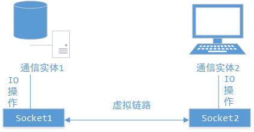

# 疯狂 Java 讲义笔记

## 1. Java 语言描述

所有程序部分必须放在类定义里；
如果某个类能被解释器直接解释执行，则这个类必须包含 main 方法

### 1.1 Java 源文件命名规则
- Java 源代码里定义了一个 public 类， 则该源文件名必须与该 public 类名相同
- 一个 Java 源文件最多只能定义一个 public 类名相同
- Java 中的关键字全部是小写
- 路径不要包含空格

## 2. 理解面向对象
面向对象的程序单位是类（面向过程的程序单位是函数）<br>
面向对象基本特征：封装、继承、多态<br>
- 封装：将对象的实现细节隐藏，然后通过一些公用方法暴露该对象的功能
- 继承：子类获得父类的属性和方法
- 多态：子类对象可直接赋值给父类变量，但运行时依然表现出子类的行为特征

### 2.1 类之间的三种基本关系
- 关联（包括聚合、组合）
- 泛化（与继承同一个概念）
- 依赖（一个类的改动会导致另一个类的改动）：
    - 改动的类将消息发给另一个类
    - 改动的类以另一个类作为数据部分
    - 改动的类以另一个类作为操作参数

## 3. 数据类型
### 3.1 注释
分为：单行注释、多行注释、文档注释  
文档注释以/**开始，*/结尾，JDK可直接文档注释提取成API文档  
常用的javadoc标记：
- @autheor  作者
- @version  版本
- @deprecated   不推荐使用的方法
- @param    方法参数说明
- @return   方法返回值说明
- @see  参见，用于交叉引用
- @exception    抛出异常类型
- @throws   抛出的异常
### 3.2 数据类型分类
- 基本类型
- 引用类型：包括类、接口和数组类型

> 空引用(null)只能被转换成引用类型，不能转换成基本类型，不要把一个 null 值赋给基本数据类型的变量

#### 3.2.1 基本数据类型
- boolean类型：boolean(1位)
- 数值类型
    - 整数类型：byte(1字节)、short(2字节)、int(4字节)、long(8字节)
    - 浮点类型：float(4字节)、double(8字节)
    - 字符类型:char(2字节)

#### 3.2.2 基本数据类型转换

#### 3.2.3 表达式类型的自动提升
当一个算术表达式包含多个基本类型的值时，整个算术表达式数据类型将发生自动提升
- 所有byte、short和char提升为int
- 整个算术表达式的数据类型自动提升到与表达式中最高等级操作数同样的类型
````
//输出 Hello!a7
System.out.println("Hello!" + 'a' + 7);
//输出104Hello!
System.out.println('a'+ 7 + "Hello!");
````
### 3.3 直接量
直接量：通过源代码直接指定的值  
能指定直接量的通常只有3种类型：基本类型、字符串和null
> String类型直接量：用一个双引号括起来所有的字符序列

> String类型直接量不能赋给其他类型的变量；null类型直接量可以赋给任何引用类型变量包括String；boolean类型直接量只赋给boolean类型变量

当程序第一次使用某个字符串直接量时，Java会使用常量池来缓存该字符串直接量，如果程序后面需要用的该直接量，会使用常量池中的字符串常量
> String类是一个典型的不可变类，String对象创建出来就不可被改变

### 3.4 运算符
#### 3.4.1 位运算符
- &     按位与
- |     按位或
- ~     按位非
- ^     按位异或
- <<    左移运算符
- \>>    右移运算符
- \>>> 无符号右移运算符

左移运算符是将运算数的二进制码整体左移指定位数，左移后右边空出来的位以0填充  
右移运算符分为\>> 和\>>> 。对于\>>，把第一个操作数二进制码右移指定位数，左边以原来的符号位填充；对于\>>>是无符号右移运算符，把第一个操作数的二进制码右移指定位数，左边空出来的位以0填充

> \>> 、\>>> 和 << 并不适合所有数值类型，只适合byte、short、char、int和long。
> - 对于低于int类型的，先自动转成int再移位
> - int 类型整数位a>>b,若b>32，先对32取余再位移；而a>>32和a相同
> - 对于long类型 a>>b，若b>64,先对64取余再位移

#### 3.4.2 比较运算符
基本类变量、值不能和引用类型变量、值使用==进行比较  
boolean类型变量、值不能和其他任意类型比较  
若两引用类型没有继承关系，则它们也不能用==比较

## 4. 流程控制
保留 if, for 等执行体的花括弧，增加可读性，减少犯错
### 4.1 条件
switch语句后的expression数据类型只能是byte、short、char、int、String和枚举类型

### 4.2 循环
多层循环中，break 语句不仅可以结束其所在的循环，还可以直接结束外层循环。<br>
此时要使用标签，Java 中的标签是一个紧跟着英文冒号(:)的标识符, 放在循环语句前有作用
<pre><code>
public static void main(String[] args) {
    //外层循环。outer作为标识符
    outer:
    for(int i = 0; i < 5; i++) {
        //内层循环
        for(int j = 0; j < 3; j++) {
            System.out.println("========");
            if(j == 1) {
                break outer;
            }
        }
    }
}
</code></pre>

continue 后也可以紧跟一个标签，用于直接跳过标签所标识循环的当次循环的剩下语句，重新开始下一次循环：
<pre><code>
public static void main(String[] args) {
    outer:
    for(int i = 0; i < 5; i++) {
        for(int j = 0; j < 3; j++) {
            System.out.println("i:" + i + " j:" + j);
        }
    }
}
</code></pre>

return 的功能是结束一个方法。一旦在循环体内执行到 return 语句时，就会结束该方法
<pre><code>
public class ReturnTest {
    public static void main(String[] args) {
        for(int i = 0; i < 3; i++) {
            System.out.println("i: " + i);
            if(i == 1) {
                return ;
            }
            System.out.println("return 后的语句");
        }
    }
}
</code></pre>

return直接结束整个方法，不管return处于多少层循环内

## 5. 数组
Arrays 类处于 java.util 包下<br>
一个数组中只能存储一种数据类型的数据（可以是子类）<br>
数组也是一种数据类型，本身是一种引用类型<br>
<pre><code>
type[] arrayName;
type arrayName[];//不推荐使用
</pre></code>
都可以，推荐第一种方式

### 5.1 数组初始化
- 静态初始化：显示指定初始值，系统决定长度
- 动态初始化：只指定长度，系统为元素分配初始值

系统按如下规则分配初始值：
- 基本类型(整数类型byte、short、int和long)：0
- 基本类型(float、double):0.0
- 基本类型(char):'\u0000'
- 基本类型(boolean):false
- 引用类型:null

### 5.2 数组与内存

实际的数组对象被存储在堆(heap)内存中；<br>
如果引用该数组对象的数组引用变量是一个局部变量，那么它被存储在栈(stack)内存中;<br>
从数组底层的运行机制上来看，没有多维数组
> Java 中数组类型是引用类型，数组变量其实是一个引用，这个引用指向真实数组内存。如果数组元素的引用再次指向真实数组内存，这种情形看上去很像多维数组。

如果堆内存中数组不再有任何引用变量指向自己，则这个数组变成垃圾，等待被垃圾回收

> 注意 length, length(), size()
>- length属性是针对数组说的
>- length()方法是针对字符串String说的
>- size()方法是针对泛型集合说的,如果想看这个泛型有多少个元素,就调用此方法来查看

### 5.3 foreach 循环
<pre><code>
for(type variableName : array | collection) {
    // variableName 自动迭代每个元素
}
</code></pre>

## 6. 面向对象
类定义 包含三种成员：构造器、Field 和方法<br>

Java 类名：每个单词首字母大写，单词之间无分隔符<br>
Field 名：第一个单词字母小写，后面每个单词首字母大写<br>
方法名：建议以动词开头，同 Field 名<br>

static 修饰的成员不能访问没有 static 修饰的成员<br>
构造器用于构造类的实例，通过 new 关键字来调用构造器<br>
修饰方法的修饰符：abstract 和 final 最多只能二选一，(final 可与 static 组合)
static 修饰的成员表明它属于这个类本身，而不属于该类的单个实例

### 6.1 引用
类也是一种引用数据类型<br>
栈内存里的引用变量并未对真正存储对象的 Field 数据，对象的 Field 数据实际存放在堆内存里；<br>
而引用变量只是指向该堆内存里的对象;<br>
当一个对象被创建成功以后，这个对象将保存在堆内存中<br>
- Java 不允许直接访问堆内存中的对象，只能通过该对象的引用操作该对象。
- 堆内存里的对象可以有多个引用，即多个引用变量指向同一个对象

### 6.2 this 引用
this 作为对象的默认引用有2种情形：
- 构造器中引用该构造器正在初始化的对象
- 在方法中引用调用该方法的对象

> 当this出现在某个方法体中，它的类型是确定的，只能是当前类；只有当这个方法被调用时，才能确定this所代表的对象，谁调用这个方法，this就代表谁

this 关键字最大的作用：让类种的一个方法访问该类里的另一个方法或 Field<br>
Java 允许对象的一个成员直接调用另一个成员，可以省略 this 前缀<br>
static 修饰的方法不能使用 this 引用

- 不要使用对象去调用 static 修饰的 Field、方法，而是应该使用类去调用 static 修饰的 Field、方法
- 如果方法里有个局部变量和 Field 同名，但程序又需要在该方法里访问这个被覆盖的 Field，则必须使用 this 前缀 

### 6.3 方法
方法不能独立存在，方法必须属于类或对象<br>
方法被 static 修饰，则这个方法属于这个类，否则属于这个类的实例<br>
Java 里方法的参数传递方式只有一种：值传递（将实际参数值的副本传入方法内，参数本身不受影响）<br>
Java 允许定义形参个数可变的参数，在最后一个形参后增加"..."，表明该形参可接收多个参数值，被当成数组传入<br>
一个方法最多只能有一个长度可变的形参

<pre><code>
public static void test(int a, String... books) {
    for(String tmp : books) {
        System.out.println(tmp);
    }
}
</code></pre>

Java 里不能使用方法返回值类型作为区分方法重载的依据<br>
不推荐重载形参长度可变的方法

### 6.4 成员变量和局部变量
<table>
    <tr>
        <th rowspan = 6>所有变量</th>
        <th rowspan = 2>成员变量</th>
        <th>实例 Field（不以 static 修饰）</th>
    </tr>
    <tr>
        <th>类 Field(以 static 修饰)</th>
    </tr>
    <tr>
        <th rowspan = 4>局部变量</th>
    </tr>
    <tr>
        <th>形参（方法签名中定义的变量）</th>
    </tr>
    <tr>
        <th>方法局部变量（在方法内定义）</th>
    </tr>
    <tr>
        <th>代码块局部变量（在代码块内定义）</th>
    </tr>
</table>

类 Field 的作用域比 实例 Field 更大<br>
如果通过一个实例修改类 Field 的值，会导致该类的其他实例来访问这个类 Field 时也获得被修改的值<br>

局部变量分三种：
- 形参：在定义方法签名时定义的变量，作用域在整个方法有效
- 方法局部变量： 在方法体内定义的局部变量，从定义该变量的地方生效，方法结束时消失
- 代码块局部变量：在代码块中定义，从定义地方生效，代码块结束失效

尽量避免局部变量和成员变量同名<br>
局部变量不属于任何类或实例，它总保存在所在方法的栈内存中
> 如果局部变量是基本类型，则直接把变量值保存在对应内存中；<br>
> 如果是引用类型，则变量里存放的是地址

变量的使用规则：
- 用于描述类或对象的固有信息，使用成员变量
- 某个类中需要以一个变量来保存该类或实例运行时的状态信息，使用成员变量
- 某个信息需要在某个类的多个方法之间共享，使用成员变量

### 6.5 隐藏和封装
控制级别由小到大：
<pre>privte -> default -> protected -> public</pre>


|-|private|default|protected|public|
|-|-|-|-|-|
|同一个类中|√|√|√|√|
|同一个包中||√|√|√|
|子类中|||√|√|
|全局范围内||||√|


控制符基本原则：
- 绝大部分 Field 都应该用 private 修饰，只有一些 static 修饰的、类似全局变量的 Field 才考虑 public。除此之外，工具方法（只用于辅助实现该类的其他方法）也应该使用 private 修饰
- 某个类用做其他类的父类，包含大部分方法仅希望被子类重写，应使用 protected 修饰
- 希望暴露给其他类自由调用的方法使用 public 修饰

### 6.6 package, import 和 import static
Java 允许将一组功能相关的类放在同一 package 下，组成逻辑上的类库单元<br>
一旦使用了 package 语句，意味着该文件定义的所有类都属于这个包<br>
同一个包中的类不必位于相同目录下<br>
建议把 Java 源文件放在与包名一致的目录下<br>
package 语句必须作为源文件的**第一条非注释语句**，一个源文件只能指定一个包<br>

import 可以向某个 Java 文件中导入指定包层次下某个类或全部类<br>
import 语句中的 "*" 只能代表类不能代表包

### 6.7 Java 常用包
- java.lang: 核心类，无需使用 import, 自动导入
- java.util: 大量工具和集合框架
- java.net: 网络编程
- java.collection: Java 输入/输出
- java.text: Java 格式化 
- java.sql: JDBC 数据库编程


### 6.8 构造器
使用 this 调用另一个重载的构造器只能在构造器中使用，而且必须作为构造器执行体第一行语句

### 6.9 继承
Java 的子类不能获得父类的构造器<br>
java.lang.Object 类是所有类的父类<br>
方法重写重写遵循"两同两小一大"：<br>
- 方法名、形参列表相同
- 子类方法返回值类型比父类更小或相等，子类方法声明抛出异常类应比父类更小或相等
- 子类方法访问权限应比父类更大或相等

可用 super 调用被覆盖的父类实例方法和 Field<br>
super 也不能出现在 static 修饰的方法中 <br>
在子类构造器中调用父类构造器使用 super 调用来完成(而同一个类中用 this 调用重载的构造器)<br>

overload 重载：同一类的多个同名方法之间<br>
override 重写：子类父类同名方法之间

### 6.10 多态
Java 引用变量有2个类型：编译时类型和运行时类型，如果他们不一致，就可能出现多态<br>
````
BasicClass x = new SubClass();
//输出"son speak."
x.speak();
//报错，找不到
x.jump();
````
````
class BasicClass {
    public void speak() {
        System.out.println("father speak.");
    }
}
class SubClass extends BasicClass {
    public void speak() {
        System.out.println("son speak.");
    }
    public void jump() {
        System.out.println("son jump.");
    }
}
````


Java 允许把一个子类对象直接赋值给一个父类引用变量，成为向上转型<br>
上例中，编译类型是 BaseClass，运行时类型是 SubClass<br>
而 **Field 不具备多态性**，调用时输出的是 BaseClass 中的 Field

引用变量强制类型转换：
- 基本类型间的转换只能在数值类型之间，数值和布尔型之间不能转换
- 引用类型之间的转换只能在具有继承关系的两个类型之间。如果把一个父类实例转换成子类类型，则这个对象必须实际上时子类实例

instanceof 作用：在进行强制类型转换之前，先判断前一个对象是否是后一个类的实例，是否成功转换

### 6.11 继承与组合
设计父类通常遵循：
- 尽量隐藏父类的内部数据
- 不要让子类随意访问、修改父类的方法
- 尽量不要在父类构造器中调用将被子类重写的方法

继承&组合：
- 继承：将一个较为抽象的类改造成嫩适用于某些特定需求的类 （is-a）
- 组合：如果两个类之间有明确的整体、部分关系(has-a)

### 初始化块
初始化块只在创建 Java 对象时隐式执行，而且在执行构造器之前执行<br>
初始化块是构造器的补充<br>
使用 static 修饰的初始化块是类初始化块
````
class Father {
    static{
        System.out.println("父类静态初始化块");
    }
    {
        System.out.println("父类普通初始化块");
    }
    public Father() {
        System.out.println("父类构造器");
    }
}

class Son extends Father {
    static{
        System.out.println("子类静态初始化块");
    }
    {
        System.out.println("子类普通初始化块");
    }
    public Son() {
        super();
        System.out.println("子类构造器");
    }
}

public class Test {
    public static void main(String[] args) {
        new Son();
    }
}
/**
* 输出顺序：
* 父类静态初始化块
* 子类静态初始化块
* 父类普通初始化块
* 父类构造器
* 子类普通初始化块
* 子类构造器
*/
````
### 6.12 包装类
基本数据类型 -> 包装类<br>


8个包装类除了 Character 外，可通过传入一个字符串参数来构建包装类对象
<pre><code>
Float fl = new Float("4.56");
</code></pre>

如果希望获得包装类对象中包装的基本类型变量，则可以使用包装类提供的 xxxValue()实例方法<br>


### 6.13 处理对象

toString() 方法是 Object 类里的一个实例方法，所有 Java 对象都可以和字符串进行连接计算<br>
toString() 方法返回该对象实现类的 "类名 + @ + hashCode"<br>

- == 如果两个变量是基本类型，只要值相等，就返回 true
- == 如果两个引用类型变量，它们必须指向同一对象，才返回 true
- equals 是 Object 类提供的实例方法，与 == 没有区别
- String 重写了 equals() 方法：只要两个字符串包含字符序列相同，通过 equals() 比较将返回 true

正确重写 equals 方法应满足：
- 自反性：对任意 x, x.equals(x)一定返回 true
- 对称性：对任意 x 和 y, 如果 y.equals(x) 返回 true, 则 x.equals(y) 也返回 true
- 传递性：对任意x,y,z, 如果 x.equals(y) 返回ture, y.equals(z) 返回 true, 则 x.equals(z) 一定返回 true
- 一致性：对任意 x 和 y, 如果对象中用于等价比较的信息没有改变，那么返回结果保持一致

### 6.14 类成员
单例类： 一个类始终只能创建一个实例<br>
- 把该类构造器使用 private 修饰<br>
- 一旦隐藏构造器，就需要提供一个 public 方法作为该类的访问点，用于创建类的对象，且该方法必须是 static 修饰<br>
- 该类还必须缓存已创建的对象

<pre><code>
class Singleton {
    private static Singleton instance;
    private Singleton() {

    }
    public static Singleton getInstance() {
        if(instance == null) {
            instance = new Singleton();
        }
        return instance;
    }
}
</code></pre>

### 6.15 final 修饰符

final 关键字修饰的类、方法和变量不可改变<br>
final Field
- 类 Field：必须在静态初始化过程中或声明该 Field 时指定初始值
- 实例 Field：必须在非静态初始化块、声明该 Field 或构造器中指定初始值
- final 成员变量必须显式初始化
- final 修饰局部变量可在定义时不指定默认值
- 使用 final 修饰引用类型变量不能被重新赋值，但可以改变引用类型变量所引用对象的内容

final 方法：
- 不可被重写，如果不希望子类重写父类方法，则可用 final
- Object 类中的 getClass() 方法就是 final 方法

final 类：
- 不能有子类

不可变类：创建实例后，实例的 Field 关键字修饰的类、方法和变量不可改变<br>
<pre><code>
Double d = new Double(6.5);
</code></pre>

创建不可变类的规则：
- 使用 private 和 final 修饰符来修饰该类的 Field
- 提供带参数构造器，用于根据传入参数来初始化类里的 Field
- 仅为该类的 Field 提供 getter 方法，不提供 setter方法
- 若有必要，重写 Object 类的 hashCode 和 equals 方法


### 6.16 抽象类
抽象方法 & 抽象类 规则：
- 必须使用 abstract 修饰，抽象方法不能有方法体
- 抽象类不能被实例化
- 抽象类可包含 Field, 方法（普通和抽象均可），构造器，初始化块，内部类，枚举类
- 含抽象方法的类只能被定义为抽象类

<pre><code>
public abstract void test(); //抽象方法(记得带分号)
public void test() {} //是普通方法
</code></pre>

- abstract 类只能被继承
- abstract 方法只能被重写
- final 和 abstract 永远不能同时使用
- static 和 abstract 不能同时修饰某个方法
- private 和 abstract 不能同时修饰某个方法

使用模板模式的简单规则：
- 抽象父类可只定义需要使用的某些方法，把不能实现的部分抽象成抽象方法，留给子类去实现
- 父类可能包含需要调用的其他系列方法的方法，这些方法既可以父类实现，也可以子类实现

### 6.17 接口
接口里通常定义一组公用方法<br>
interface 语法：
- 修饰符可 public 可省略，省略后只有相同包下才可访问
- 接口名应与类名采用相同的命名规则，每个单词首字母大写
- 一个接口可以有多个直接父接口，但接口只能继承接口，不能继承类
- interface 里不能包含构造器和初始化块
- interface 内的 Field 只能是常量，方法只能是抽象方法
- interface 内的所有成员均是 public 权限
- interface 内没有静态方法
- 一个 Java 文件内最多只能有一个 public 接口

接口的实现：
- 一个类实现了接口后，必须完全实现这个接口里定义的全部抽象方法
- 实现接口方法时，必须使用 public 修饰符

接口和抽象类：
- 都不能被实例化
- 都可以包含抽象方法，实现接口或继承抽象类都必须实现这些抽象方法
- 接口里只能包含抽象方法，抽象类可包含普通方法
- 接口里不能自定义静态方法，抽象类可定义静态方法
- 接口只能定义静态 Field， 抽象类可定义普通 Field 和 静态 Field
- 接口不包含构造器；抽象类可包含构造器
- 接口不包含初始化块，抽象类可以
- 一个类最多一个直接父类，但可直接实现多个接口

> 接口不能实现接口，只能**继承**，并且可以**多重继承**
````
public interface if1 extends if2, if3 {

}
````

### 6.18 内部类
内部类作用：
- 更好的封装，不允许同一个包中其他类访问
- 内部成员可直接访问外部类私有数据
- 匿名内部类适合创建仅需要使用一次的类

内部类可用 private 修饰符来修饰该类<br>
成员内部类编译后的 class 文件形式：OuterClass$InnerClass.class<br>
如果外部类成员变量、内部类成员变量与内部类方法局部变量同名，可通过 this、 OuterLass.this 作为区分<br>
外部类的静态方法、静态代码块不能访问非静态内部类<br>
Java 不允许在非静态内部类里定义静态成员<br>
静态内部类是外部类的一个静态成员，因此外部类的静态方法、静态初始化块中可使用静态内部类来定义变量、创建对象<br>
外部类不能直接访问静态内部类的成员，但可使用静态内部类类名作为调用者来访问静态内部类成员<br>
 > 接口内部类只能是静态内部类（但意义不大），默认使用 public static 修饰

#### 内部类的用法
1. 在外部类中使用内部类：和使用普通类没有太大区别
2. 在外部类以外使用非晶态内部类：内部类不能用 private 修饰；创建内部类对象前必须先创建外部类对象

#### 匿名内部类
适合创建只需要使用一次的类<br>
定义：
<pre><code>
new 父类构造器(实参列表)|实现接口() {
    //类体部分
}
</code></pre>

匿名内部类规则：
- 必须继承一个父类或实现一个接口
- 不能是抽象类
- 不能定义构造器，因为没有类名

> 当通过实现接口来创建匿名内部类时，匿名内部类不能显示创建构造器，因此匿名内部类只有一个隐式的无参构造器，故new 接口名后的括号里不能传入参数值

#### 闭包和回调
闭包：一种被调用的对象，保存了创建它的作用域信息<br>
把非静态内部类当成面向对象领域的闭包<br>

回调：某个方法一旦获得了内部类对象的引用后，就可以在合适的时候反过来去调用外部类实例的方法

例：
<pre><code>
interface Teachable {
    void work();
}
public class Programmer {
    private String name;
    public Programmer() {

    }
    public Programmer(String name) {
        this.name = name;
    }

    public void work() {
        System.out.println(name + "coding...");
    }
}

public class TeachableProgrammer extends Programmer {
    public TeachableProgrammer() {

    }
    public TeachableProgrammer(String name) {
        super(name);
    }
    private void teach() {
        System.out.println("Teacher's teaching on the stage..");
    }
    private class Closure implements Teachable {
        public void work() {
            teach();
        }
    }
    //返回一个非静态内部类引用，允许外部类通过该非静态内部类引用来回调外部类的方法
    public Teachable getCallbackReference() {
        return new Closure();
    }

}
</code></pre>

### 枚举类
枚举类： 实例有限而且固定的类<br>
enum 关键字定义枚举类

- 一个 Java 源文件最多只能定义一个 public 的枚举类
- enum 定义的枚举类继承 java.lang.Enum，而非 Object
- 枚举类构造器只能使用 private 修饰符
- 枚举类所有实例必须在枚举类第一行显示列出
- 枚举类也可以定义 Field、方法
- 一旦枚举类显示定义了构造器，列出枚举值就必须传入参数
- 枚举类实现接口，可以让每个枚举类分别来实现方法，提供不同的实现方式
- 当创建枚举值时，实际上创建了枚举类的匿名子类实例

<pre><code>
public enum SeasonEnum {
    SPRING,SUMMER,FALL,WINTER;
}
</code></pre>

java.lang.Enum 包含的方法
- int compareTo(E o): 指定枚举对象比较顺序，若该枚举对象位于指定枚举对象之后，返回正整数；在之前返回负整数；否则返回零
- int ordinal(): 返回枚举值在枚举类中的索引值（在枚举声明中的位置）
- String toString(): 返回枚举常量名称

### 对象与垃圾回收
- 只负责回收堆内存中的对象，不会回收任何物理资源
- 程序无法精确控制垃圾回收运行

#### 对象在内存中的状态
- 可达状态：对象被创建后，有一个以上引用
- 可恢复状态：某个对象不再有任何引用变量引用它
- 不可达状态：对象与所有引用变量的关联被切断，且系统调用finalize()方法后依然没有使该对象变成可达状态


#### 强制垃圾回收
- System.gc()
- Runtime.getRuntime().gc()
只是通知系统进行垃圾回收，但系统是否进行垃圾回收依然不确定

#### finalize()方法4个特点：
- 永远不要主动调用
- 该方法何时被调用，是否被调用具有不确定性
- JVM 执行客恢复对象的finalize()方法时，可能使其重变成可达
- 不会报告异常

#### 对象的强、软、弱、虚引用
1. 强引用：最常见，通过引用变量来操作实际对象，处于可达时不被回收
2. 软引用：通过SoftReference实现，当对象只有软引用时有可能被强制回收；当内存空间足够，不会被回收，空间不足时系统可能回收它
3. 弱引用：和软引用很像，但垃圾回收机制运行时，总会被回收
4. 虚引用：完全类似于没有引用，用于跟踪对象被垃圾回收的状态，必须和引用队列(ReferenceQueue)联合使用

### JAR 包
全称 Java Archive File Java 档案文件


## 7. 与运行环境交互
### 7.1 与用户互动
main 方法由 JVM 调用，args形参由 JVM 赋值<br>

Scanner 类是一个基于正则表达式的文本扫描器，可以从文件、输入流、字符串中解析出基于基本类型值的字符串值
- hasNextXxx():是否还有下一个输入项，其中Xxx 可以是Int\Long等基本数据类型
- nxtXxx():获取下一个输入项
- boolean hasNextLine():返回输入源中是否还有下一行
- String nextLine():返回输入源中下一行的字符串
- 创建Scanner 对象时传入一个File对象作为参数，就可以让Scanner读取该文件内容
<pre><code>
Scanner sc = new Scanner(new File("ScannerFileTest.java"));
while(sc.hasNextLine()) {
    System.out.println(sc.nextLine());
}
</code></pre>

### 7.2 系统相关
#### System 类
- 程序不能创建System 类对象
- 提供标准输入输出和错误输出的类 Field, 并提供静态方法访问环境变量、系统属性
- 提供 identityHashCode(Object x) 方法，返回指定对象的精确 hashCode 值（根据对象的地址计算得到）

#### Runtime 类
- 代表Java 程序的运行时环境，程序不能自己创建 Runtime 实例
- 可访问 JVM 相关信息

### 7.3 常用类
#### Object 类
- 是所有类的父类，所有类默认继承 Object
- boolean equals(Obkect obj) 和"=="基本没有区别，存在的意义在于被重写
- protected void finalize() 垃圾回收调用
- Class<?> getClass() 返回运行时类
- int hashCode() 返回对象hashCode值
- String toString() 返回 “运行时类名@十六进制hashCode值”
- protected clone()方法,帮助其他对象实现自我克隆，即获得当前对象副本，且二者完全隔离；是一种浅克隆，只克隆该对象的所有Field值，不会对引用类型的Field值所引用对象进行克隆

#### String、StringBuffer
- String 一旦一个 String 对象被创建以后字符序列不可变
- StringBuffer 对象代表一个字符序列可变的字符串，通过该类提供的append(),insert(),reverse(),setCharAt(),setLength()等方法可改变这个字符串
- StringBuilder基本类似于StringBuffer，但 StringBuffer 是线程安全的
- StringBuffer 和 StringBuilder 有两个属性：length 和 capacity，与 String 对象不同的是，length 可变，capacity 通常比 length 大，且无需关心

因为 String 是不可变的，在执行连接字符串操作时，会额外产生很多临时变量，使用 StringBuffer 或 StringBuilder 就可以避免

#### Math 类
- 两个静态 Field:PI, E
- 工具类，无法创建 Math 对象

#### ThreadLocalRandom 与 Random
- Random 类生成伪随机数，如果这个类的两个实例用同一个种子创建，对它们同样顺序调用，会产生相同数字序列
- ThreadLocalRandom 类可保证系统更好的线程安全性，提供静态 current() 方法获取 ThreadLocalRandom 对象，之后可调用各种 nextXxx() 方法
- 为避免产生相同数字序列，通常已当前时间作为 Random 对象的种子
<pre><code>
Random rand = new Random(System.currentTimeMills());
</code></pre>

#### BigDecimal 类
为了精确表示、计算浮点数<br>
通常建议有限使用基于 String 的构造器<br>
若必须使用 double 作为 BigDecimal 构造器参数，应通过 BigDecimal.valueOf(double value) 静态方法来创建 BigDecimal 对象

### 7.4 处理日期的类
#### Date 类
不推荐使用

#### Calendar 类
抽象类，用于表示日历<br>
GregorianCalendar：公历，Calendar 类的子类

### 7.5 正则表达式
正则表达式是一个用于匹配字符串的模板<br>
通配符是可以匹配多个字符的特殊字符<br>
Pattern 对象是正则表达式编译后在内存中的表示形式，然后利用该 Pattern 对象创建对应的 Matcher对象<br>
Matcher 类的 find() 和 group()方法可从目标字符串中依次取出特点子串<br>

> String 类的 equals(), startsWith()都与字符串比较，而 Matcher 的 matches() 和 lookingAt() 是与正则表达式匹配

## 8. Java 集合
### 8.1 集合概述
所有集合类都位于 java.util 包下<br>
集合里只能保存对象（引用）而不能保存基本数据类型<br>
主要由两个接口派生出来：Collection 和 Map<br>


- Set 和 List 接口分别代表了无序集合和有序集合
- Queue 是 Java 提供的队列实现，有点类似 List
- 所有的 Map 实现类用于保存具有映射关系的数据
- Set 里的元素不能重复
- List可以记住每次添加元素的顺序，长度可变
- Map 的每项数据都由两个值组成

### 8.2 Collection 和 Iterator 接口
Collection 接口：List, Set 和 Queue 的父接口<br>
所有的 Collection 都重写了 toString()方法，可以一次性输出集合中的所有元素<br>
Iterator 用于遍历 Collection 集合中的元素<br>
Iterator 进行迭代时，是把集合元素的值传给了迭代变量，修改迭代变量的值对集合元素本身无影响<br>
foreach 循环迭代集合元素时，该集合也不能被改变

### 8.3 Set 集合
Set 集合不允许包含相同的元素<br>
判断两个元素相同是根据 equals 方法<br>
#### HashSet
HashSet 按 Hash 算法来存储集合中的元素
- 不能保证元素排列顺序
- 不同步，多线程同时修改HashSet时，必须通过代码来保证同步
- 元素值可以是 null
- 把一个对象放入 HashSet 中，如需重写 equals() 方法，也要重写 hashCode()方法，其规则是：如果两个对象通过 equals() 方法返回 true，这两个对象的 hashCode 值也应相同

> Hash 算法的功能：保证通过一个对象快速查找到另一个对象，价值在于速度<br>
> hash 算法可以直接根据元素值计算出该元素的存储位置<br>
> 与数组不同的是，数组定长且索引连续；hash根据元素 hashcode 值来计算索引

重写 hashCode() 的基本规则：
- 同一对象多次调用 hashCode()应返回相同值
- 两对象通过 equals()返回true，则 hashCode()返回相同
- 对象中用作 equals() 比较标准的 Field，都应计算 hashCode()值
一般规则
1. 把对象内每个有意义的 Field计算出一个 int 类型的 hashCode值
2. 第1步多个 hashCode值组合计算出一个 hashCode 值返回

#### LinkedHashSet 类
使用链表维护元素的次序，遍历时按元素插入顺序访问<br>
性能略低于 HashSet<br>
依然不允许集合元素重复

#### TreeSet 类
- 是 SortedSet 接口实现类，可确保集合元素处于排序状态
- 所以增加了访问第一个、前一个、后一个、最后一个元素的方法
- 根据元素实际值的大小来排序
- 采用红黑树数据结构来存储集合元素
- 支持自然排序（默认）和定制排序

1. 自然排序<br>
TreeSet 调用集合元素的 compareTo(Object obj) 方法比较两元素大小，将集合元素按升序排列<br>
Java 中的 Comparable 接口提供了一个 compareTo(Object obj)方法，实现该接口的类必须实现此方法<br>
向 TreeSet 中添加的应该是同一个类的对象，否则引发异常<br>
TreeSet 判断两元素相等的唯一标准：compareTo方法返回值是否是0<br>
> 当可变对象的Field被修改时，TreeSet 处理这些对象将非常复杂，且容易出错,推荐 HashSet 和 TreeSet 只放入不可变对象

2. 定制排序<br>
如需实现定制排序，需要在创建 TreeSet 集合时通过 Comparable 接口帮助

#### EnumSet 类
- 专为枚举类设计的集合类
- 所有元素都必须是指定枚举类型的枚举值
- 元素有序，以枚举值排序
- 以向量形式存储，内存占用小，运行效率高
- 不允许加入 null 元素
- 无可调用的构造器，需通过 static 方法创建 EnumSet 对象

#### 各 Set 性能分析
- HashSet 性能总比 TreeSet 好
- 只有当需要保持排序的 Set 时，才使用 TreeSet
- HashSet 的子类 LinkedHashSet 比 HashSet 略慢，但遍历更快
- EnumSet 性能最好，但只能保存同一个枚举类的枚举值作为集合元素
- 线程都是不安全的

### 8.4 List 集合
List 代表一个元素有序、可重复的集合

#### List 接口 和 ListIterator 接口
相比于 Set， List 增加了根据索引来插入、替换和删除集合元素的方法<br>
List 额外提供了一个 liseIterator()方法，返回 ListIterator 对象，提供前向迭代，还可通过add方法向List集合中添加元素<br>

#### ArrayList 和 Vector
ArrayList 和 Vector 都基于数组实现 List 类，所以 ArrayList 和 Vector 封装了一个动态的、允许再分配的 Object[] 数组<br>
ArrayList 或 Vector 对象使用 initialCapacity 设置数组长度，当元素超出长度时，initialCapacity 自动增加
- ArrayList 和 Vector 显著区别： ArrayList 线程不安全，Vector 是线程安全的，Vector性能差
- Vetor 提供了一个 Stack 子类， 用于模拟“栈”这种数据结构

### 8.5 Queue 集合
Queue 用于模拟队列，通常队列不允许随机访问<br>

#### PriorityQueue 实现类
PriorityQueue 是一个比较标准的队列实现类，但是按队列元素大小进行重排，而非按加入顺序<br>
取出队列元素时先取出最小的元素<br>
不允许插入 null 元素<br>
采用自然排序和定制排序<br>

#### Deque 接口与 ArrayDeque 实现类
Deque 是 Queue 的子接口，代表一个双端队列，允许从两端操作队列元素<br>
Deque 提供了一个经典实现类： ArrayDeque，基于数组实现，创建对象时可指定一 numElements 参数，用于指定Object[] 数组长度<br>

#### LinkedList 实现类
LinkedList 可以根据索引来随机访问集合中的元素<br>
LinkedList 可作为双端队列、栈使用

#### 各种线性表的性能分析

|  | 实现机制 | 随机访问排名 | 迭代操作排名 | 插入操作排名 | 删除操作排名 |
| ------------- |:-------------:| :-----:| :-----:| :-----:| :-----:|
| 数组 | 连续内存区保存元素 | 1 | 不支持 | 不支持 | 不支持 |
| ArrayList/ArrayDeque | 以数组保存元素 | 2 | 2 | 2 | 2 |
| Vector | 以数组保存元素 | 3 | 3 | 3 | 3 |
| LinkedList | 以链表保存元素 | 4 | 1 | 1 | 1 |

### 8.6 Map
- Map 用于保存具有映射关系的数据
- 一组值保存key，另一组保存 value，都可以是引用变量
- key 不允许重复
- key 和 value 间存在单向一对一关系
- Map 里的所有 key 构成 set 集合

> map 与 set 关系密切，Map 提供一个 Entry 内部类来封装 key-value 对，计算 Entry 存储时只考虑 Entry 封装的 key

#### HashMap 和 Hasgtable 实现类
- 都是 map 接口的经典实现，关系类比 ArrayList 与 Vector
- 两点区别：Hashtable 是线程安全的，HashMap 性能高；Hashtable 不允许使用 null 作为 key 和 value，HashMap 可以
- HashMap 和 Hashtable 均不保证元素顺序
- 尽量不要在程序中修改 key，或不要使用可变对象作为 key

#### LinkedHashMap 实现类
- LinkedHashMap 使用双向链表来维护 key-value 对的次序（其实是key的次序）  
- 迭代顺序与 key-value 对的插入次序保持一致，性能略低于 HashMap

#### SortedMap 接口和 TreeMap 实现类
Map 接口派生出一个 SortedMap 接口和一个 TreeMap 实现类
- TreeMap 是一个**红黑树**数据结构, 每个 key-value 对即作为红黑树的一个节点
- TreeMap 存储 key-value 对时，需根据 key 对节点进行排序
- 采用2种排序方式
  - 自然排序： 所有 key 实现 Comparable 接口，且所有 key 都是同一类的对象，否则抛出 ClassCastexception 异常
  - 定制排序： 不要求实现 Comparable 接口，创建 TreeMap 时传入一个 Comparator 对象，负责对 TreeMap 中所有 key 进行排序；需要重写 equals() 和 compareTo() 方法

#### WeakHashMap 实现类
WeakHashMap 与 HashMap 用法相似，区别在于：
- 只要该 HashMap 对象不被摧毁， HashMap 所有 key 所引用的对象就不会被垃圾回收， HashMap 也不自动删除这些 key 对应的 key-value 对
- WeakHashMap 的 key 只保留了对实际对象的弱引用，意味着如果 WeakHashMap 对象的 key 所引对象没有被其他强引用变量所引用，则这些 key 所引用的对象可能被垃圾回收， WeakHashMap 也可能自动删除这些 key-value 对

> 如果需要使用 WeakHashMap 的 key 来保留对象的弱引用，则不要让该 key 所引用的对象具有任何强引用

#### IdentityHashMap 实现类
- IdentityHashMap 类在处理两个 key 严格相等 （key1 == key2） 时， 才认为两个 key 相等；
- 普通 HashMap 类则通过 equals() 方法判定

> IdentityHashMap 在实现 Map 接口时，有意违反 Map 通常规范

#### EnumMap 实现类
- EnumMap 中所有 key 都必须时单个枚举类的枚举值
- 创建 EnumMap 时必须显式或隐式指定它对应的枚举类
- 在内部以数组形式保存
- 根据 key 的自然顺序（即枚举值在枚举类中的定义顺序）维护 key-value 顺序
- 不允许使用 null 作为 key，但可作为 value

#### 各 Map 性能分析
- HashMap 和 Hashtable 效率大致相同
- TreeMap 比HashMap 慢，在底层采用红黑树管理 key-value 对
- 对于一般的场景，考虑 HashMap
- LinkedHashMap 比 HashMap 慢，需要维护链表来保持 key-value 的添加顺序
- EnumMap 性能最好，但只能使用同一个枚举类的枚举值作为 key

### 8.7 HashSet 和 HashMap 的性能选项
- 容量(capacity)：hash 表中桶的数量
- 初始化容量(initial capacity)：创建hash表时桶的数量
- 尺寸(size)：当前hash表中记录的数量
- 负载因子(load factor)： 等于 size/capacity

### 8.8 操作集合工具类 Collections
#### 排序操作
- reverse 反转
- shuffle 随机排序
- sort(List list) 根据自然顺序升序排序
- sort(List list, Comparator c) 根据指定 comparator 产生顺序对List排序
- swap 指定两元素交换
- rotate(List list, int distance) 当 distance为正，将list的后 distance 个元素整体移到前面；当 distance 为负，将 list 的前 distance 个元素整体移到后面

#### 查找、替换操作
- binarySearch 二分法搜索
- max 根据（自然/指定）排序，返回集合中最大元素
- min 返回最小元素
- fill 用指定元素替换list中所有元素
- frequency 返回元素出现次数
- indexOfSubList 返回子List对象在父List对象中第一次出现的位置索引
- lastIndexOfSubList 返回子List对象在父List对象中最后一次出现的位置索引
- replaceAll 使用一个新值替换List对象的所有旧值

#### 同步控制
synchronizedXxx() 方法，将指定集合包装成线程同步的集合,解决多线程并发访问集合时的线程安全问题

#### 设置不可变集合
- emptyXxx() 返回一个空的、不可变的集合对象，可为 List, Set, Map
- singletonXxx() 返回一个只包含指定对象的、不可变的集合对象，可为 List, Set, Map
- unmodifiableXxx() 返回指定集合对象的不可变视图

## 第9章 泛型
### 9.1 泛型入门
把一个对象丢进 Java 集合，集合就会忘记这个对象的数据类型，取出对象时编译类型就变成了 Object  
Java 引入参数化类型的概念，允许在创建集合时能指定集合元素类型  
参数化类型被称为泛型
<pre><code>
List&lt;String> strList = new ArrayList<>();
Map&lt;String, Integer> scores = new HashMap<>();
</code></pre>
Java 允许在构造器后不需要带完整的泛型信息，只要给出一对尖括号即可


### 9.2 深入泛型
泛型：允许在定义类、接口、方法时使用类型形参，这个类型形参将在声明变量、创建对象、调用方法时动态指定  
可以在声明集合变量、创建集合对象时传入类型实参

**泛型的实质**：允许在定义接口、类时声明类型形参，类型形参在整个接口、类体内可当成类型使用  
几乎所有可使用普通类型的地方都可以使用这种类型形参  

Set<K>形式时一种特殊的数据类型，是一种与 Set 不同的数据类型，可认为是 Set 类型的子类

> 并不是只有集合类才可以使用泛型声明，虽然集合类是泛型的重要使用场所
> 当创建带泛型声明的自定义类，为该类定义构造器时，构造器名还是原来的类名，不要增加泛型声明

#### 从泛型类派生子类
创建了带泛型声明的接口、父类之后，可为接口创建实现类，或从该父类派生子类，但当使用这些接口、父类时不能再包含类型形参
<pre><code>
//以下代码均正确
public class A extends Apple&lt;String>
public class A extends Apple
</code></pre>

> 如果子类需要重写父类的方法，注意将返回值类型也进行修改（如果父类中该方法的返回值是泛型）

#### 并不存在泛型类
不管泛型的实际类型参数是什么，它们在运行时总有同样的类  
在静态方法、静态初始化块或静态变量的声明和初始化中不允许使用类型形参  

### 9.3 类型通配符
> List&lt;String> 对象不能被当作 List&lt;Object> 对象使用  
> 即 List&lt;String> 并不是 List&lt;Object>的子类

未来表示各种泛型List的父类，我们需要使用类型通配符，类型通配符是一个问号(?)，写作List<?>   
不管List的真实类型是什么，它包含的都是Object
> 这种写法适用于任何支持泛型声明的接口和类。如：Set<?>, Collection<?>, Map<?,?>  

- 这种带通配符的List仅表示它是各种泛型List的父类，并不能把元素加入其中  
- 调用get()方法返回List<?>集合元素，总是一个Object，可以把get()返回值赋给一个Object类型变量

#### 设定通配符的上限
当我们想要用通配符表示某一泛型List的父类，而不是任何泛型List的父类，可以使用：
<pre><code>
//表示所有SuperClass泛型List的父类
List&lt;? extends SuperClass>
</code></pre>

#### 设定类型形参上限
用于表示传给该类型的实际类型要么是该上限类型，要么是该上限类型的子类
<pre><code>
public class Apple&lt;T extends Number> {
    T col;
    public static void main(String[] args) {
        Apple&lt;Integer> ai = new Apple<>();
        Apple&lt;Double> ad = new Apple<>();
        //编译错误,String 不是 Number 子类型
        Apple&lt;String> as = new Appke<>(); 
    }
} 
</code></pre>

### 9.4 泛型方法
#### 定义泛型方法
**泛型方法**：在声明方法时定义一个或多个类型形参
<pre><code>
修饰符 &lt;T, S> 返回值类型 方法名(形参列表){
    //方法体
}
static &lt;T> void fromArrayToCollection(T[] a, Collection&lt;T> c) {
    for(T o : a) {
        c.add(o);
    }
}
</code></pre>
- 与接口、类声明中定义的类型形参不同，方法中定义的形参只能在该方法里使用
- 方法中的泛型参数无须显式传入实际类型参数

#### 泛型方法和类型通配符的区别
大多数时候都可以用泛型方法代替类型通配符
> 如果某个方法中一个形参(a)的类型或返回值的类型依赖于另一形参(b)的类型，则形参(b)的类型声明不应该使用通配符，而只能考虑在方法签名中声明类型形参——即使用泛型方法  

#### 泛型构造器
定义了泛型构造器后，可让Java根据数据参数类型来推断类型参数的类型，且可以显示为构造器中的形参指定实际的类型  
> 如果程序显式指定了泛型构造器中声明的类型形参的实际类型，则不可以使用“菱形”语法
<pre><code>
class MyClass&lt;E>{
    public &lt;T> MyClass(T ) {
        //
    }
}

public class GenericDiamondTest {
    public static void main(String[] args) {
        MyClass&lt;String> mc1 = new MyClass&lt;>(5); //合法
        MyClass&lt;String> mc2 = new &lt;Integer> Myclass&lt;String>(5); //合法
        MyClass&lt;String> mc3 = new &lt;Integer> MyClass&lt;>(5); //不合法
    }
}
</code></pre>

#### 设定通配符下限
&lt;? super Type> 这个通配符表示它必须是 Type 本身，或是 Type 的父类


### 9.5 擦除和转换
当把一个具有泛型信息的对象赋给一个没有泛型信息的变量时，所有在尖括号内的类型信息都将被扔掉。
> 比如一个List&lt;String> 类型被转换为 List, 则该List对集合元素的类型检查变成了类型变量的上限（即Object）

### 9.6 泛型与数组
- 数组元素的类型不能包含类型变量或类型形参，除非是无上限的类型通配符  
- 但可以声明元素类型包含类型变量或类型形参的数组
> List&lt;String>[] 可以被声明  
> ArrayList&lt;String>[10] 不能被创建


## 第10章 异常处理
### 10.1 异常概述
### 10.2 异常处理机制
#### try catch捕获异常
<pre><code>
try{

}catch (Exception e) {

}
</code></pre>
try 语句块出现异常，系统自动生成一个异常对象，该异常对象提交给JRE的过程称为**抛出异常**

#### 异常类的继承体系
当JRE收到异常对象后，会依次判断该异常对象是否是catch块后异常类或其子类的实例  
如果是，则调用该catch块来处理异常；否则往下比较  


#### 多异常捕获
<pre><code>
try{

}cactch(IndexOutOfBoundsException | NumberFormatException | 
        ArithmeticException ie) {

}
</code></pre>

#### 访问异常信息
- getMessage() 返回异常详细描述字符串
- printStackTrace() 返回异常跟踪栈信息输出到标准错误输出
- printStackTrace(PrintStream s) 将异常跟踪栈信息输出到指定输出流
- getStrackTrace() 返回异常的跟踪栈信息

#### Finally
不论try语句块是否出现异常，都会执行finally 语句

> 异常处理中， try语句必须有， catch和finally至少出现一种  
> 即便是catch语句块中有return语句，也会先执行finally再return  
> 通常情况下，不要在finall语句块中使用return和throw

### 10.3 Checked 异常 与 Runtime 异常
Java的异常分为两类： Checked 异常和 Runtime 异常（运行时异常）  
所有的RuntimeException类及其子类实例被称为 Runtime异常；  
不是Runtime类及其子类实例则被称为Checked异常

Checked异常的处理方式：
- 当前方法明确知道如何处理异常，使用try...catch捕获异常，在对应catch块修复异常
- 当前方法不知道如何处理异常，应在定义该方法时抛出异常

#### throws 声明抛出异常
throws 只能在方法签名中使用，throws可抛出多种异常类，一旦使用throws抛出异常，就无需使用try...catch来捕获异常了

> 子类方法声明抛出的异常类型应是父类方法声明抛出的异常类型的子类或相同  
> 子类方法抛出的异常不允许比父类方法声明抛出的异常多

当使用Runtime异常时，程序无需在方法中声明抛出 Checked异常，一旦发生自定义错误，程序只管抛出Runtime异常即可  
一样可以使用try...catch语句来捕获Runtime异常

### 10.4 throw抛出异常
若需要在程序中自行抛出异常，则应使用throw语句，抛出一个异常实例
<pre><code>
throw ExceptionInstance;
</code></pre>

> 如果throw语句抛出Checked异常，则该throw语句要么处于try块里，显示捕获异常；要么放在一个带throws声明抛出的方法中  
> 如果throw语句抛出的是Runtime异常，则无须放在try块里，也无须放在带throws声明抛出的方法中

#### 自定义异常类
都继承Exception基类；  
若希望自定义Runtime异常，应继承RuntimeException基类  

#### catch 和 throw 同时使用
当一个异常出现在当前方法中时，可能只能对异常进行部分处理，还需要在该方法的调用者中才能完成，所以应再次抛出异常  
可以在catch块中结合throw语句来完成
<pre><code>
try{

}catch(Exception e){
    e.printStackTrace();
    throw new Exception("new exception");
}
</code></pre>

### 10.5 Java 的异常跟踪栈
### 10.6 异常处理规则
- 不要过度使用异常
- 不要使用过于庞大的try块
- 避免使用 Catch All
- 不要忽略捕获到的异常
  - 处理异常
  - 重新抛出异常
  - 在合适的层处理异常

## 13. MySQL 数据库与 JDBC 编程 
程序使用JDBC API 以统一的方式来连接不同的数据库，然后通过 Statement 对象来执行标准的 SQL 语句
### 13.1 JDBC 基础
JDBC 全称 Java Database Connectivity, 是一种可执行SQL语句的Java API，可以跨数据库  
通过JDBC驱动的转换，才使得使用相同JDBC API编写的程序，在不同数据库系统上运行良好  
### 13.2 SQL 语法
DBMS Database Management System 数据库管理系统  
DBMS 分类：
- 网状型数据库
- 层次型数据库
- **关系数据库**
- 面向对象数据库

**数据表**是存储数据的逻辑单元
- 每一行称为一条**记录**
- 每一列称为一个**字段**
应为每个数据表指定一个特殊列，特殊列的值可唯一标识此行的记录，称为**主键列**

标准SQL语句分为以下几种：
- 查询语句
- DML（Data Manipulation Language，数据操作语言）:insert, update, delete
- DDL（Data Definition Language, 数据定义语言）:create, alter, drop, truncate
- DCL（Data Control Language, 数据控制语言）:grant 和 revoke
- 事务控制语言：主要由commit,rollback,savepoint 组成

DCL用于为数据库用户授权，不讨论

**标识符**用于定义表名、列名和变量
规则：
- 字母开头
- 包括字母、数字和 #_$
- 多词建议用_分隔
- 同一模式（外模式）下的对象不应该同名

> truncate 相当于先删除指定的数据表，再重建该数据表

|对象名称|对应关键字|描述|
| ------------- |:-------------:| :-----:|
|表|table|存储数据的逻辑单元；列：字段；行：记录|
|数据字典||系统表|
|约束|constraint|执行数据校验的规则|
|视图|view|数据的逻辑显示，并不存储数据|
|索引|index|提高查询性能|
|函数|function|完成特定计算并返回一个值|
|存储过程|procedure|完成一次义务处理，没有返回值，可通过传出参数将多个值传给调用环境|
|触发器|trigger|事件监听器，特定事件发生后完成相应处理|

#### 1.创建表的语法
<pre><code>
create table [模式名]表名
{
    columnName1 datatype [default expr],
    ...
}
</code></pre>

若在建表时同时插入数据：
<pre><code>
create table [模式名] 表名
    [column[,column...]]
as subquery;
</code></pre>
新表的字段列表必须与子查询中的字段列表数量匹配

#### 2. 修改表结构的语法
包括增加列定义、修改列定义、删除列、重命名列等
<pre><code>
alter table 表名
add
{
    column_name1 datatype [default expr].
    ...
}
</code></pre>
> PS： 如果数据表中已有数据记录，除非给新增的列指定了默认值，否则心中的数据列不可指定非空约束
<pre><code>
alter table 表名
modify column_name datatype [default expr] [first|after col_name];
</code></pre>
<pre><code>
alter table 表名
drop column_name
</code></pre>
<pre><code>
alter table 表名
rename to 新表名
</code></pre>

<pre><code>
alter table 表名
change old_column_name new_column_name type [default  expr] [first|after col_name]
</code></pre>

#### 3. 删除表的语法
<pre><code>
drop table 表名;
</code></pre>

#### 4. truncate 表
删除该表里的全部数据，但保留表结构
<pre><code>
truncate 表名
</code></pre>

#### 数据库约束
约束是在表上强制执行的数据校验规则，主要用于保证数据库里数据的完整性  
**5种完整性约束**：
- NOT NULL: 非空约束，指定某列不能为空
- UNIQUE: 唯一约束，指定某列或几列组合不能重复
- PRIMARY KEY: 主键约束，指定某列的值可以唯一标识该条记录
- FOREIGH KEY: 外键约束，指定该行记录从属于主表中的一条记录，主要用于保证参照完整性
- CHECK: 检查约束，指定一个布尔表达式，用于指定对应列的值必须满足该表达式

##### I. NOT NULL 约束
确保指定列不为空
##### II. UNIQUE 约束
保证指定列或指定组合列不允许出现重复值
> 唯一约束的列不可出现重复值，但可出现多个null值

当建立唯一约束时，MySQL在唯一约束所在列（组合）上建立对应的唯一索引
语法：在列定义后添加 unique 关键字
> 可在create table语句中添加也可在 alter table语句中使用add关键字或modify关键字添加

##### III. PRIMARY KEY 约束
相当于**非空约束**和**唯一约束**  
主键的值用来唯一标识表中的一条记录  
每一个表中最多允许**一个主键**  
> MySQL 将所有主键约束命名为 PRIMARY

建立主键约束用 primary key

如果需要删除主键约束，在 alter tabler 语句后使用 drop primary key 子句；  
如果需要增加主键约束，则通过 modify 修改列定义或 add 来增加主键约束

##### IV. FOREIGN KEY 约束
外键约束用于保证一个或两个数据表之间的参照完整性  
外键是构建于一个表的两个字段或两个表的字段之间的参照关系：子（从）表外键列的值必须在主表被参照列的值范围内

采用列级外键约束直接使用 references 关键字
> MySQL 中列级外键约束不生效

表级外键约束：需要使用 foreign key 来指定本表的外键列，并使用 references 来指定参照哪个主表。以及参照到主表的哪个数据列  
删除外键约束：在 alter table 后增加 drop foreign key 约束名
增加外键约束： 在 alter table 后增加 add foreign key 命令

##### V. CHECK 约束
不会有任何作用

#### 索引
创建索引的**作用**：加速对表的查询  
不能单独存在，必须属于某个表
创建索引的方式：
- 自动：当在表上定义主键约束、唯一约束和外键约束时自动创建
- 手动：通过 create index 语句创建(create index 索引名 on 表名)

删除索引：同上/(drop index 索引名 on 表名)

#### 视图
视图不存储数据，是一个或多个数据表的逻辑显示
<pre><code>
create or replace view 视图名
as
subquery
</code></pre>

#### DML 语句语法
DML 主要操作数据表里的数据，3个任务：插入/修改/删除数据

##### I. insert into 语句
<pre><code>
insert into table_name
values(value [, value...]);
</code></pre>

有时可用带子查询的插入语句，一次插入多条记录(要求选择出来的数据列和插入目的表的数据列个数相等、数据类型匹配)
<pre><code>
insert into student_table2(student_name)
select teacher_name from teacher_table2;
</code></pre>

##### II. update 语句
用于修改数据表的记录，可修改多条，使用where子句限定修改哪些记录
<pre><code>
update table_name
set column1 = value1[, column2 = value2]...
[where condition];
</code></pre>

##### III. delete from 语句
用于删除指定数据表的记录
<pre><code>
delete from table_name
[where condition];
</code></pre>
> 当主表记录被从表 reference时，只能先删从表记录，才可删主表记录，除非定义了级联删除 on delete casecade；或者使用 on delete set null 用于当主表记录删除时，从表记录把外键值设为 null

#### 单表查询
select 语句查询数据，用于从一个、多个数据表中选出指定行、特定列的交集
<pre><code>
select column1, column2...
from 数据源
[where condition]
</code></pre>
若选出所有列，用 select *  
select 后可以是数据或表达式

#### 数据库函数
执行函数语法：
<pre><code>
function_name(arg1, arg2 ...)
</code></pre>
- 函数
  - 多行函数：又称为聚集函数、分组函数，完成统计功能
  - 单行函数：对每行起作用，每行返回一个结果
    - 数值函数
    - 字符函数
    - 日期时间函数
    - 转换函数
    - 其他函数：位函数、流程控制函数、加密解密函数、信息函数

#### 分组和组函数
常用5个：
- avg(expr):计算多行expr平均值
- count({expr})：计算多行expr总条数
- max(expr)：计算多行expr最大值
- min(expr)：计算最小值
- sum(expr)：求和

> having 子句和 where 子句的区别：  
> 不能在 where 子句中过滤组，where仅用于过滤行，过滤组必须用having;  
> 不能在where 子句中使用组函数，having可以

#### 多表连接查询
#### 子查询
指在查询语句中嵌套另一查询
- 出现在from语句，行内视图
- 出现在where条件后做过滤条件的值
> 子查询要用括号括起来  
> 把子查询当过滤条件时，将子查询放在比较运算符右边，单（多）行子查询使用单（多）行运算符

#### 集合运算
交(intersect)并(union)差(minus)运算  
并
<pre><code>
select 语句 union select 语句
</code></pre>
差
<pre><code>
select 语句 minus select 语句
</code></pre>

交
<pre><code>
select 语句 intersect select 语句
</code></pre>

### 13.3 JDBC 典型用法
#### 常用接口和类
JDBC API 由以下常用接口和类组成：
- DriverManager:用于管理JDBC驱动的服务类。使用该类的主要功能是获取Connection 对象
- Connection：代表数据库连接对象，每个Connection 代表一个物理连接会话
- Statement: 用于执行SQL 语句的工具接口，该对象可用于执行DDL,DCL,DML语句以及SQL 查询
- PreparedStatement: 预编译的 Statement 对象，Statement的子接口，允许数据库预编译 SQL 语句，每次只改变SQL 命令的参数，避免数据库每次都编译 SQL 语句
- ResultSet:结果集对象，包含访问查询结果的方法，可通过列索引或列名获得列数据

#### JDBC 编程步骤
1. 加载数据库驱动
<pre><code>
Class.forName(driverClass)
//加载MySQL驱动
Class.forName("com.mysql.jdbc.Driver");
</code></pre>
2. 通过 DriverManager 获取数据库连接
<pre><code>
DriverManager.getConnection(String url, String user, String pass)
</code></pre>
> MySQL 的 URL写法：  
> jdbc:mysql://hostname:port/databasename

3. 通过 Connection 对象创建 Statement 对象  
方法有3个：
  - createStatement():创建基本 Statement对象
  - prepareStatement(String sql):根据传入的SQL语句创建预编译的Statement对象
  - prepareCall(String sql):根据传入的SQL语句创建Called
4. 使用 Statement 执行 SQL 语句  
方法3个：
  - execute()：可执行任何SQL语句，但麻烦
  - executeUpdate()：执行DML和DDL语句
  - executeQuery()：执行查询语句
5. 操作结果集  
如果执行查询语句，则执行结果将返回一个 ResultSet 对象，保存 SQL 语句查询结果
6. 回收数据库资源

### 13.4 执行 SQL 语句的方式
#### 使用 excuteUpdate 方法执行 DDL 和 DML 语句
使用 Statement 执行 DDL 和 DML 语句，区别在于 DDL 语句返回值为0， DML 语句返回值为受影响的记录条数  
> 成熟的做法：用一个 mysql.ini 文件（properties文件）来保存数据库连接信息，而不是把数据库连接信息写在程序中

#### 使用 execute 方法执行 SQL 语句
如果不清楚 SQL 语句类型，只能用 execute()方法来执行SQL语句  
使用 execute()方法返回值只是boolean值，表明该SQL语句是否返回了ResultSet对象， Statement 提供2个方法获取执行结果：
- getResultSet()：获取 ResultSet 对象
- getUpdateCount()：获取DML语句影响的记录行数

#### 使用 PreparedStatement 执行 SQL 语句
对于2条SQL语句，如果只是插入值不同，可用占位符(?)参数的SQL语句来代替：
<pre><code>
insert into student_table(null, ?, ?);
</code></pre>
为满足此功能，JDBC提供 PreparedStatement接口，可预编译SQL语句，存储在 PreparedStatement 对象中，可对该对象多次执行该语句，更高效
<pre><code>
//创建PreparedStatement对象
pstmt = conn.prepareStatement("insert into student_table values(null, ?, 1");
</code></pre>
PreparedStatement提供一系列 setXxx(int index, Xxx value) 方法来传入参数值  
PreparedStatement 比 Statement 多了3个好处：
- 预编译 SQL 语句，性能好
- 无需拼接 SQL 语句
- 可防止 SQL 注入，安全性好

#### 使用 CallableStatement 调用存储过程

### 13.5 管理结果集
### 13.6 Java 7 的 RowSet 1.1
### 13.7 事务处理
### 13.8 分析数据库信息
### 13.9 使用连接池管理连接


## 14. 注释
Annotation 是一个接口，程序可以通过反射来获取指定程序元素的Annotation对象，通过Annotation对象来取得注释里的元数据  
Annotation 不影响代码的运行
### 14.1 基本Annotaion
4个基本Annotaion:
- @Override
- @Deprecated
- @Suppress Warnings
- @SafeVarargs
#### 限定重写父类的方法: @Override
作用：告诉编译器检查这个方法，保证父类要包含一个被该方法重写的方法，帮助避免一些低级错误
> @Override 只能作用于方法

#### 标示已过时： @Deprecated
用于表示某个程序元素（类、方法等）已过时，当其他程序使用已过时的类、方法时，编译器发出警告

#### 抑制编译器警告： @SuppressWarnings
指示被该Annotation修饰的程序元素取消显示指定的编译器警告  
@SupperessWarnings 会一直作用于该程序元素的所有子元素  
当使用@SuppressWarnings Annotation来关闭编译器警告时，一定要在括号里使用name = value的形式为该Annotation的成员变量设置值

### 14.2 JDK的元Annotation
#### 使用 @Retention
用于指定被修饰的Annotation可以保留多长时间

#### 使用 @Target
只能修饰一个Annotation定义，用于指定被修饰的Annotation能用于修饰哪些程序单元

#### 使用 @Documented
用于指定该元Annotation修饰的Annotation类将被javadoc工具提取成文档

#### 使用 @Inherited
指定被它修饰的Annotation将具有继承性  
对积累使用@Inheritable 修饰，子类将会默认使用@Inheritable修饰

### 14.3 自定义Annotation
使用@interface定义Annotation类型
<pre><code>
pubic @interface Test {
    //Test 及为注释名
}
</code></pre>
### 14.4 编译时处理Annotation

## 15. 输入/输出
每种输入输出流可分为**字符流**和**字节流**  
Java的IO流使用了一种装饰器设计模式，将IO流分成底层节点流和上层处理流

### 15.1 File类
- File类是java.io包下表示与平台无关的文件和目录  
- 不管文件还是目录都使用File来操作，能新建、删除和重命名文件和目录
- 不能访问文件内容本身，如有需要，则使用输入输出流

#### 访问文件和目录
File类可以使用相对路径和绝对路径来创建字符串
> 相对路径：运行Java虚拟机时所在的路径，由系统属性"user.dir"指定

当使用相对路径的File对象来获取父路径时可能引起错误，因为该方法返回将File对象所对应的目录名、文件名里最后一个目录名、子文件名删除后的结构

#### 文件过滤器
FilenameFilter接口，过滤出符合条件的文件名
FilenameFilter中包含了一个accept(File dir, String name) 方法，依次对指定File的所有子目录或文件进行迭代

### 15.2 理解IO流
Java中把不同的输入/输出源抽象为"流"(stream)  
stream 是从源到接收的有序数据

#### 流的分类
1. 输入输出流（从程序运行所在的内存的角度来划分）
  - 输入流：只能从中读取数据
  - 输出流：只能向其写入数据

2. 字节流和字符流
  - 字节流：操作的数据单元是8位的字节，由InputStream和OutputStream作为基类
  - 字符流：操作的数据单元是16位的字符， 主要由Reader和Writer作为基类

3. 节点流和处理流
  - 节点流： 从/向一个特定IO设备读写数据的流，和实际输入输出节点相连
  - 处理流： 对一个已存在的流进行连接或封装，通过封装后的流来实现数据读写功能，并不直接连接到实际的数据源
> 使用处理流的好处：只要使用相同的处理流，程序就可以采用完全相同的输入输出代码来访问不同的数据源，随着处理流所包装节点流的变化，程序实际所访问的数据源也相应发生变化。  
> 处理流来包装节点流是一种**装饰器设计模式**，即可以消除不同节点流的实现差异，也可以提供更方便的方法来完成输入/输出功能

#### 流的概念模型
Java 的 40多个类都是从如下4个抽象基类派生的:
- InputStream/Reader:所有输入流的基类，前者是字节输入流，后者是字符输入流
- OutputStream/Writer:所有输出流的基类，前者是字节输出流，后者是字符输出流

字节流和字符流的处理方式相似，处理的单位不同而已  
输入流使用隐式的记录指针来表示当前正准备从何处开始读取，每当程序从 InputStream 或 Reader 里读取一个或多个单位后，记录指针自动向后移动
对于 OutputStream 和 Writer 而言，执行输出时，程序把每个单位放入到输出流的水管中，输出流同样采用隐式记录指针来标示当前单位即将放入的位置，每当程序向 OutputStream 或 Writer 里输出一个或多个单位后，记录指针自动向后移动

### 15.3 字节流和字符流
#### InputStream 和 Reader
InputStream 和 Reader 是所有输入流的抽象基类  
InputStream 和 Reader 都是抽象类，本身不能创建实例，但它们分别有一个用于读取文件的输入流：FileInputStream 和 FileReader，都是节点流  
> 需要显式关闭文件IO资源

#### OutputStream 和 Writer
字符流直接以字符作为操作单位，所以 Writer 可以用字符串来代替字符数组，即以 String 对象作为参数  
FileOutputStream 和 FileWriter  用于读取文件的输出流

### 15.4 输入/输出流体系
#### 处理流的用法
处理流的功能，可以隐藏底层设备上节点流的差异  
使用处理流的典型思路：使用处理流来包装节点流，程序通过处理流来执行输入/输出功能  
识别处理流：只要流的构造器参数不是一个物理节点，而是已存在的流，那么这种流就一定是处理流
下面用 PrintStram 处理流来包装节点流,最后用PrintStream输出字符串、输出对象
<pre><code>
public class PrintStreamTest {
    public static void main(String[] args) {
        try{
            FileOutputStream fos = new FileOutputStream("test.txt");
            PrintStream ps = PrintStream(fos);
            //使用 PrintStream 执行输出
            ps.println("普通字符串");
            ps.println(new PrintStreanTest());
        }catch (IOException ioe) {
            ioe.printStackTrace();
        }
    }
}
</code></pre>
> 前面程序中使用的标准输出就是 PrintStream
程序使用处理流非常简单，通常只需要在创建处理流时传入一个节点流作为构造器即可。这样创建的处理流就是包装了该节点流的处理流

#### 输入/输出流体系

| 分类 | 字节输入流 | 字节输出流 | 字符输入流 | 字符输出流 |
| -------- |:-------------:| :-----:| :-----:| :-----:|
| 抽象基类 | InputStream | OutputStream | Reader | Writer |
| 访问文件 | FileInputStream | FileOutputStream | FileReader | FileWriter |
| 访问数组 | ByteArrayInputStream | ByteArrayOutputStream | CharArrayReader | CharArrayWriter |
| 访问管道 | PipedInputStream | PipedOutputStream | PipedReader | PipedWriter |
| 访问字符串 |  |  | StringReader | StringWriter |
| 缓冲流 | BufferedInputStream | BufferedOutputStream | BufferedReader | BufferedWriter |
| 转换流 |  |  | InputStreamReader | OutputStreamWriter |
| 对象流 | ObjectInputStream | ObjectOutputStream |  |  |
| 抽象基类 | FilterInputStream | FilterOutputStream | FilterReader | FilterWriter |
| 打印流 |  | PrintStream |  | PrintWriter |
| 推回输入流 | PushbackInputStream |  | PushbackReader |  |
| 特殊流 | DataInputStream | DataOutputStream |  |  |

通常的规则：如果进行输入/输出的内容是文本内容，则考虑使用字符流；如果是二进制内容，则考虑字节流
> 所有能用记事本打开并看到字符内容的文件成为文本文件，反之称为二进制文件。Windows下中文默认GBK字符集，Linux默认UTF-8字符集

以数组为物理节点的节点流在创建节点对象时需要传入一个字节数组或字符数组  
字符流还可使用字符串作为物理节点，实现从字符串读取内容，或将内容写进字符串  
PipedInputStream、PipedOutputStream、PipedReader、PipedWriter都是用于实现进程间通信功能的  
4个缓冲流都有缓冲功能，需要使用flush()才可将缓冲区内容写进实际物理节点

#### 转换流
输入/输出体系提供2个转换流，用于实现将字节流转换成字符流  
InputStreamReader 输入流转换  
OutputStreamWriter 输出流转换
> 没有字符流转字节流的转换流

#### 推回输入流
PushbackInputStream 和 PushbackReader都带有一个推回缓冲区，调用unread()方法后，系统把指定数组的内容推回到缓冲区里，而每次调用read()方法总是先从推回缓冲区读取，还没装满read()所需的数组时才从输入流中读取

#### 重定向标准输入/输出
Java的标准输入/输出分别通过 System.in 和 System.out 代表，默认情况下分别代表键盘和显示器
在System类里提供了如下3个重定向标准输入/输出方法：
- static void setErr(PrintStream err): 重定向“标准”错误输出流
- static void setIn(InputStream in): 重定向“标准”输入流
- static void setOut(PrintStrean out): 重定向“标准”输出流

### 15.6 Java虚拟机读写其他进程的数据
Runtime对象的exec()方法可运行平台上的其他程序，该方法产生一个Process对象，代表由该Java程序启动的子进程  
Process类提供3个方法，用于程序和其子进程进行通信：
- InputStream getErrorStream(): 获取子进程的错误流
- InputStream getInputStream(): 火气子进程的输入流
- OutputStream getOutputStream(): 获取子进程的输出流
> 站在程序的角度，子进程读取程序中的数据，是输出流
例子：
<pre><code>
public class ReadFromProcess{
    public static void main(String[] args) throws IOException {
        //运行 javac 命令，返回运行命令的子进程
        Process p = Runtime.getRuntime().exec("javac");
        try{
            //以p进程的错误流创建 BufferReader对象
            //这个错误流对本程序是输入流，对p进程是输出流
            BufferedReader br = new BufferedReader(new 
                InputStreamReader(p.getErrorstream()));
            String buff = null;
            //循环读取p进程错误
            while((buff = br.readLine()) != ) {
                System.out.println(buff);
            }
        }
    }
}
</code></pre>

### 15.7 RandomAccessFile
RandomAccessFile 是 java 输入/输出流体系中功能最丰富的文件内容访问类，提供众多方法来访问文件内容，可读取文件内容，也可向文件输出数据  
支持随机访问，程序可跳转文件任意位置来读写数据  
如果值希望访问文件**部分内容**，使用 RandomAccessFile类是更好的选择  
RandomAccessFile 允许自由定位文件记录指针，可以不从开始的地方输出，可以向已存在文件后追加内容  
RandomAccessFile对象也包含一个记录指针，标示当前读写处的位置,可自由移动该记录指针，包含2个方法来操作记录指针：
- long getFilePointer(): 返回指针当前位置
- void seek(long pos): 将文件记录指针定位到 pos 位置

RandomAccessFile 即可读文件，也可以写，包含一系列readXxx()和writeXxx()完成输入、输出
> Radom 可以理解为“任意”，而不是“随机”  
> RadomAccessFile 依然不能向文件指定位置插入内容，如果直接将指针移动到中间某位置并开始输出，新输出会覆盖文件中原有内容。如果需要向指定位置插入内容，程序需要先把插入点后面的内容读入缓冲区，等把需要插入的数据写入文件后，再将缓冲区内容追加到文件后面

> 多线程断点的网络下载工具可通过RandomAccessFile来实现，所有的下载工具在下载开始时会创建2个文件：一个与被下载文件大小相同的空文件，一个是记录文件指针的位置文件，下载工具用多条线程启动输入流来读取网络数据，使用RandomAccessFile将从网络上读取的数据写入前面建立的空文件中，每写一些数据，记录文件指针分别记下每个RandomAccessFile当前的文件指针文职，网络端口后，再次开始下载，每个RandomAccessFile都根据记录文件指针的文件中记录的位置继续向下些数据。

### 15.8 对象序列化
对象序列化的**目标**：将对象保存到磁盘中，或允许在网络中直接传输对象  
对象序列化的机制允许把内存中的Java对象转换成平台无关的二进制流，从而允许这种二进制流持久保存在磁盘上，通过网络将二进制流传输到另一网络节点，恢复成原来的二进制对象

#### 序列化的含义和意义
对象的序列化(Serialize)：指将一个Java对象写入IO流；反序列化(Deserialize)只从IO流中恢复该Java对象
如果需要某对象支持序列化，则必须实现以下2个接口之一：
- Serializable
- Externalizable
所有可能在网络上传输的类都应该是可序列化的

#### 使用对象流实现序列化
程序可通过以下两步骤来序列化该对象:
1. 创建一个 ObjectOutputStream， 这个输出流是一个处理流，必须建立在其他节点的基础上
<pre><code>
ObjectOutputStream oos = new ObjectOutputStream(
    new FileOutputStream("Object.txt"));
</code></pre>
2. 调用 ObjectOutputStream对象的writeObject()方法输出可序列化对象
<pre><code>
//将一个对象写入输出流
oos.writeObject(person);    //Person类对象person
</code></pre>

如果希望从二进制流中恢复 Java 对象，则需要反序列化，步骤如下：
1. 创建一个 ObjectInputStream 输入流，是一个处理流，必须建立在其他节点流的基础之上
<pre><code>
ObjectInputStream ois = new ObjectInputStream(
    new FileInputStream("Object.txt"));
</code></pre>
2. 调用 ObjectInputStream 对象的 readObject()方法读取流中的对象，该方法返回一个 Object 类型的 Java 对象
<pre><code>
Person p = (Person) ois.readObject();
</code></pre>

> 反序列化机制无须通过构造器来初始化 Java 对象

#### 对象引用的序列化
如果某个类的Field类型不是基本类型或String，那么这个引用类必须是可序列化的，否则拥有该类型的Field的类也是不可序列化的  

Java 序列化机制采用了一种特殊的序列化算法：
- 所有保存到磁盘中的对象都有一个序列化编号
- 当程序试图序列化一个对象时，程序先检查该对象是否已被序列化过，只有该对象从未（在本虚拟机）被序列化过，系统才会将该对象转换成字节序列并输出
- 如果某个对象已序列化过，程序只直接输出一个序列化编号，而不是再次重新序列化该对象

当程序序列化一个可变对象时，只有第一次使用 writeObject()方法输出时才会将该对象转换成字节序列并输出，再次调用 writeObject()方法时，程序只输出前面的序列化编号，即使后面对象的Field值已改变，改变的Field值也不会输出

#### 自定义序列化
通过在Field前面使用transient关键字修饰，可指定Java序列化时无须理会该Field
> transient 关键字只能用于修饰Field，不可修饰Java程序中其他部分

被transient修饰的Field将被完全隔离在序列化机制之外，导致反序列化恢复Java对象时无法取得该Field值。  
Java 还提供一种自定义序列化机制，可以让程序控制如何序列化各Field，甚至完全不序列化某些Field  
- writeObject()方法负责写入特定类的实例状态，以便相应readObject()方法可以恢复它
- readObject()方法负责从流中读取并恢复对象Field，通过重写该方法，可自主决定需要反序列化哪些Field，以及如何反序列化
- 当序列化流不完整时，readObjectNoData()方法可以用来正确初始化反序列化的对象

下面的Person类提供writeObject()和readObject()两个方法
<pre><code>
public class Person implements java.io.Serializable {
    private String name;
    private int age;
    //此处没有无参构造器
    public Person(String name, int age) {
        System.out.println("有参数构造器");
        this.name = name;
        this.age = age;
    }
    //省略setter、getter
    private void writeObject(java.io.ObjectOutputStream out)
        throws IOException {
            //将name Field值反转后写入二进制流
            out.writeObject(new StringBuffer(name).reverse());
            out.writeInt(age);
    }
    private void readObject(java.io.ObjectInputStream in)
        throws IOException, ClassNotFountException {
            this.name = ((StringBuffer)in.readObject()).reverse().toString();
            this.age = in.readInt();
        }
}
</code></pre>

#### 另一种自定义序列化机制
这种序列化方式完全由程序员决定存储和恢复对象数据，Java类必须实现 Externalizable 接口，需实现两个方法：
- void readExternal(ObjectInput in)
- void writeExternal(ObjectOutput out)

下例用Externalizable接口实现自定义序列化
<pre><code>
public class Person implements java.io.Externalizable {
    private String name;
    private int age;
    //没有无参构造器
    public Person(String name, int age) {
        System.out.println("有参数的构造器");
        this.name = name;
        this.age = age; 
    }
    //省略getter 和 setter
    public void writeExternal(java.io.ObjectOutput out) throws IOException{
        //将name Field值反转后写入二进制流
        out.writeObject(new StringBuffer(name).reverse());
        out.writeInt(age);
    }
    public void readExternal(java.io.ObjectInput in) 
        throws IOException, ClassNotFoundException{
        //将读取的字符串反转后赋给name Field
        this.name = ((StringBuffer)in.readObject().reverse().toString());
        this.age = in.readInt();
    }
}
</code></pre>

实现Externalizable 接口导致编程复杂度增加，大部分时候用 Serializable 接口来实现序列化

> 对象序列化需要注意：
> - 对象的类名、Field都会被序列化；方法、static Field transient Field 不会
> - 实现Serializable接口的类如果需要让某个Field不被序列化，在该Field前加transient修饰
> - 保证序列化对象的Field类型也是可序列化的
> - 反序列化对象时必须有序列化对象的 class 文件
> - 当通过文件、网络来读取序列化后的对象时，必须按实际写入的顺序读取

#### 版本
Java序列化机制允许为序列化类提供一个private static final 的 serialVersionU值，该Field 用于标识该 Java 类的序列化版本，如果一个类升级后，只要它的 serialVersionUID Field值保持不变，序列化机制也会把他们当成同一个序列化版本

### 15.9 NIO
Java 1.4 提供了心得处理输入/输出的类，放在java.nio包下
#### NIO概述
NIO采用内存映射文件的方式处理输入/输出，将文件或文件区的一段区域映射到内存中，就可以像访问内存一样来访问文件  
Channel 和 Buffer 是NIO中的两个核心对象，Channel是对传统的输入/输出系统的模拟，在NIO系统中所有的数据都需要通过通道传输：Channel与传统的InputStream、OutputStream最大的区别在于它提供了一个map()方法，通过该map()方法可以直接将“一块数据”映射到内存中  
如果说传统IO系统面向流的处理，则NIO是面向**块**的处理
Buffer 可以被理解成一个容器，本质是一个数组，发送到Channel中的所有对象都必须放到Buffer中,而从Channel 中读取的数据也必须先放到Buffer中  
除Channel和Buffer外，NIO还提供将Unicode字符串映射成字节序列以及逆映射操作的Charset类，也提供了用于支持非阻塞式输入/输出的Selector类

#### 使用 Buffer
Buffer是一个抽象类，其最常用的子类是ByteBuffer，可以在底层字节数组上进行get/set操作,对应于其他基本数据类型（boolean除外）都由相应Buffer类：CharBuffer、ShortBuffer、IntBuffer、LongBuffer、FloatBuffer、DoubleBuffer  

Buffer类都没有提供构造器，通过使用如下方法来得到一个Buffer对象：
- static XxxBuffer allocate(int capacity)：创建一个容量为capacity的XxxBuffer对象
> 使用较多的是ByteBuffer和CharBuffer.ByteBuffer还有一个子类MappedByteBuffer，用于表示Channel将磁盘文件的部分或全部内容映射到内存中后得到的结果

在Buffer中有3个重要的概念：capacity,limit,position
- 容量(capacity): 缓冲区的容量表示该Buffer的最大数据容量，创建后不能改变
- 界限(limit): 第一个不应该被读出或写入的缓冲区位置索引
- 位置(position): 用于指明下一个可以被读出或写入的缓冲区位置索引（类似于IO流中的记录指针）

除此之外，Buffer还支持一个可选的标记(mark)，允许直接将position定位到mark处，满足如下关系：
> 0 <= position <= limit <= capacity

下图展示了某个Buffer读入一些数据后的示意图


Buffer的主要作用就是装入数据，然后输出数据，开始时Buffer的position为0；程序通过put()方法向Buffer中放入一些数据，position相应地向后移动一些位置；Buffer调用flip()方法之后，Buffer为输出数据做好准备；当Buffer输出数据结束后，调用clear()方法，将position置为0（不清空Buffer的数据），limit置为capacity  
> Buffer包含2个重要的方法，即flip()和clear(),flip()为从Buffer中取出数据做好准备，而clear()为再次向Buffer中装入数据做好准备

Buffer所有子类提供2个重要方法：put()和get()方法，用于向Buffer中放入数据和从Buffer中取出数据，支持单个数据和批量数据访问，使用put()和get()时，分绝对和相对两种：
- 相对(Relative)：从Buffer当前position开始读取或写入数据，然后将position的值按处理元素的个数增加
- 绝对（Absolute）:直接根据索引向Buffer中读取或写入数据，并不影响position的值

#### 使用 Channel
Channel 类似于传统的流对象，但有2个区别：
- Channel 可直接将指定文件的部分或全部直接映射成Buffer
- 程序不能直接访问 Channel 中的数据（包括读写），Channel只能与Buffer进行交互

即如果从Channel中取得数据，必须先用Buffer从Channel中取出一些数据，然后让程序从Buffer中取出这些数据；如果将程序数据写入Channel，一样先放入Buffer，再将Buffer里的数据写入Channel中  
Java为Channel接口提供了DatagramChannel、FileChannel、Pipe.SinkChannel、Pipe.SourceChannel、SelectableChannel、ServerSocketChannel、SocketChannel等实现类  
NIO里的Channel是按功能划分的：Pipe.SinkChannel、Pipe.SourceChannel是用于支持线程间通信的管道Channel；ServerSocketChannel、SocketChannel是用于支持TCP网络通信的Channel；DatagramChannel是用于支持UDP网络通信的Channel  

所有的Channel都不是构造器创建的，而是通过传统节点InputStream、OutputStream的getChannel()方法返回对应的Channel,不同节点流获得的Channel不一样。如，FileInputStream和FileOutputStream的getChannel()方法返回的是FileChannel

Channel最长用的3类方法是map()、read()和write()
- map()方法用于将Channel对应的部分或全部数据映射成ByteBuffer
- read()或write()都有一系列重载形式，用于从Buffer中读取数据或向Buffer中写入数据

<pre><code>
MappedByteBuffer map(FileChannel.MapMode mode, long position, long size)
第一个参数执行映射时的模式，有只读、读写等；第二、三个参数用于控制将Channel中的哪些数据映射成ByteBuffer
</code></pre>

<pre><code>
public class FileChannelTest{
    public static void main(String[] args) {
        File f = new File("FileChannelTest.java");
        try{
            //创建FileInputStream，以该文件输入流创建FileChannel
            FileChannel inChannel = new FileInputStream(f).getChannel();
            //以文件输出流创建FileChannel，以控制输出
            FileChannel outChannel = new FileOutputStream("a.txt").getChannel();
            //将FileChannel里的全部数据映射成ByteBuffer
            MappedByteBuffer buffer = inChannel.map(FileChannel.MapMode.READ_ONLY, 0, f.length());
            //使用GBK字符集来创建解码器
            Charset charset = Charset.forName("GBK");
            //直接将buffer里的数据全部输出
            outChannel.write(buffer);
            //再次调用buffer的clean()方法，复原limit、position的位置
            buffer.clear();
            //创建解码器(CharsetDecoder)对象
            CharsetDecoder decoder = charset.newDecoder();
            //使用解码器将ByteBuffer转换成CharBuffer
            CharBuffer charBuffer = decoder.decode(buffer);
            System.out.println(charBuffer);

        }catch(IOException ex) {
            ex.printStackTrace();
        }
    }
}
</code></pre>

#### 字符集和Charset
所有文件在底层都是二进制文件，全都是字节码  
下面是编解码示意图


Java默认使用Unicode字符集，但很多操作系统并不使用 
 Java 1.4 提供了Charset来处理字节序列和字符序列(字符串)之间的转换，包含创建解码器和编码器的方法，还提供了获取Charset所支持字符集的方法，Charset类是不可变的

 每个字符集有一个字符串别名：
 - GBK 简体中文字符集
 - UTF-8 8为UCS转换格式
 - ...

 获得Charset对象后，就可以通过该对象的newDecoder()、newEncoder()两个方法返回CharsetDecoder和CharsetEncoder对象

 #### 文件锁
 使用文件锁可以阻止多个进程并非修改同一文件  
 NIO中，Java提供了额FileLock来支持文件锁定功能，在FileChannel 中提供lock()/tryLock()方法可获取文件锁FileLock对象，从而锁定文件，区别：
 - lock()试图锁定文件时，如果无法得到文件锁，程序阻塞
 - tryLock()尝试锁定文件，直接返回而不是阻塞，如果获得文件锁，则返回文件锁，否则返回null

<pre><code>
lock(long position, long size, boolean shared)
对文件从position开始，长度为size的内容加锁，阻塞式

tryLock(long position, long size, boolean shared)
非阻塞式的加锁方法
</code></pre>
当shared为true时，表明该锁是一个共享锁，允许多个进程来读取该文件，但阻止其他进程获得对该文件的排他锁。当shared为false时，该锁为排他锁，锁住对该文件的读写

 > 文件锁可用于控制并发访问，但对于高并发访问场景，推荐使用数据库来保存程序信息，而非文件

### 15.10 Java7 的 NIO.2
NIO2的改进：
- 提供全面的文件IO和文件系统访问支持
- 基于异步 Channel 的 IO

#### Path、Paths 和 Files 核心 API
NIO.2引入一个Path接口，代表一个平台无关的平台路径，还提供了Files、Paths两个工具类

#### 使用 FileVistor遍历文件和目录
FileVistor 代表一个文件访问器，Files类提供如下两个方法来遍历文件和子目录：
- walkFileTree(Path start, FileVistor<? super Path>visitor):遍历start路径下所有文件和子目录
- walkFileTree(Path start, Set&lt;FileVisit> options, int maxDepth, FileVisitor<? super Path> visitor): 该方法最多遍历maxDepth深度的文件

#### 使用 WatchService 监控文件变化
NIO.2的Path类提供一个方法来监听文件系统的变化
WatchService 代表一个文件系统监听服务，负责监听path代表的目录下的文件变化
- register(WatchService watcher, WatchEvent.Kind<?>... events): 用water来监听该path代表的目录下的文件变化，events参数指定监听哪些类型的事件  
一旦使用register()方法完成注册后，就可以用WatchService的3个方法来获取被监听目录文件变化事件：
- WatchKey poll(): 获取下一个WatchKey
- WatchKey poll(long timeout, TimeUnit unit):尝试等待timeout时间就去获取下一个WatchKey
- WatchKey take(): 获取下一个WatchKey，如果没有就一直等待

如果程序需要一直监控，则选择take()方法

#### 访问文件属性

## 16. 多线程
### 16.1 线程概述
每个运行的程序是一个进程，程序运行时，内部可能包含多个顺序执行流，每个顺序执行流是一个线程
#### 线程和进程
所有运行中的任务通常对应一个进程(Process)  
进程是出于运行过程中的程序，并具有一定独立功能，进程是系统进行资源分配和调度的一个独立单位  
进程3个特性：
- 独立性：进程是系统中独立存在的实体，它可以拥有自己独立的资源，每一个进程都有自己私有的地址空间
- 动态性：进程与程序的区别在于，程序只是一个静态的指令集合，而进程是一个正在系统中活动的指令集合
- 并发性：多个进程可以在单个处理器上并发执行，多个进程间不相互影响

> 并发性(concurrency)和并行性(parallel)是两个概念：并行指在同一时刻，有多条指令在多个处理器上同时执行；并发性指在同一时刻只有一条指令执行，但多个进程指令被快速轮换执行

- 多线程扩展了多进程的概念，使得同一个进程可以同时并发处理多个任务。线程(Thread)也被称作轻量级进程，线程是进程的执行单元。线程在程序中是独立的、并发的执行流  
- 线程是进程的组成部分，一个进程可以拥有多个线程，一个线程必须有一个父进程  
- 线程可与其他线程共享父进程中的共享变量及部分环境  
- 线程是独立运行的，线程的执行是抢占式的，当前运行的线程在任何时候都有可能被挂起，以便另一个线程可运行  
- 同一进程中多个线程之间可以并发  

#### 多线程的优势
- 进程间不能共享内存，但线程之间共享内存
- 系统创建进程时需要为该进程重新分配资源，而创建线程代价很小，因此多线程实现多任务并发比多进程效率高
- Java 内置多线程功能

### 16.2 线程的创建和启动
线程对象都必须是Thread类或其子类的实例，每个线程的作用是完成一定的任务

#### 继承Thread类创建线程类
步骤如下：
1. 定义Thread类的子类，并重写run()方法，该run()方法的方法体代表线程要完成的任务
2. 创建Thread子类的实例，即创建了线程对象
3. 调用线程对象的start()方法来启动该线程

> main()方法的方法体就是主线程的线程执行体  
> 使用Thread类的方法来创建线程类时，多个线程之间无法共享线程类的实例变量

#### 实现Runnable接口创建线程类
步骤：
1. 定义Runnable接口的实现类，并重写接口的run()方法
2. 创建Runnable实现类的实例，并以此实例作为Thread的target来创建Thread对象，该Thread对象是真正的线程对象
3. 调用该对象的start()方法来启动该线程
<pre><code>
public class SecondThread implements Runnable {
    private int i;
    public void run() {
        for(; i < 100; i++) {
            //如果想获取当前线程，只能用Thread.currentThread()方法
            System.out.println(Thread.currentThread().getName() + " " + i);
        }
    }

    public static void main(String[] args) {
        for(int i = 0; i < 100; i++) {
            System.out.println(Thread.currentThread().getName() + " " + i);
            if(i == 20) {
                SecondThread st = new SeconThread();
                //创建新线程
                new Thread(st, "新线程1").start();
                new Thread(st, "新线程2").start();
            }
        }
    }
}
</code></pre>

> 继承Thread和实现Runnable接口创建线程对象的区别：前者直接创建的Thread子类即可代表线程对象；后者创建的Runnable对象只能作为线程对象的target

#### 使用Callable和Future创建线程
Callable接口提供了一个call()方法作为线程执行体  
call()方法可以有返回值，可以声明抛出异常  
Java 5提供了Future接口来代表Callable接口里call()方法的返回值，并为Future接口提供了一个FutureTask实现类，实现了Future接口，并实现了Runnable接口————可以作为Thread类的target
> Callable接口有泛型限制，Callable接口里的泛型形参类型与call()方法返回值类型相同

创建并启动有返回值的线程的步骤如下：
1. 创建Callable接口的实现类，并实现call()方法，该方法作为线程执行体，且有返回值
2. 创建Callable实现类的实例，使用FutureTask类来包装Callable对象，该对象封装了Callable对象的call()方法的返回值
3. 使用FutureTask对象作为Thread对象的target创建并启动新线程
4. 调用FutureTask对象的get()方法来获得子线程执行结束后的返回值

<pre><code>
public class ThirdThread implements Callable&lt;Integer> {
    //实现call方法,作为线程执行体
    public Integer call() {
        int i = 0;
        for(; i < 100; i++) {
            System.out.println(Thread.currentThread().getName() +
                " 的循环变量i的值");
        }
        //call()方法可以有返回值
        return i;
    }

    public static void main(String[] args) {
        //创建Callable对象
        ThirdThread rt = new ThirdThread();
        //使用FutureTask来包装Callable对象
        FutureTast&lt;Integer> task = new FutureTask&lt;Integer>(rt);
        for(int i = 0; i < 100; i++) {
            System.out.println(Thread.currentThread().getName() 
                + " 的循环变量i的值：" + i);
                if(i==20) {
                    //实质还是以Callable对象来创建并启动线程
                    new Thread(task, "有返回值的线程").start();
                }
        }
        try{
            //获取线程返回值
            System.out.println("子线程返回值：" + task.get());
        }catch(Exception ex) {
            ex.printStackTrace();
        }
    }
}
</code></pre>


创建Callable实现类与创建Runnable实现类并没有太大差别，只是Callable的call()方法允许声明抛出异常，并允许带返回值

#### 创建线程的三种方式对比
主要差别：  
采用实现Runnable、Callable接口创建多线程：
- 线程类只实现了Runnable或Callable接口，还可以继承其他类
- 这种方式下，多个线程可共享同一target对象，非常适合多个相同线程处理同一份资源的情况
- 劣势：编程稍复杂，如需访问当前线程，必须使用Thread.currentThread()方法

采用继承Thread类的方式创建多线程：
- 劣势：不能继承其他父类
- 优势：编写简单，需要访问当前线程，直接使用this即可

### 16.3 线程的生命周期
在线程的生命周期中，要经过新建(New)、就绪(Runnable)、运行(Running)、阻塞(Blocked)和死亡(Dead)5种状态
#### 16.3.1 新建和就绪状态
new一个线程后，就处于新建状态，和其他Java对象一样，仅由JVM分配内存并初始化，没有表现任何线程的动态特征，程序也不执行线程执行体  
当调用start()方法后，进入就绪状态，JVM会为其创建方法调用栈和程序计数器，处于这个状态的线程没有开始运行，只表示可运行了，何时开始运行取决于JVM的调度
> 永远不要调用线程对象的run()方法，系统会把线程对象当成一个普通对象,run()方法当成一个普通方法，调用了run()方法后，线程不再处于新建状态，不要在此调用start()方法  

> 只能对处于新建状态的线程调用start()方法，否则抛出IllegalThreadStateException  

> 如果希望调用子进程start()后立即开始执行，可以使用Thread.sleep(1)让当前运行的线程（主线程）睡眠1ms，CPU会去执行另一个处于就绪状态的线程，这样就可以让子线程立即开始执行.


<pre><code>
public class InvokeRun extends Thread {
    private int i;
    public void run() {

    }
    public static void main(String[] args) {
        for(int i = 0; i < 100; i++) {
            //调用Thread的currentThread()方法获取当前线程
            System.out.println(Thread.currentThread.getName() + " " + i);
            if(i == 20) {
                //直接调用线程对象run()方法
                //系统会把线程对象当成普通对象，把run()方法当成普通方法
                //下面代码不会启动2个线程，而是依次执行两个run()方法
                new InvokeRun().run
            }
        }
    }
}
</code></pre>

#### 16.3.2 运行和阻塞状态
当一个线程开始运行后，它不可能一直处于运行状态，线程在运行过程中需要被中断。在选择下一个线程时，系统会考虑线程的优先级

当如下情况时，线程将会进入阻塞状态：
- 线程调用sleep()方法主动放弃所占用的处理器资源
- 线程调用了一个阻塞式IO方法，在该方法返回之前，该线程被阻塞
- 线程试图获得一个同步监视器，但该同步监视器正被其他线程所持有
- 线程在等待某个通知
- 程序调用了线程的suspend()方法将线程挂起

当发生如下特定情况时可以解除上面的阻塞，让该线程重新进入就绪状态：
- 调用sleep()方法的线程过来指定时间
- 线程调用阻塞式IO方法已经返回
- 线程成功地获得了试图取得的同步监视器
- 线程正在等待某个通知时，其他线程发出了一个通知
- 处于挂起的线程被调用了resume()方法


#### 16.3.3 线程死亡
线程会以如下3种方式结束，结束后处于死亡状态：
- run()或call()方法执行完成，线程正常结束
- 线程抛出一个未捕获的Exception或Error
- 直接调用该线程的stop()方法来结束该线程——容易导致死锁，不推荐

> 当主线程结束时，其他线程不受任何影响，并不会随之结束。一旦子线程启动后，它就拥有和主线程相同的地位，不受主线程影响

为测试某个线程是否死亡，可调用对象的isAlive()方法，当线程处于就绪、运行、阻塞3种状态时，返回true；当线程处于新建、死亡状态时，返回false

> 不要试图对一个已死亡的线程调用start()方法重新启动

````
public class StartDead extends Thread {
    private int i;
    public void run() {
        for(; i < 100; i++) {
            System.out.println(getName() + " " + i);
        }
    }

    public static void main(String[] args) {
        //创建线程对象
        StartDead sd = new StartDead();
        for(int i = 0; i < 300; i ++) {
            //调用currentThread()获取当前线程
            System.out.println(Thread.currentThread().getName() + " " + i);
            if(i == 20) {
                //启动线程
                sd.start();
                //判断启动后线程的isAlive()值，输出true
                System.out.println(sd.isAlive());
            }
            if(i > 20 && !sd.isAlive()) {
                //试图再次启动该线程
                //此处会抛出IllegalThreadStateException异常
                sd.start();
            }
        }

    }
}
````

### 16.4 控制线程
#### 16.4.1 join 线程
Thread提供了一个线程等待另一个线程完成的方法——join()方法  
当在某个程序执行流中调用其他线程的join()方法时，调用线程被阻塞，知道被join()方法加入的join线程执行完为止
````
public class JoinThread extends Thread{
    //提供一个有参构造器，用于设置线程名字
    public JoinThread(String name) {
        super(name);
    }
    //重写run()方法
    public void run() {
        for(int i = 0; i < 100; i++) {
            System.out.println(getName() + " " + i);
        }
    }
    public static void main(String[] args) {
        //启动子线程
        new JoinThread("新线程").start();
        for(int i = 0; i < 100; i++) {
            if(i == 20) {
                JoinThread jt = new JoinThread("被Join的线程");
                jt.start();
                //main线程调用了jt线程的join()方法，
                //main线程必须等jt执行结束才会向下执行
                jt.join();
            }
            System.out.println(Thread.currentThread().getName() + " " + i);
        }
    }
}
````

join()方法有3种重载：
- join() 等待被join线程执行完成
- join(long mills) 等待被join的线程的时间最长为mills毫秒
- join(long mills, int nanos) 等待被join的线程的时间最长为mill毫秒+nano微秒

#### 16.4.2 后台线程
有一种线程，在后台运行，任务是为其他线程提供服务，被称为“后台业务”，又称守护线程或精灵线程  
后台线程特征：如果所有前台线程死亡，后台线程自动死亡  
调用Thread对象的setDaemon(true)方法可将指定线程设置成后台线程
> setDaemon(true)必须在start()方法前调用

#### 16.4.3 线程睡眠:sleep
让当前线程暂停一段时间，进入阻塞状态，sleep()方法有2种重载形式:
- static void sleep(long millis) 暂停millis毫秒
- static void sleep(long millis, int nanos) 暂停millis毫秒+nanos微秒

#### 16.4.4 线程让步 yield
yield也是一个静态方法，可让当前正在执行的线程暂停，但不会阻塞，只是转入就绪状态  
当某个线程用了yield()方法之后，只有优先级与当前线程相同，或比当前线程更高的处于就绪状态的线程才会获得执行机会
````
public class YieldTest extends Thread{
    public  YieldTest(String name) {
        super(name);
    }
    //定义run()方法
    public void run() {
        for(int i = 0; i < 50; i++) {
            System.out.println(getName() + " " + i);
            if(i == 20) {
                Thread.yield();
            }
        }
    }
    public static void main(String[] args) throws Exception{
        YieldTest yt1 = new YieldTest("高级");
        //yt1.setPriority(Thread.MAX_PRIORITY);
        yt1.start();
        YieldTest yt2 = new YieldTest("低级");
        //yt2.setPriority(Thread.MIN_PRIORITY);
        yt2.start();
    }
}
````

> 关于sleep()方法和yield()方法区别如下:
> - sleep()方法暂停当前线程后，会给其他线程执行机会，不理会其他线程的优先级；但yield()方法只给优先级相同或优先级更高的线程执行机会
> - sleep()方法会将线程转入阻塞状态，直到经过阻塞时间才会转入就绪状态;yield不会将线程转入阻塞状态，它只是强制当前线程进入就绪状态
> - sleep()方法抛出InterruptedException异常，所以调用sleep()方法时要么捕捉异常，要么显示抛出；而yield()方法没有声明抛出任何异常
> - sleep()方法比yield()方法有更好的移植性，通常不建议使用yield()方法来控制并发线程的执行 

### 16.5 线程同步
当有两个线程并发修改同一个对象时可能会造成异常  

#### 16.5.1 同步代码块
引入同步监视器（同步代码块）
````
synchronized(obj) {
    //此处放同步代码块
}
````
obj就是同步监视器，含义是：线程开始执行同步代码块之前，必须先获得对同步监视器的锁定

> 任何时刻只能有一个线程可以获得同步监视器锁定，当同步代码块执行完后，该线程会释放锁定

监视器**目的**：阻止两个线程对同一个共享资源并发访问，通常推荐使用被并发访问的共享资源当作同步监视器  
````
public class DrawThread extends Thread {
    private Account account;
    private double drawAmount;
    public DrawThread(String name, Account acount, double drawAmount) {
        super(name);
        this.account = account;
        this.drawAmount = drawAmount;
    }
    public void run() {
        synchronized (account) {
            if(account.getBalance() >= drawAmount) {
                System.out.println(getName() + "取钱成功" + drawAmount);
                try{
                    Thread.sleep();
                }catch(Exception e) {

                }
                account.setBalancce(account.getBalance() - drawAmount);
                System.out.println("\n 余额为"+ amount.getBalance());
            }else {
                System.out.println(getName()+ "取钱失败，余额不足");
            }
        }
    }
}
````


流程： 加锁 -> 修改 -> 释放锁

#### 16.5.3 同步方法
线程安全的类的特征：
- 该类对象可被多个线程安全访问
- 每个线程调用对象的任意方法后都可得到正确结果
- 每个线程调用该对象任意方法后，对象状态保持合理

> synchronized 关键字可修饰方法、代码块，但不能修饰构造器、属性
````
public synchronized void draw(double drawAmount) {
    //同步代码块
}
````

````
public class Account {
    private String accountNo;
    private double balance;
    public Account() {

    }
    public Account(String accountNo, double balance) {
        this.accountNo = accountNo;
        this.balance = balance;
    }
    //省略getter和setter
    public double getBalance() {
        return this.balance;
    }
    //提供一个线程安全的draw()方法来完成取钱操作
    public synchronized void draw(double drawAmount) {
        if(balance >= drawAmount) {
            System.out.println(Thread.cuurentThread().getName() + "取钱成功！吐出钞票：" + drawAmount);
            try{
                Thread.sleep();
            }catch (InterruptedException ex) {
                ex.printStackTrace();
            }
            //修改余额
            balance -= drawAmount;
            System.out.println("\t余额为：" + balance);
        }else {
            System.out.println(Thread.currentThread().getName() + "取钱失败！余额不足！");
        }
        //省略hashCode()和equals()
    }
}
````
可变类的线程安全是以降低程序的运行效率作为代价的  
- 不要对所有方法都进行同步，只对会改变竞争资源的方法进行同步
- 如果可变类有2种运行环境：单/多线程环境，则应为该可变类提供两种版本：线程安全/不安全（单线程用不安全版本保证性能，多线程使用安全版本）

#### 16.5.4 释放同步监视器锁定
解锁情况：
- 当前线程同步方法、代码块执行结束
- 同步方法、代码块遇到break、return
- 当前线程在同步代码块、方法中出现Error、Exception
- 当前线程执行了同步监视器对象的wait()方法

不解锁的情况：
- 程序调用Thread.sleep()、Thread.yield()方法
- 其他线程调用了该线程的suspend()方法将线程挂起

#### 16.5.5 同步锁（Lock）
Lock  比 synchronized 更广泛，是控制多个线程对共享资源进行访问的工具  
实现时，常用可重入锁 ReentrantLock，可以显示加锁、释放锁。一个线程可对已被加锁的ReentrantLock锁再次加锁，ReentrantLock 对象会维持一个计数器来追踪lock()方法的嵌套调用
````
class X {
    private final ReentrantLock lock = new ReentrantLock();

    public void m() {
        lock.lock();
        try{
            //需要线程安全的代码
        }finall {
            lock.unlock();
        }
    }
}
````

#### 16.5.6 死锁
一旦出现死锁，程序不会发生异常，也不会给出提示，只是所有线程阻塞

### 16.6 线程通信
#### 16.6.1 传统线程通信
借助 wait(), notify(), notifyAll() 3个方法
- wait():导致当前线程等待，直到其他线程调用同步监视器的notify()或notifyAll()方法来唤醒该线程
- notify(): 唤醒在此同步监视器上等待的单个线程
- notifyAll():唤醒等待的所有线程

#### 16.6.2 使用 Condition控制线程
使用Condition可以让已得到Lock对象却无法继续执行的线程释放Lock对象，也可唤醒其他处于等待的线程  
Lock代替同步方法或代码块、Condition代替了同步监视器  
3个方法：
- await() 导致当前线程等待，直到其他线程调用该Condition的signal()或signalAll()方法
- signal()唤醒在此Lock对象上等待的单个线程
- signalAll()唤醒所有线程

#### 16.6.3 使用阻塞队列(BlockingQueue)控制线程通信
两线程交替向BlockingQueue放入、取出元素
- put(E e):尝试把E元素放入队列，如果队列已满，则阻塞
- take():尝试从队列头部取出元素，如果队列已空，则阻塞

阻塞队列有5个实现类：
- ArrayBlockingQueue:基于数组实现
- LinkedBlokcingQueue: 基于链表实现
- PriorityBlockingQueue: 并不是标准阻塞队列，取出队列中最小的元素
- SynchronousQueue: 同步队列，必须存取交替进行
- DelayQueue：基于 PriorityBlockingQueue,要集合元素实现Delay接口，按getDelay()方法返回值排序

### 16.7 线程组和未处理异常
ThreadGroup 表示线程组，用户创建的所有线程都属于指定线程组  
默认下，子线程和父线程属于同一线程组  
Thread 构造器可指定新建线程属于哪个组  
ThreadGroup(String name)：新建线程组  
ThreadGroup 中有一个 void uncaughtException(Thread t, Throwable e)， 该方法可处理组内任意线程抛出的未处理异常  
流程
1. 如果该线程组有父线程组，调用父线程组uncaughtException()来处理异常
2. 如果该线程实例所属线程类有默认的异常处理器，则调用该处理器
3. 如果异常对象是ThreadDeath对象，则不做处理

### 16.8 线程池
线程池在系统启动时即创建大量空闲线程，程序将一个Runnable/Callable对象传给线程池，会启动一个线程来执行它们的run()或call()方法，当方法执行完，线程不死亡，而是再次返回线程池成为空闲状态，等待下一个Runnable对象的run()方法

Java 5中引入 Executors工厂类来产生线程池，该工厂类包含几个静态工厂方法来创建线程池：
- newCachedThreadPool():创建一个具有**缓存功能**的线程池，系统根据需要创建线程，这些线程会被缓存在线程池中；
- newFixedThreadPool(int nThreads):创建一个**可重用的、具有固定线程数**的线程池；
- newSingleThreadExecutor():创建一个只有**单线程**的线程池
- newScheduledThreadPool(int corePoolSize):创建具有指定线程数的线程池，可以在指定延迟后执行线程任务
- newSingleThreadScheduledExecutor():创建只有一个线程的线程池，可在指定延迟后执行线程任务

以上5个方法中，前3个方法返回一个ExecutorService对象，代表一个线程池，可执行Runnable对象或Callable对象所代表的线程；  
后2个方法返回一个ScheduledExecutorService线程池，是ExecutorService的子类  

ExecutorService代表尽快执行的线程池（只要线程池有空闲线程，就立即执行线程任务），程序只要将一个Callable对象或Runnable对象提交给该线程池，该线程池就会尽快执行该任务
- Future<?> submit(Runnable task):将一个Runnable对象提交给指定线程池，线程池将在有空闲线程时执行Runnable对象代表的任务
- <T>Future<T> submit(Runnable task, T result):将一个Runnable对象提交给指定的线程池，result显示指定线程执行结束后的返回值
- <T>Future<T> submit(Callable<T> task):将一个Callable对象提交给指定线程池，线程池将在有空闲线程时执行任务；Future代表Callable对象里call()方法的返回值

ScheduledExecutorService代表可在指定延迟后或周期性执行线程任务的线程池，提供4个方法：
- ScheduledFuture<V> schedule(Callable<V> callable, long delay, TimeUnit unit)
- ScheduledFuture<?> schedule(Runnable command, long delay, TimeUnit unit)
- ScheduledFuture<?> scheduleAtFixedRate(Runnable command, long initialDelay, long period, TimeUnit unit)
- ScheduledFuture<?> scheduleWithFixedDelay(Runnable command, long initialDelay, long period, TimeUnit unit)

当用完一个线程池后，应调用线程池的shutdown()方法，将启动线程池的关闭序列，调用shutdown()后线程池不再接收新任务，但会将以前所有已提交任务执行完成；  
当任务都执行完后，线程池所有线程死亡；  


使用**线程池**来执行线程任务的**步骤**：
1. 调用Executors类的静态工厂方法创建一个ExecutorService 对象，代表一个线程池
2. 创建Runnable/Callable实现类，作为线程执行任务
3. 调用ExecutorService对象的submit()方法提交Runanble/Callable实例
4. 不想提交任务时，调用ExecutorService对象的shutdown()关闭线程池

````
class MyThread implements Runnable {
    public void run() {
        for(int i = 0; i < 100; i++) {
            System.out.println(Thread.currentThread().getName()+"的i值为:" + i);
        }
    }
}
public class ThreadPoolTest{
    public static void main(String[] args) throws Exception{
        //创建一个具有固定线程数6的线程池
        ExecutorService pool = Executor.newFixedThreadPool(6);
        //向线程池中提交两个线程
        pool.submit(new MyThread());
        pool.submit(new MyThread());
        //关闭线程池
        pool.shutdown();
    }
}
````

### 16.9 线程相关类
#### 16.9.1 ThreadLocal 类
简化多线程编程时的并发访问，可以简洁地隔离多线程程序的竞争资源，3个public方法：
- T get()：返回此线程局部变量中当前线程的值
- void remove()：删除此线程局部变量当前线程的值
- void set(T value)：设置局部变量中当前线程副本的值

ThreadLocal将需要并发访问的资源复制多份，每个线程拥有一份资源，没有必要对该变量进行同步，但并不能代替同步机制

> 通常：如果多个线程需要共享资源以通信 -> 同步机制； 如果仅需要隔离多个线程的冲突 -> ThreadLocal

#### 16.9.2 包装线程不安全的集合
ArrayList、LinkedList、HashSet、TreeSet、HashMap、TreeMap都是线程不安全的，可以用Collections提供的静态方法把这些集合包装成线程安全集合

#### 16.9.3 线程安全集合类
- 以Concurrent开头的集合类
- 以CopyOnWrite开头的集合类

## 17 网络编程
### 17.1 网络编程基础知识
#### 17.1.1 网络基础知识
计算机网络按规模划分为：局域网（LAN）、城域网（MAN）、广域网（WAN）  
计算机网络中实现通信必须有的约定称为**通信协议**，负责对传输速率、传输代码、代码结构、传输控制步骤、出错控制等制定处理标准  
通信协议由3部分组成：
1. 语义部分，用于决定双方对话的类型
2. 语法部分，用于决定双方对话的格式
3. 变换规则，用于决定通信双方的应答关系

OSI7层栈结构


**IP协议**又称互联网协议，是支持网间互联的数据报协议，提供网间连接的完善功能  
**TCP协议**，传输控制协议，规定一种可靠的数据信息传递服务  
实际中统称TCP/IP协议  
TCP分层模型/OSI分层模型对应关系：  


#### 17.1.2 IP地址与端口号
IP地址用于唯一标识网络中的一个通信实体  
IP地址是一个32位整数，分为4个8位二进制数  
IP地址分为A，B，C，D，E共5类
- A: 10.0.0.0 - 10.255.255.255
- B: 172.16.0.0 - 172.31.255.255
- C: 192.168.0.0 - 192.168.255.255

**端口**是一个16位整数，用于表示数据交给哪个通信程序处理，是应用程序与外界交流的出入口，是一种抽象的软件结构，包括一些数据结构和I/O缓冲区  
同一机器上不能有两个程序占用同一端口，端口号可从0到65535，分为3类：
- 公认端口：0到1023，它们紧密绑定一些特定服务
- 注册端口：1024-49151，应用程序通常使用这个范围内的接口
- 动态和/或私有端口：49152-65535，应用程序使用的动态端口，应用程序一般不会主动使用

### 17.2 Java的基本网络支持
Java为网络支持提供了java.net包，其中URL和URLConnection等类提供了编程方式访问Web服务和功能
#### 17.2.1 使用 InterAddress
Java 提供了 InetAddress来代表IP地址，有2个子类:Inet4Address、Inet6Address，分别代表IPv4和IPv6地址  
InetAddress没有提供构造器，而是提供2个静态方法来获取InetAddress实例：
- getByName(String host)    根据主机获取InetAddress对象
- getByAddress(byte[] addr) 根据原始IP地址来获取InetAddress对象

也提供3个方法获取实例对应IP地址和主机名:
- getCanonicalHostName()    获取全限定域名
- getHostAddress()          返回IP地址字符串
- getHostName()             获取主机名

还有一个getLocalHost()方法，获取本机IP地址对应的InetAddress实例

#### 17.2.2 使用 URLDecoder 和 URLEncoder
完成普通字符串和 application/x-www-form-urlencoded MIME 字符串之间的相互转换  
URLDecoder 类包含一个decoded(String s, String enc) 静态方法，可以将看上去是乱码的特殊字符转成普通字符  
URLEncoder 类包含一个 encoder(String s, String enc) 静态方法，将普通字符串转为 MIME 字符串
````
public clcass URLDecoderTest {
    public static void main(String[] args) throw Exception{
        String keyWord = URLDecoder.decode("%B7%E8%BF%F1java", "GBK");
        System.out.println(keyWord);
        String urlStr = URLEncoder.encode("疯狂Andriod讲义", "GBK");
        System.out.println(urlStr);
    }
}
````
### 17.2.3 使用URL和URLConnection
URL（Uniform Resource Locator）对象代表同一资源定位器，指向互联网资源的指针，资源可以是简单的文件或目录，也可以是复杂对象的引用  
URL可以由协议名、主机、端口和资源组成
````
protocal://host:port/resourceName
````
> JDK 中还提供一个URI(Uniform Resource Identifiers)类，它的实例代表一个同一资源标识符，URI不用于资源定位，它的唯一作用就是解析  
> URL 则包含一个可打开到达该资源的输入流，URL可理解为URI的特例

URL类提供多个构造器，获得URL对象后，可访问URL对应资源：
- getFile()     获取资源名
- getHost()     获取主机名
- getPath()     获取路径部分
- getPort()     获取端口号
- getProtocol() 获取协议名称
- getQuery()    获取查询字符串部分
- openConnection()  返回URLConnection对象，代表与URL所引用的远程对象连接
- openStream()      打开与此URL的连接，并返回一个用于读取该URL资源的InputStream

通常创建一个和URL的连接，并发送请求、读取此URL引用的资源需要如下几个步骤：
1. 通过调用URL对象的openConnection()方法来创建URLConnection对象
2. 设置URLConnection的参数和普通请求属性
3. 如果只是发送GET方式请求，则使用connect()方法建立和远程资源之间的实际连接即可；如果发送POST方式的请求，则需获取URLConnection实例对应的输出流来发送请求参数
4. 远程资源变为可用，程序可以访问远程资源的头字段或输入流读取远程资源的数据

在建立和远程资源的实际连接之前，可通过如下方法设置请求头字段：
- setAllowUserInteraction()
- setDoInput()
- setDoOutput()
- setIfModifiedSince()
- setUseCaches()

除此之外，还可使用如下方法设置或增加通用头字段：
- setRequestProperty(String key, String value)  设置该URLConnection的key请求头字段的值为value
- addRequestProperty(String key, String value)  为该URLConnecntion的key请求头字段增加value值，不会覆盖原请求头字段的值，而是将新值追加到原请求头字段中

远程资源可用后，可使用以下方法来访问头字段和内容：
- getContent()
- getHeaderFiled(String name)
- getInputStream()
- getOutputStream()
- getContentEncoding()
- getContentLength()
- getContentLength()
- getContentType()
- getDate()
- getExpiration()
- getLastModifiend()

下例展示如何向Web站点发送GET请求、POST请求，并从Web站点取得响应
````
public class GetPostTest{
    /**
    * 向指定URL发送GET方式请求
    * @param url 发送请求的URL
    * @param param 请求参数，格式满足 name1=value1&name2=value2的形式
    * @return URL代表远程资源的响应
    */
    public static String sendGet(String url, String param) {
        String result = "";
        String urlName = url + "?" + param;
        try{
            URL realURL = new URL(urlName);
            //打开和URL之间的连接
            URLConnection conn = realURL.openConnection();
            //设置通用的请求属性
            conn.setRequestProperty("accept", "*/*");
            conn.setRequestProperty("connection", "Keep-Alive");
            conn.setRequestProperty("user-agent", 
                "Mozilla/4.0 (compatible; MSIE 6.0; Windows NT 5.1; SV1)");
            //建立实际的连接
            conn.connect();
            //获取所有的响应头字段
            Map<String, List<String>> map = conn.getHeaderFields();
            //遍历所有响应头字段
            for(String key : map.keySet()) {
                System.out.println(key + "--->" + map.get(key));
            }
            try{
                //定义BufferedReader输入流来读取URL的响应
                BufferedReader in = new BufferedReader(
                    new InputStreamReader(conn.getInputStream(), "utf-8"));
                String line;
                while((line = in.readLine()) != null) {
                    result += "\n" + line;
                }
            }
        }catch(Exception e) {
            System.out.println("发送GET请求出现异常！" + e);
            e.printStackTrace();
        }
        return result;
    }

    /**
    * 向指定URL发送POST方式的请求
    * @param url 发送请求的URL
    * @param param 请求参数，格式应该满足 name1=value1&name2=value2的形式
    * @return URL代表远程资源的响应
    **/
    public static String sendPost(String url, String parm) {
        String result = "";
        try{
            URL realURL = new URL(url);
            //打开和URL之间的连接
            URLConnection conn = realURL.openConnecntion();
            //设置通用的请求属性
            conn.setRequestProperty("accept", "*/*");
            conn.setRequestProperty("connecntion", "Keep-Alive");
            conn.setRequestProperty("user-agent", 
                "Mozilla/4.0 (compatible; MSIE 6.0; Windows NT 5.1; SV1)");
            //发送POST请求必须设置如下两行
            conn.setDoOutput(true);
            conn.setDoInput(true);
            try{
                //获取URLConnection对象对应的输出流
                PrintWriter out = new PrintWriter(conn.getOutputStream());
                //发送请求参数
                out.print(param);
                //flush输出的缓冲
                out.flush();
            }
            try{
                //定义BufferedReader输入流来读取URL的响应
                BufferedReader in = new BufferedReader(
                    new InputStreamReader(conn.getInputStream(), "utf-8"));
                String line;
                while((line = in.readLine()) != null) {
                    result += "\n" + line;
                }
            }
        }catch(Exception e) {
            System.out.println("发送POST请求出现异常！" + e);
            e.printStackTrace();
        }

        return result;
    }
    public static void main(String[] args) {
        //发送GET请求
        String s = GetPost.sendGet("http://localhost:8888/abc/a.jsp", null);
        System.out.println(s);
        //发送POST请求
        String s1 = GetPost.sendPost("http://localhost:8888/abc/login.jsp", "name=crazyit.org&pass=leegang");
        System.out.println(s1);
    }
}
````
上面程序中发送GET请求时只需将请求参数放在 URL 字符串之后，以"?"隔开，程序直接调用URLConnection对象的connect()方法即可  
如果程序要发送POST请求，则需先设置doIn和doOut两个请求头字段的值，再使用URLConnection 对应的输出流来发送请求参数  
无论GET/POST请求，程序获取URLConnection响应的方式一样：如果可确定远程响应是字符流，则使用字符流来读取；如果无法确定，则用字节流读取

### 17.3 基于TCP协议的网络编程
TCP/IP通信协议在通信两端各建立一个Socket，从而在通信的两端之间形成网络虚拟链路，两端程序可通过虚拟链路通信  
Java对基于TCP协议的网络通信提供了良好的封装，Java使用Socket对象来代表两端的通信端口，并通过Socket产生IO流来进行通信
#### 17.3.1 TCP协议基础
IP协议负责将消息从一个主机传送到另一个主机，消息在传送过程中被分割成一个个小包  ，但IP协议不能解决数据分组在传输过程中可能出现的问题  
TCP协议是端到端协议，当一台主机与另一台主机连接时，TCP协议会让它们建立一个连接:用于发送和接收数据的虚拟链路。TCP协议负责收集信息包，按适当次序放好发送，接收端收到后正确还原  
TCP使用丢包重发机制  


上图显示了TCP协议控制两个通信实体互相通信的示意图  

#### 17.3.2 使用ServerSocket 创建 TCP 服务端
在两个通信实体没有建立虚拟链路之前，必须有一个通信实体先做Server，主动接收其他通信实体的连接请求  
Java能接收其他通信实体连接请求的类是ServerSocket,ServerSocket对象用于监听来自客户端的Socket连接，如果没有连接，则处于等待状态  
ServerSocket包含一个监听来自客户端连接请求的方法：
- Socket accept():如果收到一个客户端Socket连接请求，该方法返回一个与客户端Socket对应的Socket；否则一直等待，线程阻塞

Socket 构造器：
- ServerSocket(int port) 用指定端口来创建一个ServerSocket
- ServerSocket(int port, int backlog) 增加一个改变队列长度的参数
- ServerSocket(int port, int backlog, InetAddress localAddr) 在机器存在多IP地址情况下，指定ServerSocket绑定指定IP地址

当ServerSocket 使用完毕后，使用close()方法来关闭ServerSocket  
通常情况下，服务器不断接收来自客户端的请求
````
ServerSocket ss = new ServerSocket(30000);
while(true) {
    //每当接收到客户端Socket请求，服务器端就对应产生一个Socket
    Socket s = ss.accept();
    //下面可以使用Socket通信了
}
````
#### 17.3.3 使用Socket进行通信
客户端使用Socket构造器来连接到指定服务器
- Socket(InetAddress/String remoteAddress, int port) 创建连接到指定远程主机、远程端口的Socket
- Socket(InetAddress/String remoteAddress, int port, InetAddress localAddr, int localPort) 适用于本地主机多IP地址的情形

````
Socket s = new Socket("127.0.0.1", 30000);
````
执行上面代码，连接到指定服务器，让服务器的ServerSocket的accept()方法向下执行，建立一对Socket

Socket提供如下输入输出流：
- InputStream getInputStream()  用于从Socket中读取数据
- OutputStream getOutputStream()    用于向Socket中输出数据

下例建立ServerSocket监听，并使用输出流输出
````
public class Server {
    public static void main(String[] args) throws IOException{
        //创建一个ServerSocket，用于监听客户端Socket连接请求
        ServerSocket ss = new ServerSocket(30000);
        while(true) {
            //每接收一个客户端Socket请求，服务器也对应产生一个Socket
            Socket s = ss.accept();
            //将Socket对应的输出流包装成PrintStream
            PrintStream ps = new PrintStream(s.getOutputStream());
            ps.println("您好，您收到了服务器的新年祝福!");
            //关闭输出流，关闭Socket
            ps.close();
            s.close();
        }
    }
}
````
下例客户端使用Socket建立与指定IP地址、指定端口的连接，并使用Socket获取输入流读取数据
````
public class Client {
    public static void main(String[] args) throws IOException {
        Socket socket = new Socket("127.0.0.1", 30000);
        //将Socket对应输入流包装成BufferedReader
        BufferedReader br = new BufferedReader(
            new InputStreamReader(socket.getInputStream()));
        String line = br.readLine();
        System.out.println("来自服务器的数据" + line);
        br.close();
        socket.close();
    }
}
````

可以设置超时时间,当网络连接、读取操作超时报SocketTimeoutException 异常
````
Socket s = new Socket("127.0.0.1", 30000);
s.setSoTimeout(10000);
````
假设程序需要为Socket连服务器时指定超时时长，但Socket所有构造器没有提供超时时长参数，所以程序应先创建一个无连接的Socket，在调用Socket的connect()方法来连接远程服务器，而connect()方法可接收一个超时时长参数
````
//创建一个无连接的Socket
Socket s = new Socket();
//让该Socket连接到远程服务器，若10s未连接，则认为超时
s.connect(new InetAddress(host, posr), 10000);
````
#### 17.3.4 加入多线程
实际客户端可能需要和服务器保存长时间通信，即服务器端需要不断读取客户端数据，并向客户端写入数据；客户端需要不断读取服务器数据，并向服务器写入数据  
服务器端应为每个Socket 单独开启一个线程，每个线程负责与一个客户端通信  
在服务器端使用List来保存所有Socket

下面是服务器端代码，共2个类，一个创建ServerSocket监听，一个负责处理每个Socket通信的线程类
````
public class MyServer {
    public static ArrayList<Socket> socketList = new ArrayList<>();
    public static void main(String[] args) throws IOException{
        ServerSocket ss = new ServerSocket(30000);
        while(true) {
            //此行代码会阻塞，等待连接
            Socket s = ss.accept();
            socketList.add(s);
            //每当客户端连接后启动一个ServerThread线程为该客户端服务
            new Thread(new ServerSocket(s)).start();
        }
    }
}
````
每当客户端Socket连接到该ServerSocket之后，程序将对应Socket放入集合并为该Socket启动一个线程，负责处理该Socket所有通信任务
````
public class ServerThread implements Runnable {
    Socket s = null;
    //该线程处理Socket的对应输入流
    BufferedReader br = null;
    public ServerThread(Socket s) throws IOException{
        this.s = s;
        //初始化输入流
        br = new BufferedReader(new InputStreamReader(s.getInputStream()));
    }
    public void run() {
        try{
            String content = null;
            //不断从Socket读取客户端发来的数据
            while((content = readFromClient()) != null) {
                //遍历每个Socket
                //将读到的内容向每个Socket发送一次
                for(Socket s : MyServer.socketList) {
                    PrintStream ps = new PrintStream(s.getOutputStream());
                    ps.println(content);
                }
            }
        }catch(Exception e) {
            e.printStackTrace();
        }
    }
    //定义读取客户端数据的方法
    private String readFromClient() {
        try{
            return br.readLine();
        }catch(Exception e) {
            Myserver.socketList.remove(s);
        }
        return null;
    }
}
````
当服务器线程读到客户端数据后，遍历socketList集合，并将该数据向socketList集合中的每个Socket发送一次  
每个客户端包含2个线程，一个负责读取用户的键盘输入，并将输入数据写入Socket对应输出流中，一个负责读取Socket对应输入流，并将之打印输出
````
public class MyClient{
    public static void main(String[] args) throws Exception{
        Socket s = new Socket("127.0.0.1", 30000);
        //客户端启动ClientThread线程不断读取来自服务器的数据
        new Thread(new ClientThread(s)).start();
        PrintStream ps = new PrintStream(s.getOutputStream());
        String line = null;
        BufferedReader br = new BufferedReader(
            new InputStreamReader(System.in));
        while((line = br.readLine()) != null) {
            ps.println(line);
        }
    }
}
````

````
public class ClientThread implements Runnable {
    //该线程负责处理的Socket
    private Socket s;
    //该线程所处理的Socket 对应输入流
    BufferedReader br = null;
    public ClientThread(Socket s) throws IOException{
        this.s = s;
        br = new BufferedReader(
            new InputStreamReader(s.getInputStream()));
    }

    public void run() {
        try{
            String content = null;
            while((content = br.readLine()) != null) {
                System.out.println(content);
            }
        }catch(Exception e) {
            e.printStackTrace();
        }
    }
}
````

先运行MyServer类，作为服务器，看不到输出；再运行多个MyClient，相当于启动多个聊天室客户端登陆该服务器，粗劣实现C/S结构聊天室功能

#### 17.3.5 记录用户信息
当客户端使用Socket连接到服务器端后，只使用socketList集合保存了服务器对应生成额度Socket，并没有保存该Socket关联的客户信息  
下面考虑使用Map来保存用户信息，实现私聊，即一个客户端发送给另一个指定客户端，需要解决：
- 客户端发来的信息必须有特殊标识——公聊/私聊
- 若是私聊，服务端如何将该信息发给指定私聊对象

可以考虑使用一个Map保存所有用户和对应Socket之间的映射关系,本例仅用Map保存用户名和对应输出流之间的映射关系
````
public class Server {
    private static final int SERVER_PORT = 30000;
    public static HashMap<String, PrintStream> clients = new HashMap<>();
    public void init() {
        try{
            //建立监听的ServerSocket
            ServerSocket ss = new ServerSocket(SERVER_PORT);
            while(true) {
                Socket socket = ss.accept();
                new ServerThread(socket).start();
            }
        }catch(IOException e) {
            System.out.println("服务器启动失败，是否端口" + SERVER_PROT + "已被占用?");
        }
    }
    public static void main(String[] args) {
        Server server = new Server();
        server.init();
    }
}
````
上述代码关键工作：建立ServerSocket,监听客户端Socket连接请求，为已连接Socket启动单独线程  
服务器线程类要分别处理公聊/私聊信息，还要处理用户名是否重复的问题
````
public class ServerThread extends Thead {
    private Socket socket;
    //该线程所处理的Socket 对应输入流
    BufferedReader br = null;
    PrintStream ps = null;
    Public ServerThread(Socket socket) {
        this.socket = socket;
    }

    public void run() {
        try{
            br = new BufferedReader(
                new InputStreamReader(socket.getInputStream()));
            ps = new PrintStream(socket.getOutputStream());
            String line = null;
            while((line = br.readLine()) != null) {
                //如果读到的行是用户登陆的用户名
                if(line.startsWith(CrazyitProtocol.USER_ROUND) && 
                    line.endsWith(CrazyitProtocol.USER_ROUND)) {
                    String userName = getRealMsg(line);
                    if(Server.clients.containskey(userName)) {
                        System.out.println("重复");
                        ps.println(CrazyitProtocal.NAME_REP);
                    }else {
                        System.out.println("成功");
                        ps.println(CrazyitProtocol.LoGIN_SUCCESS);
                        Server.clients.put(userName, ps);
                    }
                }
                // 如果读到的行是私聊信息，只向特定输出流发送
                else if(line.startsWith(CrazyitProtocol.PRIVATE_ROUND) && 
                    line.endsWith(CrazyitProtocol.PRIVATE_ROUND)) {
                    String userAndMsg = getRealMsg(line);
                    String user = userAndMsg.split(
                        CrazyitProtocol.SPLIT_SIGN)[0];
                    String msg = userAndMsg.split(
                        CrazyitProtocol.SPLIT_SIGN)[1];
                    Server.clients.get(user).println(Server.clients.getKeyByValue(ps) + "悄悄地对你说" + msg);
                }
                //公聊向每个Socket发送
                else {
                    //得到真实信息
                    String msg = getRealMst(line);
                    for(PrintStream clientPs : Server.clients.valueSet()) {
                        clientPs.println(Server.clients.getKeyValue(ps) + "说：" + msg);
                    }
                }
            }
        }
        //出问题表明Socket对应的客户端已出现了问题，应从Map中删除
        catch(Exception e) {
            Server.clients.removeByValue(ps);
            System.out.println(Server.clients.size())
            try{
                if(br != null) {
                    br.close();
                }
                if(ps != null) {
                    ps.close();
                }
                if(socket != null) {
                    socket.close();
                }
            }catch(IOException e) {
                ex.printStackTrace();
            }
        }
    }

    private String getRealMsg(String line) {
        return line.substring(CrazyitProtocol.PROTOCOL_LEN, line.length() - CrazyitProtocol.PROTOCOL_LEN);
    }
}
````
客户端增加了让用户输入用户名/密码，且不允许用户名重复；还可根据用户输入来判断用户是否发送私聊/公聊信息
````
public class Client{
    private static final int SERVER_PORT = 30000;
    private Socket socket;
    privte PrintStream ps;
    private BufferedReader brServer;
    priavte BufferedReader keyIn;

    public void init() {
        try{
            //初始化代表键盘的输入流
            keyIn = new BufferedReader(new InputStreamReader(System.in));
            //连接到服务器端
            socket = new Socket("127.0.0.1", SERVER_PORT);
            //获取该Socket对应的输入流和输出流
            ps = new PrintStream(socket.getOutputStream());
            brServer = new BufferedReader(
                new InputStreamReader(socket.getInputStream()));
            String tip = "";
            //采用循环不断地弹出对话框要求输入用户名
            while(true) {
                String userName = JoptionPane.showInputDialog(tip + "输入用户名");
                //在用户输入的用户名前后增加协议字符串后发送
                ps.println(CrazyitProtocol.USER_ROUND + userName + 
                    CrazyitProtocol.USER_ROUND);
                String result = brServer.readLine();
                //如果用户名重复，开始下次循环
                if(result.equals(CrazyitProtocol.NAME_REP)) {
                    tip = "用户名重复！请重新";
                    continue;
                }
                //若服务器端返回登陆成功，结束循环
                if(result.equals(CrazyitProtocol.LOGIN_SUCCESS)) {
                    break;
                }
            }
        }
        //捕获异常，关闭网络资源，退出程序
        catch(UnknownHostExcpetion ex) {
            System.out.println("找不到远程服务器，请确定服务器已启动");
            closeRs();
            System.exit(1);
        }
        //以该Socket对应的输入流启动ClientThread线程
        new ClientThread(brServer).start();
    }
    private void readAndSend() {
        try{
            //不断读取键盘输入
            String line = null;
            while((line = keyIn,readLine()) != null) {
                //如果发送的信息中有冒号，且以/开头，则认为想发送私聊信息
                if(line.indexOf(":") > 0 && line.startsWith("/")) {
                    line = line.substring();
                    ps.println(CrazyitProtocol.PRIVATE_ROUND + 
                        line.split(":")[0] + CrazyitProtocol.SPLIT_SIGN + 
                        line.split(":")[1] + CrazyitProtocol.PRIVATE_ROUND);
                }else {
                    ps.println(CrazyitProtocol.MSG_ROUND + line + CrazyitProtocol.MSG_ROUND);
                }
            }
        }catch(IOException e) {
            System.out.println("网络通信异常！请求重新登录！");
            closeRs();
            System.exit(1);
        }
    }
    private void closeRs() {
        try{
            if(keyIn != null) {
                ps.close();
            }
            if(brServer != null) {
                ps.close();
            }
            if(ps != null) {
                ps.close();
            }
            if(socket != null) {
                keyIn.close();
            }
        }catch(IOException e) {
            e.printStacktTrace();
        }
    }
    public void main(String[] args) {
        Client client = new Client();
        client.init();
        client.readAndSend();
    }
}
````

````
public class ClientThread extends Thread {
    //该客户端线程负责处理的输入流
    BufferedReader br = null;
    
    public ClientThread(BufferedReader br) throws IOException{
        this.br = br;
    }

    public void run() {
        try{
            String content = null;
            while((content = br.readLine()) != null) {
                System.out.println(content);
            }
        }catch(Exception e) {
            e.printStackTrace();
        }finally {
            try{
                if(br != null) {
                    br.close();
                }
            }catch( IOException ex) {
                ex.printStackTrace();
            }
        }
    }
}
````

#### 17.3.6 半关闭的Socket
在网络通信中不能通过关闭输出流来表示输出已结束，因为关闭输出流时，该输出流对应的Socket也随之关闭，导致程序无法再从该Socket输入流中读取数据  
Socket提供2个半关闭方法，只关闭Socket输入流或输出流，用以表示输出数据已发送完成
- shutdownInput():关闭该Socket的输入流，程序还可通过该Socket的输出流输出数据
- shutdownOutput():关闭输出流

> 即使同一个Socket实例先后调用shutdownInput()、shutdownOutput()方法，该实例依然没有被关闭，只是Socket不能输出也不能读取数据

````
public class Server {
    public static void main(String[] args) throws Exception{
        ServerSocket ss = new ServerSocket(30000);
        Socket socket = ss.accept();
        PrintStream ps = new PrintStream(socket.getOutputStream());
        ps.println("服务器第一行数据");
        ps.println("服务器第一行数据");
        //关闭socket输出流，表明输出数据已结束
        socket.shutdownOutput();
        //返回false，表明socket未关闭
        System.out.println(socket.isClosed());
        Scanner scan = new Scanner(socket.getInputStream());
        while(scan.hasNextLine()) {
            System.out.println(scan.nextLine());
        }
        scan.close();
        socket.close();
        ss.close();
    }
}
````
当关闭输入流/输出流后，该Socket无法再次打开输出/输入流，因此不适合保持持久通信状态的交互式应用，只适用于一站式的通信协议，如HTTP：客户端连接到服务器后，开始发送请求数据，发送完成后无须再次发送，只需要读取服务器响应，读取完后，Socket连接关闭

### 17.3.7 使用NIO实现非阻塞Socket通信
使用NIO API则可让服务器使用一个或几个线程来同时处理连接到服务器端的所有客户端  
NIO为非阻塞式Socket通信提供几个特殊类：
- Selector 是SelectableChannel 对象的多路复用器，所有希望采用非阻塞式通信的Channel都应注册到Selector对象.通过调用此类的open()静态方法来创建Selector实例  

Selector可同时监控多个SelectableChannel的IO状况，是非阻塞IO的核心，一个Selector实例有3个SelectionKey集合
- 所有的SelectionKey集合：代表了注册在该Selector上的Channel，这个集合可通过keys()方法返回
- 被选择的SelectionKey集合：代表了所有可通过select()方法获取的、需要进行IO处理的Channel，这个集合可通过selectedKeys()返回
- 被取消的SelectionKey集合：代表了所有被取消注册关系的Channel,在下一次执行select()方法时，这些Channel对应的SelectionKey会被彻底删除

Seletor 还提供了一系列和select()相关的方法
- select()：监控所有注册的Channel,当它们有需要处理IO操作时，该方法返回，并将对应SelecitonKey加入被选择的SelectionKey集合中，方法返回Channel数量
- selectNow() 立即返回，不会阻塞线程

SelectableChannel 代表可支持非阻塞IO操作的Channel对象，可被注册到Selector上，这种注册关系由SelectionKey表示  
调用SelectableChannel的register()方法将其注册到指定Selector上，当该Selector上的某些SelectableChannel上有需要处理的IO操作时，可调用Selector实例的select()方法获取它们的数量，并通过selectedKeys()方法返回它们对应的SelectionKey集合————通过该集合可获取所有需要进行IO处理的SelectableChannel集  
SelectedChannel对象支持阻塞和非阻塞两种模式，必须使用非阻塞模式才可利用非阻塞IO操作
- SelectableChannel configureBlocking(boolean block):设置是否采用阻塞模式
- boolean isBlocking()返回该Channel是否阻塞

- SelectionKey: 该对象代表SelectableChannel和Selector之间的注册关系
- ServerSocketChannel 支持非阻塞操作，对应于java.net.ServerSocket类
- SocketChannel:支持非阻塞操作，对应于java.net.Socket类，支持OP_CONNET、OP_READ和OP_WRITE操作，还实现了ByteChannel接口、ScatteringByteChannel接口和GatheringByteChannel接口，可直接通过SocketChannel来读写ByteBuffer对象


上图显示了NIO的非阻塞式服务器示意图,服务器上所有Channel(包括ServerSocketChannel和SocketChannel)都需要向Selector注册，该Selector则负责监视这些Socket的IO状态，当其中一个或多个Channel具有可用IO操作时，该Selector的select()方法会返回大于0的整数，表示该Selector上有多少个Channel具有可用IO造作，并提供selectedKeys()方法返回这些Channel对应的SelectionKey集合
> 当所有Channel都没有要处理的IO时，select()方法阻塞，调用该方法的线程阻塞

使用ServerSocketChannel监听客户端请求时，必须先调用它的open()方静态法返回一个ServerSocketChannel实例，再使用它的bind()方法指定它在某个端口监听
````
//通过open方法打开一个未绑定ServerSocketChannel实例
ServerSocketChannel server = ServerSocketChannel.open();
InetSocketAddress isa = new InetSocketAddress("127.0.0.1", 30000);
//将该ServerSocketChannel绑定到指定IP地址
server.bind(isa);
````
设置Server的非阻塞模式，将其注册到指定Selector
````
//设置ServerSocket以非阻塞方式工作
server.configureBlocking(false);
//将server注册到指定Selector对象
server.register(selector, SelectionKey.OP_ACCEPT);
````
经上述步骤后，该ServerSocketChannel可接收客户端的连接请求，但需要调用select()方法来监听所有Channel上的IO操作

````
public class NServe{
    //用于检测所有Channel状态的Selector
    private Selector selector = null;
    static final int PORT = 30000;
    //定义实现编码、解码的字符集对象
    private Charset charset = Charset.forName("UTF-8");
    public void init() throws IOException {
        selector = Selector.open();
        //通过open方法打开一个未绑定的ServerSocketChannel实例
        ServerSocketChannel server = ServerSocketChannel.open();
        InetSocketAddress isa = new InetSocketAddress("127.0.0.1", PORT);
        //将该ServerSocketChannel绑定到指定IP地址
        server.bind(isa);
        //设置ServerSocket以非阻塞方式工作
        server.configureBlocking(false);
        //将server注册到指定Selector对象
        server.register(selector, SelectionKey.OP_ACCEPT);
        while(selector.select() > 0) {
            //依次处理selector上的每个已选择的SelectionKey
            for(SelectionKey sk : selector.selectedKeys()) {
                //从已选择Key集中删除正在处理的SelectionKey
                seletor.selectedKeys().remove(sk);
                //如果sk对应的Channel包含客户端连接请求
                if(sk.isAcceptable()) {
                    //调用accept方法接受连接，产生服务器端SocketChannel
                    SocketChannel sc = server.accept();
                    //设置非阻塞模式
                    sc.configureBlocking(false);
                    //将该SocketChannel也注册到selector
                    sc.register(selector, SelectionKey.OP_READ);
                    //将sk对应的Channel设置成准备接收其他请求
                    sk.interestOps(SelectionKey.OP_ACCEPT);
                }
                //如果sk对应的Channel有数据需要读取
                if(sk.isReadable()) {
                    //获取该SelectionKey对应的Channel,该Channel中有可读数据
                    SocketChannel sc = (SocketChannel) sk.channel();
                    //定义准备执行读取数据的ByteBuffer
                    ByteBuffer buff = ByteBuffer.allocate(1024);
                    String content = "";
                    //开始读取数据
                    try{
                        while(sc.read(buff) > 0) {
                            buff.flip();
                            content += charset.decode(buff);
                        }
                        //打印从该sk对应的Channel里读取到的数据
                        System.out.println("读取的数据:" + content);
                        //将sk对应的Channel 设置成准备下一次读取
                        sk.interestOps(SelectionKey.OP_READ);
                    }
                    //如果捕获到该sk对应的Channel出现了异常，即表明该Channel
                    //对应的Client出现了问题，所以从Selector中取消sk的注册
                    catch(Exception ex) {
                        sk.cancel();
                        if(sk.channel() != null) {
                            sk.channel().close();
                        }
                    }
                    //如果content长度大于0，即聊天信息不为空
                    if(content.length() > 0) {
                        //遍历该selector里注册的所有SelectionKey
                        for(SelectionKey key : selector.keys()) {
                            //获取该key对应的Channel
                            Channel targetChannel = key.channel();
                            //如果该Channel是SocketChannel对象
                            if(targetChannel instanceof SocketChannel) {
                                //将读到的内容写入该Socket中
                                SocketChannel dest = (SocketChannel)targetChannel;
                                dest.write(charset.encode(content));
                            }
                        }
                    }
                }
            }
        }

    }

    public static void main(String[] args) throws Excpetion{
        new NServer().init();
    }
}
````
上面程序启动时建立了一个可监听连接请求的ServerSocketChannel,并将该Channel注册到指定的Selector，接着程序直接采用循环不断地监控Selector对象的select()方法返回值，当返回值大于0时，处理该Selector上所有被选择的SelectionKey  
开始处理指定的SelectionKey之后，立即从该Selector上被选择的SelectionKey集合中删除该SelectionKey  
服务器端的Selector仅需监听2种操作：连接和读数据，所以程序中分别处理这2种操作：处理连接操作时，只需将连接完成后产生的SocketChannel注册到指定的Selector对象即可；处理读数据操作时，系统先从该Socket中读取数据，再将数据写入Selector上注册的所有Channel中

客户端需要2个线程，一个负责读取用户键盘输入，并将输入内容写入SocketChannel中；另一个线程则不断查询Selector对象的select()返回值，如果返回值大于0，说明程序需要对相应的Channel执行IO处理

> 使用NIO来实现服务器端时，无须使用List来保存服务器端所有SocketChannel，因为所有SocketChannel都已注册到指定Selector对象。另外，当客户端关闭时会导致服务器端对应Channel抛出异常，所以程序捕获这种异常，并在处理异常时从Selector中删除异常Channel的注册
````
public class NClient {
    private Selector selector = null;
    static final int PORT = 30000;
    //定义处理编码和解码的字符集
    private Charset charset = Charset.forName("UTF-8");
    //客户端SocketChannel
    private SocketChannel sc = null;
    public void init() throws IOException {
        selector = Selector.open();
        InetSocketAddress isa = new InetSocketAddress("127.0.0.1", PORT);
        //调用open静态方法创建连接到指定主机的SocketChannel
        sc = SocketChannel.open(isa);
        //设置该sc以非阻塞方式工作
        sc.configureBlocking(false);
        //将SocketChannel对象注册到指定的Selector
        sc.register(selector, SelectionKey.OP_READ);
        //启动读取服务器端数据的线程
        new ClientThread().start();
        //创建键盘输入流
        Scanner scan = new Scanner(System.in);
        while(scan.hasNextLine()) {
            //读取键盘输入
            String line = scan.nextLine();
            //将键盘输入的内容输出到SocketChannel中
            sc.write(charset.encode(line));
        }
    }

    //定义读取服务器端数据的线程
    private class ClientThread extends Thread {
        public void run() {
            try{
                while(selector.select() > 0) {
                    //遍历每个有可用IO操作的Channel对应的SelectionKey
                    for(SelectionKey  sk : selector.selectedKeys()) {
                        selector.selectedKeys().remove(sk);
                        //如果该SelectionKey对应的Channel中有可读数据
                        if(sk.isReadable()) {
                            //使用NIO读取Channel中的数据
                            SocketChannel sc = (SocketChannel) sk.channel();
                            ByteChannel buff = ByteBuffer.allocate(1024);
                            String content = "";
                            while(sc.read(buff) > 0) {
                                sc.read(buff);
                                buff.flip();
                                content += charset.decode(buff);
                            }
                            //打印输出读取的内容
                            System.out.println("聊天信息" + content);
                            //为下一次读取做准备
                            sk.interesteOps(SelectionKey.OP_READ);
                        }
                    }
                }
            }catch(IOException ex) {
                ex.printStackTrace();
            }
        }
        public static void main(String[] args) thrwos IOException{
            new NClient().init();
        }
    }
}
````
客户端只有一个SocketChannel，将该SocketChannel注册到指定Selector后，程序启动另一个线程来监听该Selector即可。如果程序监听到该Selector的select()方法返回值大于0，就表明该Selector上有需要进行IO处理的Channel，接着程序取出该Channel，并使用NIO读取该Channel中的数据

#### 17.3.8 使用AIO实现非阻塞通信
基于异步Channel的IO机制(Asynchronous IO)  
> IO可分为同步IO和异步IO。对于IO操作可分为2步：1. 程序发出IO请求； 2. 完成实际IO操作。   
>前面介绍的阻塞/非阻塞都是根据第1步划分的，如果同时发出IO请求会阻塞线程，则为阻塞IO，反之为非阻塞IO。  
>同步和异步区别在第2步：如果实际IO操作由操作系统完成，再将结果返回给应用程序，就是异步IO；如果实际IO需要应用程序本身去执行，会阻塞线程，就是同步IO。前面介绍的都是同步IO

NIO2 提供了一系列以Asychronous开头的Channel类和接口，NIO2为AIO提供了2个接口和3个实现类，其中AsychronousSocketChannel、AsychronousServerSocketChannel是支持TCP通信的异步Channel

使用AsychronousServerSocketChannel需要3步：
1. 调用它的open()静态方法创建一个未监听端口的AsychronousServerSocketChannel
2. 调用AsychronousServerSocketChannel的bind()方法指定该Channel在指定地址、指定端口监听
3. 调用AsychronousServerSocketChannel的accept()方法接受连接请求

AsychronousSocketChannel用法份3步：
1. 调用open()静态方法创建一个AsychronousSocketChannel
2. 调用AsychronousSocketChannel的connet()方法连接到指定IP地址、指定端口的服务器
3. 调用AsychronousSocketChannel的read()、write()方法进行读写

### 17.4 基于UDP协议的网络编程
UDP协议是一种不可靠的网络协议，它在通信实例的两端各建立一个Socket，但这连个Socket之间并没有虚拟链路，这两个Socket只是发送、接收数据报的对象  
Java提供了DatagramSocket对象作为基于UDP协议的Socket，用DatagramPacket代表DatagramSocket发送、接收的数据报

#### 17.4.1 UDP协议基础
 - UDP协议是网络传输层协议，在一些实用性强的场景中（网络游戏、视频会议）适用  
 - UDP协议是一种面向非连接的协议，正式通信前不必与对方建立连接，不管对方状态就直接发送，UDP不控制对方是否接收到数据内容，是一种不可靠协议  
- UDP协议适用于一次只传送少量数据、对可靠性要求不高的应用环境  
- UDP协议直接位于IP协议之上，属于OSI参考模型的传输层协议（TCP协议也是传输层协议）
- UDP面向非连接，没有建立连接过程，效率更高
- 主要作用是完成网络数据流和数据报之间的转换———在信息发送端，UDP协议将网络数据流封装成数据报，将数据报发送出去；在接收端，UDP协议将数据报转换成实际数据内容

> UDP 的 DatagramSocket作用是收发数据报。因此对于基于UDP的通信，没有所谓客户端和服务端的概念

UDP/TCP对比：
- TCP可靠，传输大小无限制，需要连接建立时间，差错控制开销大
- UDP不可靠，差错控制开销小，传输大小限制在64KB下，不需要建立连接

#### 17.4.2 使用DatagramSocket发送、接收数据
DatagramSocket代表UDP协议的Socket，唯一作用是接收和发送数据报  
DatagramPacket 代表数据报  
通常在创建服务器时，创建指定端口的DatagramSocket实例，保证客户端可以将数据发送到该服务器。一旦得到DatagramSocket实例后，就可以收发数据：
- receive(DatagramPacket p) 从该DatagramSocket接收数据报
- send(DatagramPacket p)    以该DatagramSocket向外发送数据报

DatagramSocket 并不知道将该数据报发送到哪里，而是由DatagramPacket 自身决定数据报目的地

DatagramPakcet 构造器：
- DatagramPacket(byte[] buf, int length, InetAddress addr, int port)

>当Client/Server程序使用UDP协议时，实际上并没有明显的服务器端和客户端，因为两方都需要建立一个DatagramSocket对象，用来收发数据报，然后使用DatagramPacket对象作为传输数据的载体。通常固定IP地址、固定端口的DatagramSocket对象所在程序被成为服务器，该DatagramSocket可主动接收客户端数据

````
//创建一个接收数据的DatagramPacket对象
DatagramPakcet packet = new DatagramPacket(buf, 256);
//接收数据报,将会一直等待（会阻塞线程），直到收到第一个数据报
socket.receive(packet);
````
````
//创建一个接收数据的DatagramPacket对象
DatagramPacket packet = new DatagramPacket(buf, length, address, port);
//发送数据报
socket.send(packet);
````

DatagramPacket 有3个方法获取发送者IP和端口:
- InetAddress getAddress() 当程序准备发送此数据报时，返回目标主机IP；当刚接收到数据报时，返回发送主机IP
- int getPort() 当程序准备发送此数据报时,返回目标主机端口；当刚接收到数据报时，返回发送主机端口
- SocketAddress getSocketAddress()  当程序准备发送此数据报时，返回数据报的目标SocketAddress；当程序接收到一个数据报时，返回该数据报发送主机的SocketAddress
> SocketAddress对象就是一个IP地址和端口号

````
public class UdpServer {
    public static final int PORT = 30000;
    //定义每个数据报最大4KB
    private static final int DATA_LEN = 4096;
    //定义接收网络数据字节数组
    byte[] inBuff = new byte[DATA_LEN];
    //以指定字节数组创建准备接收数据的DatagramPacket对象
    private DatagramPacket inPacket = 
        new DatagramPacket(inBuff, inBuff.length);
    //定义一个用于发送的DatagramPacket对象
    private DatagramPacket outPacket;
    //定义一个字符串数组，服务端发送该数组的元素
    String[] books = new String[] {
        "疯狂Java讲义",
        "轻量级Java EE",
        "疯狂Andriod 讲义",
        "疯狂Ajax讲义"
    };

    public void init() throws IOException {
        try{
            //创建DatagramSocket对象
            DatagramSocket socket = new DatagramSocket(PORT);
            for(ini i = 0; i < 1000; i++) {
                socket.receive(inPacket);
                //判断inPacket.getData()和inBuff是否同一个数组
                System.out.println(inBuff == inPacket.getData());
                将接收到的内容转换成字符串输出
                System.out.println(new String(inBuff, 0, inPacket.getLength()));
                //从字符串数组取一个元素作为发送数据
                byte[] sendData = books[i % 4].getBytes();
                //以指定字节数组作为发送数据，以刚收到的DatagramPacket
                //的源SocketAddress作为目标SocketAddress创建DatagramPacket
                outPacket = new DatagramPacket(
                    sendData, sendData.length, inPacket.getSocketAddress());
                //发送数据
                socket.send(outPacket);
            }
        }
    }

    public static void main(String[] args) throws IOException {
        new UdpServer().init();
    }
}
````
该程序可接收1000个客户端发来的数据  
客户端采用循环不断读取用户键盘输入，将输入内容封装成DatagramPacket数据报，发送出去；接着把DatagramSocket中的数据读入接收用的DatagramPacket中
````
public class UdpClient {
    //定义发送数据报目的地
    public static final int DEST_PORT = 30000;
    public static final String DEST_IP = "127.0.0.1";
    //定义每个数据报大小为4KB
    private static final int DATA_LEN = 4096;
    //定义接收网络数据字节数组
    byte[] inBuff = new byte[DATA_LEN];
    //以指定字节数组创建准备接收数据的DatagramPacket对象
    private DatagramPacket inPacket = 
        new DatagramPacket(inBuff, inBuff.length);
    //定义一个用于发送的DatagramPacket对象
    private DatagramPacket outPacket = null;

    public void init() throws IOException {
        try{
            //创建一个客户端DatagramSocket，使用随机端口
            DatagramSocket socket = new DatagramSocket();
            //初始化发送用的DatagramSocket，包含1个长度为0的字节数组
            outPacket = new DatagramPacket(
                new byte[0], 0, InetAddress.getByName(DEST_IP), DEST_PORT);
            Scanner scan = new Scanner(System.in);
            while(scan.hasNextLine()) {
                bytep[] buff = scan.nextLine().getBytes();
                outPacket.setDatat(buff);
                socket.send(outPacket);
                socket.receive(inPacket);
                System.out.println(new String(inBuff, 0, inPacket.getLength()));
            }
        }
    }

    public static void main(String[] args) throws IOException{
        new UdpClient().init();
    }
}
````

客户端与服务器端的唯一区别在于：服务器端的IP地址、端口是固定的，所以客户端可以直接将数据报发送给服务器端，而服务器端需要从接收到的数据报中解析回包的目的地

#### 17.4.3 使用MulticastSocket实现多点广播
DatagramSocket只允许数据报发送到指定目标地址，而MulticastSocket可以将数据报以广播方式发送到多个客户端  
若要使用多点广播，则需要让一个数据报标有一组目标主机地址，当数据报发出后，整个组的所有主机都能收到该数据报


当MulticastSocket把一个DatagramPacket发送到多点广播IP地址时，该数据报被自动广播到加入该地址的所有MulticastSocket  
MulticastSocket是DatagramSocket的一个子类  
创建MulticastSocket对象后，还需要将该MulticastSocket加入到指定的多点广播地址,MulticastSocket使用joinGroup()方法加入指定组，leaveGroup()脱离一个组  
使用MulticastSocket进行多点广播时所有通信实体都是平等的，都将自己的数据报发送到多点广播IP地址，并使用MulticastSocket接收其他人发送的广播数据报

下面基于MulticastSocket实现一个广播多人聊天室，MulticastSocket既用于发送，也用于接收；一个线程负责接收用户键盘输入，并向MulticastSocket发送数据;另一个线程负责从MulticastSocket中读取数据
````
public class MulticastSocketTest implements Runnable {
    //多点广播地址
    private static final String BROADCAST_IP = "230.0.0.1";
    //广播目的地端口
    public static final int BROADCAST_PORT = 30000;
    private static final int DATA_LEN = 4096;
    //定义本程序的MulticastSocket实例
    private MulticastSocket socket = null;
    private InetAddress broadcastAddress = null;
    private Scanner scan = null;
    //定义接收网络数据字节数组
    byte[] inBuff = new byte[DATA_LEN];
    //以指定字节数组创建准备接收数据的DatagramPacket对象
    private DatagramPacket inPacket = 
        new DatagramPacket(inBuff, inBuff.length);
    //定义一个用于发送的DatagramPacket对象
    private DatagramPacket outPacket = null;

    public void init() throws IOException {
        try{
            //创建键盘输入流
            Scanner scan = new Scanner(System.in);
            //创建用于收发数据的MulticastSocket对象
            socket = new MulticastSocket(BROADCAST_PORT);
            broadcastAddress = InetAddress.getByName(BROADCAST_IP);
            //将socket加入指定多点广播地址
            socket.joinGroup(broadcastAddress);
            //设置发送的数据是否回环到自身
            socket.setLoopbackMode(false);
            //初始化发送用的DatagramPacket
            outPacket = new DatagramPacket(
                new byte[0], 0, broadcastAddress, BROADCAST_PORT);
            //启动本实例run()方法作为执行体线程
            new Thread(this).start();
            //不断从键盘读入
            while(scan.hasNextLine()) {
                byte[] buff = scan.nextLine().getBytes();
                outPacket.setData(buff);
                //发送数据
                socket.send(outPacket);
            }
        }finnally {
            socket.close();
        }
    }

    public void run() {
        try{
            while(true) {
                //读取Socket中的数据
                socket.receive(inPacket);
                //打印输出从socket中读取的内容
                System.out.println("聊天信息:" + 
                    new String(inBuff, 0, inPacket.getLength()));
            }
        }catch(IOException e) {
            e.printStackTrace();
            try{
                if(sokcet != null) {
                    //让该Socket离开多点IP广播地址
                    socket.leaveGroup(broadcastAddress);
                    //关闭Socket对象
                    socket.close();
                }
                System.exit(1);
            }catch(IOException e) {
                e.printStackTrace();
            }
            
        }
    }

    public static void main(String[] args) throws IOException{
        new MulticastSocketTest().init();
    }
 }
````

### 17.5 使用代理服务器
java.net包下有Proxy和ProxySelector两个类，Proxy代表一个代理服务器，可打开URLConnection连接时指定Proxy,创建Socket连接时也可以指定Proxy;而ProxySelector代表一个代理选择器。提供了对代理服务器更灵活的控制，可以对HTTP、HTTPS、FTP、SOCKS等进行分别设置，还可设置不需要通过代理服务器的主机和地址

>代理服务器功能：代理用户去取得网络信息，是介于浏览器和服务器之间的一台服务器。设置了代理服务器后，浏览器不直接向Web服务器发送请求，而是向代理服务器发送请求，由代理服务器向真正的Web服务器发送请求，并取回浏览器返回信息，再送回给浏览器
> - 突破IP限制，对外隐藏自身IP地址，访问受限国外站点等
> - 提高访问速度，代理服务器提供的缓冲功能可避免每个用户直接访问远程主机

#### 17.5.1 直接使用Proxy创建连接
Proxy构造器：
Proxy(Proxy.Type type, SocketAddress sa)    sa指代理服务器地址，type指代理服务器类型，包括：
- Proxy.Type.DIRECT 表示直接连接，不使用代理
- Proxy.Type.HTTP   表示支持高级协议代理（HTTP、FTP）
- PRoxy.Type.SOCKS  表示SOCKS（v4/v5）代理

创建Proxy对象后，程序使用URLConnection打开连接时，或创建Socket连接时传入一个Proxy对象，作为本次连接所使用的代理服务器
````
public class ProxyTest {
    //代理服务器地址和端口
    final String Proxy_ADDR = "129.82.12.188";
    final int PROXY_PORT = 3124;
    //定义需要访问的网址
    String urlStr = "http://www.crazyit.org";
    
    public void init() throws IOException, MalformedURLExcpetion{
        URL url = new URL(urlStr);
        //创建一个代理服务器对象
        Proxy proxy = new Proxy(
            Proxy.Type.HTTP, new InetSocketAddress(PROXY_ADDR, PROXY_PORT));
        //使用指定代理服务器打开连接
        URLConnection conn = url.openConnection(proxy);
        //设置超时
        conn.setConnecTimeout(3000);
        try{
            //通过代理服务器读取数据Scanner
            Scanner scan = new Sacnner(conn.getInputStream());
            PrintStream ps = new PrintStream("index.html");
            while(scan.hasNextLine()) {
                String line = scan.nextLine();
                //控制台输出网页资源内容
                System.out.print(line);
                //将网页资源内容输出到指定输出流
                ps.println(line);
            }
        }
    }

    public static void main(String[] args) throws IOException{
        new ProxyTest().init();
    }
}
````
#### 17.5.2 使用ProxySelector 自动选择代理服务器
如果希望每次打开连接时总是具有默认的代理服务器，则可借助ProxySelector实现  
ProxySelector代表一个代理选择器，本身是一个抽象类，程序无法创建它的实例，可继承它自己实现。实现这个类只需要定义一个继承ProxySelector的类，并实现2个抽象方法：
- List<Proxy> select(URI uri)   根据业务需要返回代理服务器列表
- connectFailed(URI uri, SocketAddress sa, IOException ioe) 连接代理服务器失败时的回掉方法


## 18 类加载机制与反射
### 18.1 类的加载、连接和初始化
同一个JVM的所有线程、所有变量都处在同一个进程里，都使用该JVM进程的内存区
> 两次运行Java程序处于两个不同的JVM进程中，两个JVM之间不会共享数据

#### 18.1.2 类的加载
程序主动使用某个类时，如果该类未被加载到内存，则**步骤**：加载->连接->初始化  
JVM会连续完成这3步  
**类的加载**：将类的class文件读入内存，并为之创建一个java.lang.Class对象
> 当程序使用任何类时，都为之建立一个java.lang.Class对象

加载类的来源：
- 本地文件系统加载class文件
- 从JAR包加载class文件
- 通过网络加载class文件
- 把一个java源文件动态编译，并执行加载

#### 18.1.3 类的连接
负责把类的二进制数据合并到JRE中  
分为3个阶段：
1. 验证：检验被加载类是否有正确结构
2. 准备：为类的静态Field分配内存，并设置默认初始值
3. 解析：将类的二进制数据中的符号引用替换成直接引用

#### 18.1.4 类的初始化
虚拟机对类进行初始化主要是对静态Field进行初始化  
两种方式：
1. 声明静态Field时指定初始值
2. 使用静态初始化块

JVM初始化一个类的步骤:
1. 加入这个类还没有被加载和连接，则先加载并连接该类
2. 若该类的直接父类还没有被初始化，则先初始化其直接父类
3. 假如有初始化语句，则系统依次执行这些语句

#### 18.1.5 类初始化的时机
当Java程序首次用下面6个方式来使用某个类或接口时，系统会初始化该类或接口
- 创建类的实例（包括：使用new操作符来创建实例、通过反射来创建实例、通过序列化来创建实例）
- 调用某个类的静态方法
- 访问某个类或接口的静态Field，或为该静态Field赋值
- 使用反射方式来强制创建某个类或接口对应的java.lang.Class 对象
- 初始化某个类的子类，该子类所有父类都会被初始化
- 直接使用java.exe命令来运行某个主类，会先初始化该主类

对于final型静态field，如果field值在编译时就可确定下来，则这个field相当于宏变量。Java编译器会在编译时直接把这个Field出现的地方替换成它的值，因此不会导致该类的初始化。  
如果final型field值不能在编译时确定，则必须等到运行时才能确定，如果通过该类访问它的field，则会初始化  

### 18.2 类加载器
负责将.class文件加载到内存中，并为之生成对应java.lang.Class对象  
#### 18.2.1 类加载器介绍
在Java中，一个类用其全限定类名作为标识；  
在JVM中，一个类用其全限定类名和其类加载器作为其唯一标识  

在JVM启动时，会形成由3个类加载器组成的初始类加载器层次结构  
- Bootstrap ClassLoader:根类加载器，负责加载java核心类
- Extension ClassLoader:扩展类加载器，负责加载JRE扩展目录中的JAR包的类
- System ClassLoader:系统类加载器，负责在JVM启动时加载来自java 命令的 classpath 选项、java.class.path系统属性，或CLASSPATH环境变量所指定的JAR包和类路径

#### 18.2.2 类加载机制
- 全盘负责。当一个类加载器负责加载某个Class时，该Class所依赖的和引用的其他Class也将由该类加载器负责载入
- 父类委托。让父类加载器试图加载Class，无法加载时才尝试从自己的类路径中加载该类
- 缓存机制。保证所有加载过的Class都缓存，当程序需要某个Class时，类加载器先从缓存中搜寻该Class，只有当缓存中不存在时，系统才读取该类对应的二进制数据，并将其转换成Class对象

> 类加载器之间的父子关系斌不是类继承上的父子关系，是指类加载器实例之间的关系

除了使用Java提供的类加载器外，开发者还可以实现自己的类加载器


系统类加载器是AppClassLoader的实例，扩展类加载器是ExtClassLoader的实例，这两个类都是URLClassLoader类的实例  
类加载器加载Class大致要经过8个步骤：
1. 检测此Class是否载入过（即缓存区中是否存在此Class），如果有则跳到第8步，否则执行第2步
2. 如果父类加载器不存在，跳到第4步；否则执行第3步
3. 请求使用父类加载器去载入目标类，成功则跳到第8步，否则执行第5步
4. 请求使用根类加载器来载入目标类，成功则跳到第8步，否则跳到第7步
5. 当前类加载器尝试寻找Class文件，如果找到则执行第6步，否则跳到第7步
6. 从文件中载入Class，成功载入后跳到第8步
7. 抛出ClassNotFoundException异常
8. 返回对应的java.lang.Class对象

#### 18.2.3 创建自定义类加载器
JVM 中除根类加载器外所有类加载器都是ClassLoader子类的实例，可通过扩展ClassLoader子类，并重写该ClassLoader所包含的方法来实现自定义类加载器  
ClassLoader类有2个关键方法：
- loadClass(String name, boolean resolve): 该方法为ClassLoader的入口点，根据指定二进制名称来加载类
- findClass(String name):根据二进制名称来查找类

推荐重写findClass()方法，因为loadClass()方法执行步骤如下：
1. 用findLoadedClass(String)来检查是否已加载类，如果已加载则直接返回
2. 在父类加载器上调用loadClass()方法。如果父类加载器为null，则使用根类加载器来加载
3. 调用findClass(String) 方法查找类

所以重写loadClass()实现逻辑更复杂；重写findClass()可避免覆盖默认类加载器的父类委托、缓冲机制

#### 18.2.4 URLClassLoader 类
该类是系统类加载器和扩展类加载器的父类，既可从本地文件系统获得二进制文件来加载类，也可以从远程主机获取二进制文件来加载类  
一旦得到了URLClassLoader对象后，就可以调用该对象的loadClass()方法来加载指定类

### 18.3 通过反射查看类信息
Java程序运行时会出现编译时类型和运行时类型
````
Person p = new Student();
````
编译时无法预知该对象和类可能属于哪些类，只能靠运行时信息来发现，这必须使用反射

#### 18.3.1 获得 Class 对象
获得Class对象通常有如下3种方式：
- 使用Class类的forName(String className):需要传入某个类的全限定类名
- 调用某个类的class属性
- 调用某对象的getClass()方法

其中第二种方式代码更安全、程序性能好

#### 18.3.2 从 Class 中获取信息
Class类提供了大量的实例方法来获取该Class对象所对应类的详细信息：
- getConstructor 获取构造器
- getMethod 获取方法
- getField 获取Field
- getAnnotaion 获取注释
- getDeclaredClasses 获取全部内部类
- getDeclaringClasses 访问外部类
- getInterface 访问所继承的父类、实现的接口
- getSuperclass 访问父类
- getModifiers 获取修饰符
- getPackage 获取包名
- getName 返回类名
- 还可以调用几个判断方法来判断该类是否为接口、枚举、注释类型等

### 18.4 使用反射生成并操作对象
Class 对象可以获得该类里的方法、构造器、Field，这3个类都位于java.lang.reflect包下，并实现了 java.lang.reflect.Member 接口  
程序可通过 Method 对象来执行对应的方法，通过Constructor对象来调用对应的构造器创建实例，通过Field对象访问并修改对象的属性值  
#### 18.4.1 创建对象
- 使用Class对象的newInstance()方法来创建该Class对象对应的实例，要求该对应类有默认构造器，使用默认构造器创建
- 先使用Class对象指定1的Constructor对象，再调用Constructor对象的newInstance()方法来创建该Class对象对应类的实例，可选择使用指定构造器创建

````
public class ObjectPoolFactory {
    // 定义一个对象池，前面是对象名，后面是实际对象
    private Map<String, Object> objctPool = new HashMap<>();
    // 定义一个创建对象的方法
    // 该方法需要传入一个字符串类名，程序可根据类名生成对象
    private Object creatObject(String clazzName) 
        throws InstantiationException, IllegalAccessException, ClassNotFoundException{
        //根据字符串来获取对应Class对象
        Class<?> clazz = Class.forName(clazzName);
        //使用clazz对应类的默认构造器创建实例
        return clazz.newInstance();
    }
    //该方法根据指定文件来初始化对象池
    //根据配置文件来创建对象
    public void initPool(String fileName) 
    throws InstantiationException, ClassNotFoundException{
        try{
            FileInputStream fis = new FileInputStream(fileName);
            Properties props = new Properties();
            props.load(fis);
            for(String name : propsstringPropertyNames()) {
                //每取出一对key-value对，就根据value创建一个对象
                //调用createObject()创建对象，并添加到对象池
                objectPool.put(name, createObject(props.getProperty(name)));
            }
        }catch(IOException ex) {
            System.out.pritnln("读取" + fileName + "异常");
        }
    }
    public Object getObject(String name) {
        //从池中取出指定name的对象
        return objectPool.get(name);
    }
    public static void main(String[] args) throws Excpetion{
        ObjectPoolFactory pf = new ObjectPoolFactory();
        pf.initPool("obj.txt");
        System.out.println(pf.getObject("a"));
        System.out.println(pf.getObject("b"));
    }
}
````

为利用指定构造器来创建Java对象，需要如下3个步骤：
1. 获取该类的Class对象
2. 利用Class对象的 getConstructor()方法来获取指定的构造器
3. 调用Constructor的 newInstance()方法来创建Java对象
````
public class CreateJFrame {
    public static void main(String[] args) throws Exception{
        Class<?> jframeClazz = Class.forName("javax.swing.JFrame");
        Constructor ctor = jframeClazz.getConstructor(String.class);
        Object obj = ctor.newInstance("测试窗口");
        System.out.println(obj);
    }
}
````
通常没有必要使用反射来创建对象，只有当程序需要动态创建某个类对象时才考虑反射

#### 18.4.2 调用方法
获得某个Class对象后，可通过该Class对象的getMethods()/getMethod()方法来获取全部/指定方法

#### 18.4.3 访问属性值
通过Class对象的getFields()/getField()方法可获取该类所包括的全部/指定Field

#### 18.4.4 操作数组
java.lang.reflext 包下还提供一个Array类，Array对象可代表所有数组，可通过使用Array来动态创建数组、操作元素  

### 18.5 使用反射生成JDK动态代理

### 18.6 反射和泛型
在反射中使用泛型，可避免使用反射生成的对象需要强制类型转换

#### 18.6.1 泛型和Class类
使用 Class&lt;T> 泛型可避免强制转换
````
public class YeekuObjectFactory{
    public static <T> T getInstance(Class<T> cls) {
        try{
            //返回该Class对象创建的实例
            return cls.newInstance();
        }catch(Exception e) {
            e.printStackTrace();
            return null;
        }
    }
    public static void main(String[] args) {
        //获取实例后无须类型转换
        Data d = YeekuObjectFactory.getInstance(Date.class);
        JFrame f = YeekuObjectFactory2.getInstance(JFrame.class);
    }
}
````
#### 18.6.2 使用反射来获取泛型信息
````
//获取Field对象f的类型
Class<?> a = f.getType();
````
这种方式只对普通Field有效，如Field是有泛型类型的类型，如Map<String, Integer>，则不能得到该Field泛型参数  
为获得指定Field泛型类型，应先使用：
````
Type gType = f.getGenericType();
````
然后将Type 对象强制转换为ParameterizedType 对象，代表被参数化的类型，增加了泛型限制类型， ParameterizedType提供2个方法：
- getRawType()  返回没有泛型信息的原始类型
- getActualTypeArguments()  返回泛型参数的类型